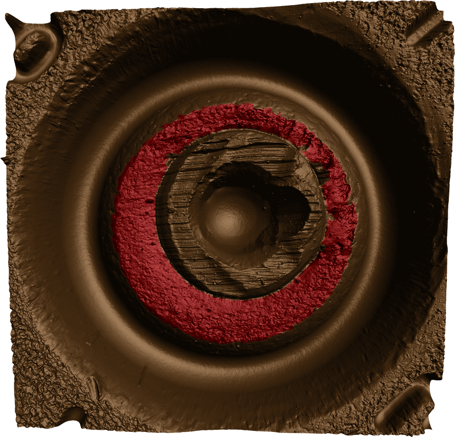
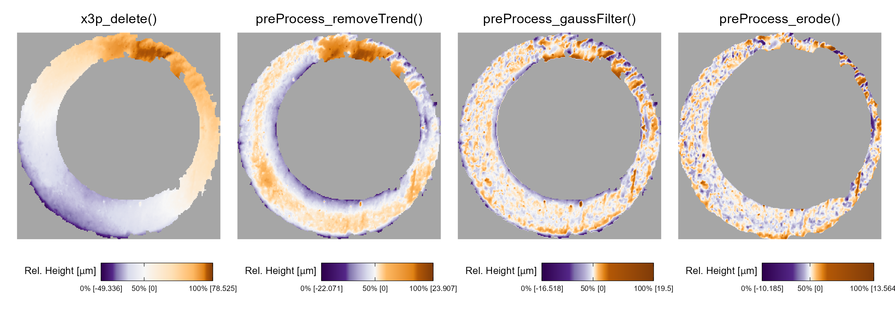
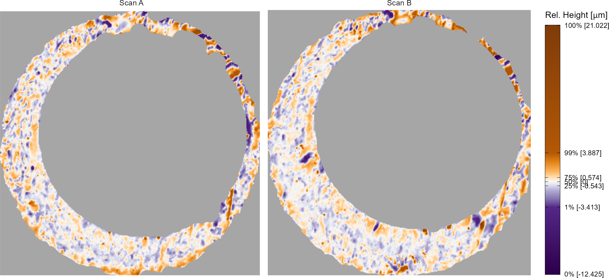
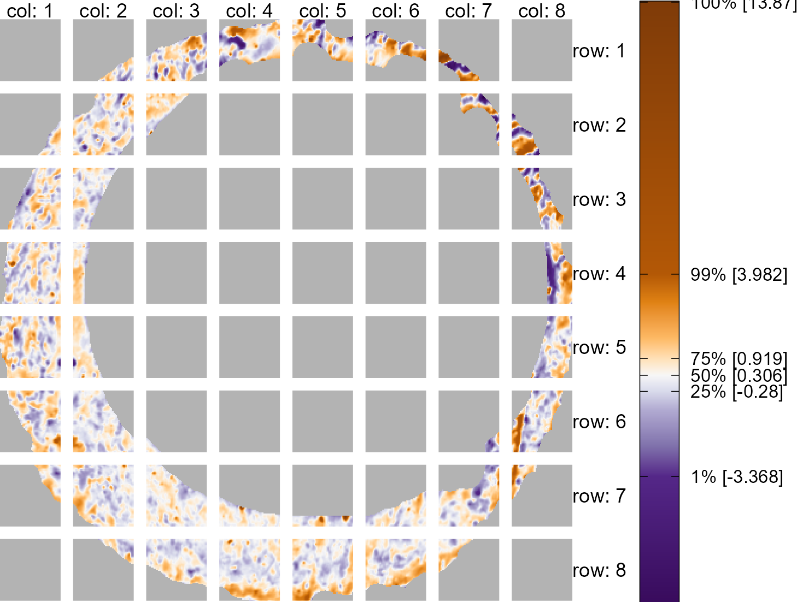
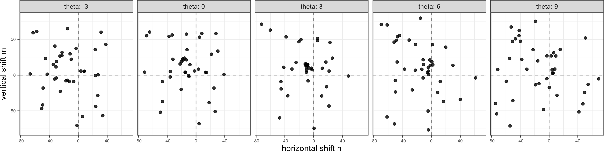
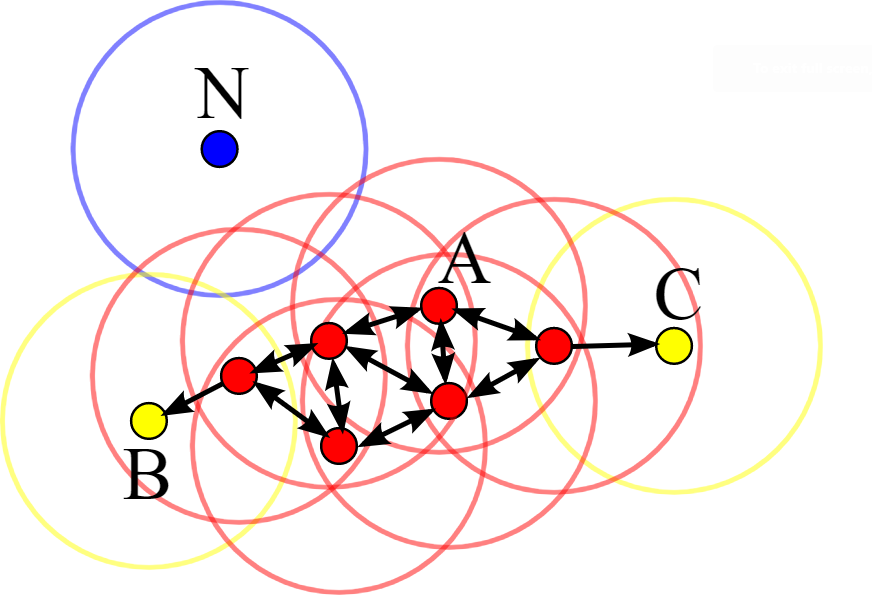
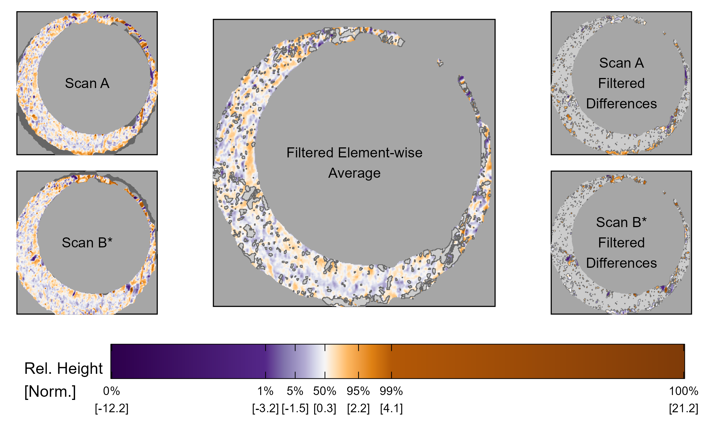
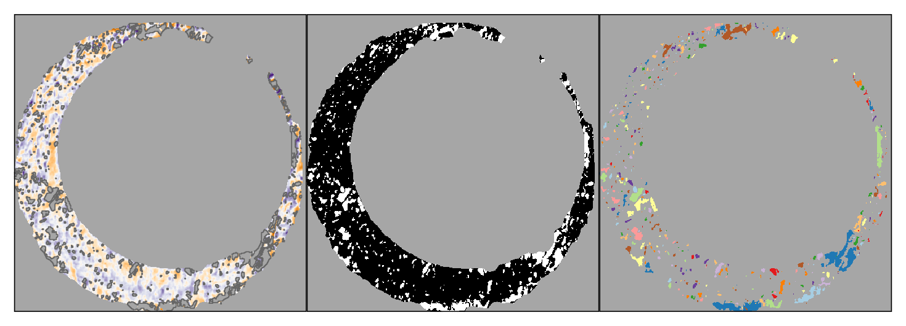
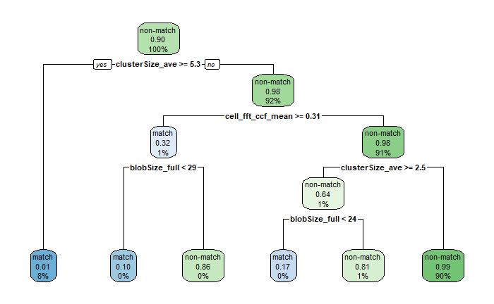
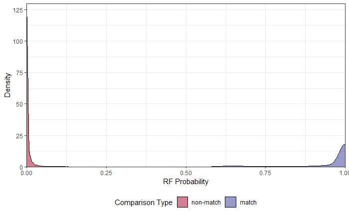

```{r setup, include=FALSE}
options(prompt = 'R> ', continue = '+ ')
knitr::opts_chunk$set(echo = "FALSE")
```

```{r load-libraries, cache = FALSE, include = FALSE}
library(cmcR) # remotes::install_github("csafe-isu/cmcR")
library(impressions) # remotes::install_github("jzemmels/impressions")
library(scored) # remotes::install_github("jzemmels/scored")

library(x3ptools)
library(tidyverse)
library(patchwork)

purple_to_orange <- rev(c("#7f3b08", "#b35806", "#e08214", 
                        "#fdb863", "#fee0b6", "#f7f7f7", "#d8daeb", 
                        "#b2abd2", "#8073ac", "#542788", "#2d004b"))

x3pPlt_horizontal <- function (
  x3pList, legend.quantiles = c(0, 0.01, 0.25, 0.5, 0.75, 0.99, 1), 
  height.quantiles = c(0, 0.01, 0.025, 0.1, 0.25, 0.5, 0.75, 0.9, 0.975, 0.99, 1), 
  height.colors = purple_to_orange, na.value = "gray65") 
{
  
  plts <- purrr::pmap(.l = list(x3pList, names(x3pList)), 
                      function(x3p, name) {
                        surfaceMat_df <- x3p %>% x3ptools::x3p_to_df() %>% 
                          dplyr::mutate(xnew = max(.data$y) - .data$y, 
                                        ynew = max(.data$x) - .data$x, value = .data$value - 
                                          median(.data$value, na.rm = TRUE)) %>% 
                          dplyr::select(-c(.data$x, .data$y)) %>% dplyr::rename(x = .data$xnew, 
                                                                                y = .data$ynew) %>% dplyr::mutate(value = .data$value - 
                                                                                                                    median(.data$value, na.rm = TRUE)) %>% dplyr::mutate(x3p = rep(name, 
                                                                                                                                                                                   times = nrow(.)))
                        
                        surfaceMat_df %>% 
                          ggplot2::ggplot(ggplot2::aes(x = .data$x, 
                                                       y = .data$y)) + 
                          ggplot2::geom_raster(ggplot2::aes(fill = .data$value)) + 
                          ggplot2::scale_fill_gradientn(colours = height.colors, 
                                                        values = scales::rescale(quantile(surfaceMat_df$value, 
                                                                                          c(0, 0.01, 0.025, 0.1, 0.25, 0.5, 0.75, 
                                                                                            0.9, 0.975, 0.99, 1), na.rm = TRUE)), 
                                                        breaks = function(lims) {
                                                          dat <- quantile(surfaceMat_df$value, legend.quantiles, 
                                                                          na.rm = TRUE)
                                                          dat <- dat %>% setNames(paste0(names(dat), 
                                                                                         " [", round(dat, 1), "]"))
                                                          return(dat)
                                                        }, na.value = na.value) + ggplot2::theme_minimal() + 
                          ggplot2::coord_fixed(expand = FALSE) + 
                          ggplot2::theme(axis.title.x = ggplot2::element_blank(), 
                                         axis.text.x = ggplot2::element_blank(), axis.ticks.x = ggplot2::element_blank(), 
                                         axis.title.y = ggplot2::element_blank(), axis.text.y = ggplot2::element_blank(), 
                                         axis.ticks.y = ggplot2::element_blank(), panel.grid.major = ggplot2::element_blank(), 
                                         panel.grid.minor = ggplot2::element_blank(), 
                                         panel.background = ggplot2::element_blank(), 
                                         plot.title = ggplot2::element_text(hjust = 0.5, 
                                                                            size = 11),
                                         legend.position = "bottom") +
                          ggplot2::guides(fill = ggplot2::guide_colourbar(barwidth = grid::unit(1.25, 
                                                                                                "in"), 
                                                                          barheight = grid::unit(.2,"in"),
                                                                          label.theme = ggplot2::element_text(size = 6), 
                                                                          title.theme = ggplot2::element_text(size = 8), 
                                                                          title.vjust = .8,
                                                                          frame.colour = "black",
                                                                          ticks.colour = "black",
                                                                          direction = "horizontal"), 
                                          colour = "none") + 
                          ggplot2::labs(fill = expression("Rel. Height [" * 
                                                            mu * "m]")) + ggplot2::labs(title = name)
                      })
  
  return(plts)
}
```

# Introduction

Introduce the problem here.
Explain what a cartridge case is.
Explain breech face impressions.

The "ground-truth" of a forensic comparison is a binary classification problem.
Briefly reference how comparisons are done by examiners currently.
Keep focus on firearm and toolmark evidence.

Critics of traditional firearm and toolmark comparisons cite a lack of foundational validity (NAS 2009, PCAST 2016).
Discuss what PCAST means by foundational validity and how firearm and toolmark evidence falls short according to NAS & PCAST.
Recent studies of examiner proficiency estimate error rates to be low - between % and % according to [Baldwin].
Nonetheless, [NAS] and [PCAST] pushed for the development of "objective image processing algorithms to....[quote PCAST here...]." An automatic comparison algorithm could be used as part of an examination to supplement or inform an examiner's opinion [cite Swofford taxonomy paper here].

# Previous Work

Discuss current state of affairs for algorithmic F&T comparisons.

Cite Hare et al. as a parallel paper to this one applied to bullet data.

Cite Xiao Hui's project.

Cite CMC method as predominant method.
Broadly summarize cell-based comparison procedure and CMC method logic.
Also reference Zhang et al. (2020) DBSCAN paper here.

Discuss limitations of current cartridge case comparison algorithms.
Currently, there is no rigorous procedure for comparing different algorithms.
This includes selecting optimal parameters for a specific algorithm.
In this work, we introduce a novel validation procedure to learn and validate optimal parameters using a cross-validation procedure.

We introduce a novel set of features to measure the similarity between two cartridge cases.
using these features, we train and test a random forest model.
We show that this random forest model improves upon the error rate of predominant automatic comparison algorithms.
Additionally, we demonstrate how the random forest model can be used to calculate score-based likelihood ratios.

# Cartridge Case Data

Discuss Baldwin study here.
Point out that it was the only appropriately-designed study according to PCAST.
Types of cartridge cases, firearms.
Design of the experiment (known and questioned samples).

Details of scanning procedure using Cadre 3D-TopMatch High Capacity Scanner.
Describe x3p file format and surface matrices.

# Methods

We divide the Methods into three broad categories:

```{=tex}
\begin{enumerate}
\item \textbf{Preprocessing:} prepare cartridge case scans for comparison

\item \textbf{Comparing:} compare two cartridge cases and compute similarity features

\item \textbf{Scoring:} measure the similarity between the two cartridge cases using a trained classifier
\end{enumerate}
```
The following sections detail each of these steps.

## Preprocessing

We first use the open-source FiX3P web application to manually annotate the breech face impression region.
An example of a manually-annotated cartridge case scan is shown in \autoref{fig:annotatedScan}.
The FiX3P software includes functionality to "paint" the surface of a cartridge case using a computer cursor and save the painted regions to a *mask.* A mask is a 2D array of hexidecimal color values of the same dimension as its associated surface matrix.
When initialized, every element of a mask is a shade of brown (#cd7f32) by default.
Any elements that are painted-over by the user will be replaced with the user's selected color value.
In \autoref{fig:annotatedScan}, the breech face impression region was manually annotated using a shade of red (#ff0000).

```{r,out.width=".6\\textwidth",echo=FALSE,fig.pos="htbp",fig.cap="\\label{fig:annotatedScan} A cartridge case surface is manually annotated using the FiX3P software. The annotated region of interest contains breech face impressions."}

```

Once read into an R environment, we use sequence of functions available in the [x3ptools] and [cmcR] packages to preprocess the raw scans.
<!-- [Code] demonstrates how the [magrittr] pipe (`%>%`) operator strings together these functions. --> \autoref{fig:preProcessEffect} shows the effect that each function has on the scan surface values.
Gray pixels in each plot represent missing values in the surface matrix.
The `x3p_delete` function removes values in the scan based on the associated mask.
Next, the `preProcess_removeTrend` function subtracts a fitted conditional median plane from the surface values to "level-out" any global tilt in the scan.
The `preProcess_gaussFilter()` function applies a bandpass Gaussian filter to remove small-scale noise and other large-scale structure, which better highlights the medium-scale breech face impressions.
Finally, the `preProcess_erode()` function applies the morphological operation of erosion on the edge of the non-missing surface values.
This has the effect of shaving-off values on the interior and exterior edge of the surface, which are often extreme "roll-off" values that unduly affect the comparing stage if not removed.
The final result is a cartridge case surface matrix with emphasized breech face impressions.

```{r,cache=TRUE,include=FALSE}
reference <- x3p_read("data/NIST_K013sA1.x3p")
target <- x3p_read("data/NIST_K013sA2.x3p")

reference$surface.matrix <- reference$surface.matrix*1e6
target$surface.matrix <- target$surface.matrix*1e6

reference_deleted <- reference %>%
  impressions::x3p_delete(mask_vals = "#CD7F32FF") %>%
  x3ptools::x3p_sample(m = 4)

reference_detrend <- reference %>%
  impressions::x3p_delete(mask_vals = "#CD7F32FF") %>%
  cmcR::preProcess_removeTrend(statistic = "quantile",
                               tau = .5,
                               method = "fn") %>%
  x3ptools::x3p_sample(m = 4)

reference_filtered <- reference %>%
  impressions::x3p_delete(mask_vals = "#CD7F32FF") %>%
  cmcR::preProcess_removeTrend(statistic = "quantile",
                               tau = .5,
                               method = "fn") %>%
  cmcR::preProcess_gaussFilter() %>%
  x3p_sample() %>%
  cmcR::preProcess_removeTrend(statistic = "quantile",
                               tau = .5,
                               method = "fn") %>%
  cmcR::preProcess_gaussFilter() %>%
  x3p_sample()

reference_eroded <- reference %>%
  impressions::x3p_delete(mask_vals = "#CD7F32FF") %>%
  cmcR::preProcess_removeTrend(statistic = "quantile",
                               tau = .5,
                               method = "fn") %>%
  cmcR::preProcess_gaussFilter() %>%
  x3p_sample() %>%
  cmcR::preProcess_removeTrend(statistic = "quantile",
                               tau = .5,
                               method = "fn") %>%
  cmcR::preProcess_gaussFilter() %>%
  x3p_sample() %>%
  preProcess_erode(region = "interior",morphRadius = round(50/4)) %>% 
  preProcess_erode(region = "exterior",morphRadius =  round(50/4)) %>%
  impressions::x3p_cropWS()

target_eroded <- target %>%
  impressions::x3p_delete(mask_vals = "#CD7F32FF") %>%
  cmcR::preProcess_removeTrend(statistic = "quantile",
                               tau = .5,
                               method = "fn") %>%
  cmcR::preProcess_gaussFilter() %>%
  x3p_sample() %>%
  cmcR::preProcess_removeTrend(statistic = "quantile",
                               tau = .5,
                               method = "fn") %>%
  cmcR::preProcess_gaussFilter() %>%
  x3p_sample() %>%
  preProcess_erode(region = "interior",morphRadius = round(50/4)) %>% 
  preProcess_erode(region = "exterior",morphRadius =  round(50/4)) %>%
  impressions::x3p_cropWS()
```

```{r,cache=TRUE,include=FALSE}
plts <- x3pPlt_horizontal(list("x3p_delete()" = reference_deleted,
                               "preProcess_removeTrend()" = reference_detrend,
                               "preProcess_gaussFilter()" = reference_filtered,
                               "preProcess_erode()" = reference_eroded),
                          legend.quantiles = c(0,.5,1))

plt <- (plts[[1]] | plts[[2]] | plts[[3]] | plts[[4]])

ggsave(plot = plt,filename = "figures/preProcessEffect.png",width = 10,height = 5)
knitr::plot_crop("figures/preProcessEffect.png")
```

```{r,out.width="\\textwidth",echo=FALSE,fig.pos="htbp",fig.cap="\\label{fig:preProcessEffect} We apply a sequence of preprocessing functions to each scan. Each preprocessing step further emphasizes the breech face impressions in the scan."}

```

Next, we compute a set of similarity features for two preprocessed cartridge case scans.

## Comparing

In this section, we introduce a set of similarity features for two cartridge case scans.
We calculate features at two scales: between two whole scans and between individual cells similar to the CMC method [cite].
Analogous to how a forensic examiner uses a comparison microscope with different magnification levels, this allows us to assess the similarity between two scans at the macro and micro levels.

### Notational Conventions

First, we introduce notation that will be used to define the features.
Let $A$ and $B$ denote two surfaces matrices that we wish to compare.
For simplicity, we assume that $A,B \in \mathbb{R}^{k \times k}$ for $t > 0$.\footnote{This assumption of equally-sized, square matrices is easily enforced by padding the matrices with additional missing values.
Due to the presence of (structurally) missing values around the breech face impression region, additional padding does not interfere with the structure of the scan.}
We use lowercase letters and subscripts to denote a particular value of a matrix: $a_{ij}$ is the value in the $i$th row and $j$th column, starting from the top-left corner, of matrix $A$.
Throughout this section, we will use the two known-match cartridge cases in \autoref{fig:matchPair} as exemplar matrices $A$ and $B$.

To accommodate structurally-missing values, we adapt standard matrix algebra as follows: if an element of either matrix $A$ or $B$ is missing, then any element-wise operation including this element is also missing, otherwise standard matrix algebra holds.
For example, the addition operator is defined as:
\begin{align*}
A \oplus_{NA} B = (a_{ij} \oplus_{NA} b_{ij})_{1 \leq i,j \leq k} = 
\begin{cases}
a_{ij} + b_{ij} & \text{if both $a_{ij}$ and $b_{ij}$ are numbers} \\
NA &\text{otherwise}
\end{cases}
\end{align*}
Other element-wise operations such as $\ominus_{NA}$ are defined similarly.
For readability, we will use standard operator notation $+, -, >, <, ...$ and assume the extended operations as defined above.

```{r,cache=TRUE,include=FALSE}
plt <- x3pListPlot(list("Scan A" = reference_eroded,
                        "Scan B" = target_eroded))

plt

ggsave(filename = "figures/matchPair.png",plot = plt,height = 7,width = 10)
knitr::plot_crop("figures/matchPair.png")
```

```{r,out.width="\\textwidth",echo=FALSE,fig.pos="htbp",fig.cap="\\label{fig:matchPair} A matching pair of processed cartridge case scans. We measure the similarity between these cartridge cases using the distinguishable breech face impressions on their surfaces."}

```

### Registration Estimation

A critical step in comparing $A$ and $B$ is to find a transformation of $B$ such that it aligns best to $A$ (or vice versa).
In image processing, this is called *image registration.* Noting that $A$ and $B$ are essentially grayscale images, we rely on a standard image registration technique [cite Brown, 1992].

In our application, this transformation is composed of a discrete translation by $(m,n) \in \mathbb{Z}^2$ and rotation by $\theta \in [-180^\circ,180^\circ]$.
Under this transformation, the index $i,j$ maps to a new index $i^*,j^*$ by: \begin{align*}
\begin{pmatrix} j^* \\ i^* \end{pmatrix} =
\begin{pmatrix} n \\ m \end{pmatrix} +
\begin{pmatrix} \cos(\theta) & -\sin(\theta) \\ \sin(\theta) & \cos(\theta) \end{pmatrix} \begin{pmatrix} j \\ i \end{pmatrix}.
\end{align*}

The value $b_{ij}$ now occupies the index $i^*, j^*$. 
In practice, we use *nearest-neighbor interpolation* meaning $i^*$ and $j^*$ are rounded to the nearest integer [cite a nearest-neighbor reference].
<!-- \footnote{Technical note: We pad the dimensions of matrix $B$ as-needed assuming free boundary conditions (0-padding) so as to not crop-out any of the original values [cite a boundary condition reference here]. For notational simplicity, we'll refer to this padded matrix as $B$ also.} -->

To determine the optimal registration, we calculate the *cross-correlation function* (CCF) between $A$ and $B$, which measures the similarity between $A$ and $B$ for every possible translation of $B$.
Denoted $(A \star B)$, the CCF between $A$ and $B$ is a 2D array of dimension $2k - 1 \times 2k - 1$ with the $m,n$-th element given by:
\begin{align*}
(a \star b)_{mn} = \sum_{i=1}^k \sum_{j=1}^k a_{mn} \cdot b_{i + m, j + n}
\end{align*} 
where $1 \leq m,n \leq 2k - 1$.
The value $(a \star b)_{mn}$ quantifies the similarity between $A$ and $B$ after $B$ is translated $m$ elements horizontally and $n$ elements vertically.
The CCF is often normalized between -1 and 1 for interpretability.

For large matrices, the above definition of the CCF is computationally taxing.
The Cross-Correlation Theorem provides an equivalent expression for the CCF:
\begin{align*}
(A \star B) = \mathcal{F}^{-1}\left(\overline{\mathcal{F}(A)} \odot \mathcal{F}(B)\right)
\end{align*}
where $\mathcal{F}$ and $\mathcal{F}^{-1}$ are the discrete Fourier and inverse discrete Fourier transforms, respectively, $\overline{\mathcal{F}(A)}$ is the complex conjugate, and $\odot$ is an element-wise (Hadamard) product [cite Brigham, 1988].
We trade the moving sum computation from the previous CCF expression for two forward Fourier transforms, an element-wise product, and an inverse Fourier transform.
The Fast Fourier Transform (FFT) algorithm reduces the computational load considerably [cite Tukey].

Using the CCF as an objective function, we estimate the registration by calculating the maximum CCF value across a range of rotations of matrix $B$.
Let $B_\theta$ denote $B$ rotated by an angle $\theta \in [-180^\circ,180^\circ]$ and $b_{\theta_{mn}}$ the $m,n$-th element of $B_\theta$.
Then the estimated registration $(m^*,n^*,\theta^*)$ is: \begin{align*}
(m^*,n^*,\theta^*) = \arg \max_{m,n,\theta} (a \star b_\theta)_{mn}.
\end{align*} In practice we consider a discrete grid of rotations $\pmb{\Theta} \subset [-180^\circ,180^\circ]$.
The registration procedure is outlined in \autoref{alg:registration}.

```{=tex}
\begin{algorithm}[htbp]
\KwData{Matrices $A$, $B$ and rotation grid $\pmb{\Theta}$}
\KwResult{Estimated registration of $B$ to $A$, $(m^*,n^*,\theta^*)$, and cross-correlation function maximum, $CCF_{\max}$}
\For{$\theta \in \pmb{\Theta}$}{
Rotate $B$ by $\theta$ to obtain $B_\theta$\;
Calculate $CCF_{\max, \theta} = \max_{m,n} (a \star b_{\theta})_{mn}$\;
Calculate translation $[m^*_\theta,n^*_\theta] = \arg \max_{m,n} (a \star b_{\theta})_{mn}$
}
Calculate overall maximum correlation $CCF_{\max} = \max_{\theta} \{CCF_{\max,\theta} : \theta \in \pmb{\Theta}\}$\;
Calculate rotation $\theta^* = \arg \max_{\theta} \{CCF_{\max,\theta} : \theta \in \pmb{\Theta}\}$\;
\Return{Estimated rotation $\theta^*$, translation $m^* = m^*_{\theta^*}$ and $n^* = n^*_{\theta^*}$, and $CCF_{\max}$}
\caption{Image Registration Procedure}
\label{alg:registration}
\end{algorithm}
```
The overall maximum CCF, $CCF_{\max}$, is a similarity measure between $A$ and $B$.

### Handling Missingness

\textbf{[Not sure what to do with this section.
It needs to be mentioned, but in more or less detail?]}

The registration estimation procedure outline above, namely the Fast Fourier Transform algorithm, does not permit missing values in $A$ or $B$.
It is common for cartridge case scans to contain many missing values - the gray regions in [preprocessing Figure] represent structural values in the scan.
Thus, when calculating the CCF we impute these missing values with the average non-missing value in the scan.

We wish to measure the similarity between $A$ and $B$ while taking this missingness into account; to measure the similarity between the non-missing intersection of the aligned scans.
We compute the *pairwise-complete correlation* using only the complete value pairs, meaning neither value is missing, between $A$ and $B$.

### Whole-Scan Comparison

We first estimate the registration between two full scans $A$ and $B$ using \autoref{alg:registration} with a rotation grid $\pmb{\Theta} = \{-30^\circ, -27^\circ,...,27^\circ,30^\circ\}$.
This results in an estimated registration $(m^*,n^*,\theta^*)$ and similarity measure $CCF_{\max}$.
<!-- [Tai and Eddy (2017)] propose using a decision boundary for $CCF_{\max}$ to define a binary classifier. --> We then apply the registration transformation $(m^*,n^*,\theta^*)$ to $B$ to obtain $B^*$ and compute the pairwise-complete correlation, $cor_{\text{comp}}$, between $A$ and $B^*$.

From this whole-scan comparison procedure we obtain two features summarized in \autoref{tab:wholeScanComparison}.

```{=tex}
\begin{table}[htbp]
\centering
\begin{tabular}{|p{.11\linewidth}|p{.7\linewidth}|}
\hline
\textbf{Notation} & \textbf{Feature Description} \\
\hline
$cor_{\text{comp}}$ & Pairwise-complete correlation between two aligned scans \\
\hline
\end{tabular}
\caption{Two similarity features based on estimating the registration of two whole scans.}
\label{tab:wholeScanComparison}
\end{table}
```

<!-- \hline -->
<!-- $CCF_{\max}$ & Maximum value of the cross-correlation function across a grid of rotations \\ -->

### Cell-Based Comparison

Following the comparison of $A$ and $B^*$, we next perform a cell-based comparison procedure.
Song (2013) points out that breech face impressions rarely appear uniformly on a cartridge case surface.
Rather, distinguishing markings appear in specific, usually small, regions of a scan (the author refers to these as *valid correlation regions*).
Calculating a correlation between two whole scans does not necessarily capture the similarity between these regions.
Song (2013) proposes partitioning a scan into a rectangular grid of "cells" to isolate the valid correlation regions.
\autoref{fig:cellGridExample} shows an example of matrix $A$ partitioned into a grid of $8 \times 8$ cells.

```{r,cache=TRUE,include=FALSE}
pltDat <- reference_eroded %>%
  cmcR::comparison_cellDivision(numCells = c(8,8)) %>%
  pmap_dfr(~ {
    
    impressions::x3p_to_dataFrame(..2) %>%
      mutate(cellIndex = ..1)
    
  }) %>%
  tidyr::separate(col = "cellIndex",into = c("row","col"),sep = ", ",remove = FALSE) %>%
  mutate(row = as.integer(row),
         col = as.integer(col))

plt <- pltDat %>%
  ggplot(aes(x=x,y=y,fill=value)) +
  geom_raster() +
  facet_grid(rows = vars(row),
             cols = vars(col),
             labeller = label_both) +
  theme_void() +
  coord_fixed(expand = FALSE) +
  ggplot2::scale_fill_gradientn(colours = rev(c("#7f3b08", "#b35806", "#e08214", 
                                                "#fdb863", "#fee0b6", "#f7f7f7", "#d8daeb", 
                                                "#b2abd2", "#8073ac", "#542788", "#2d004b")), 
                                values = scales::rescale(quantile(pltDat$value, 
                                                                  c(0, 0.01, 0.025, 0.1, 0.25, 0.5, 0.75, 
                                                                    0.9, 0.975, 0.99, 1), na.rm = TRUE)), 
                                breaks = function(lims) {
                                  dat <- quantile(pltDat$value, c(0,0.01, 0.25, 0.5, 0.75, 0.99, 1), 
                                                  na.rm = TRUE)
                                  dat <- dat %>% setNames(paste0(names(dat), 
                                                                 " [", round(dat, 3), "]"))
                                  return(dat)
                                }, na.value = "gray70") +
  ggplot2::guides(fill = ggplot2::guide_colourbar(barheight = grid::unit(3, 
                                                                         "in"), label.theme = ggplot2::element_text(size = 8), 
                                                  title.theme = ggplot2::element_text(size = 10), 
                                                  frame.colour = "black", ticks.colour = "black"), 
                  colour = "none") +
  ggplot2::labs(fill = expression("Rel. Height ["*mu*"m]"))

ggsave(filename = "figures/cellGridExample.png",plot = plt)
knitr::plot_crop("figures/cellGridExample.png")
```

```{r,out.width=".6\\textwidth",echo=FALSE,fig.pos="htbp",fig.cap="\\label{fig:cellGridExample} A reference scan separated into a grid of $8 \\times 8$ cells. Each reference cell is compared to a target scan to estimate where it aligns best. We exclude cells containing only missing values (visualized here as gray pixels)."}

```

The cell-based comparison procedure begins with selecting one of the matrices, say $A$, as the "reference" matrix to be partitioned into a grid of cells.
Each of these reference cells will be compared to the "target" matrix, in this case $B^*$.
Because $A$ and $B^*$ are already partially aligned based on the course rotation grid $\pmb{\Theta}$, we compare each reference cell to $B^*$ using a new rotation grid of $\pmb{\Theta}' = \{\theta^* - 2^\circ, \theta^* - 1^\circ,\theta^*,\theta^* + 1^\circ,\theta^* + 2^\circ\}$.

We now extend the surface matrix notation introduced previously to accommodate cells.
Let $A_{t}$ denote the $t$th cell of matrix $A$, $t = 1,...,T$ where $T$ is the total number of cells containing non-missing values (e.g., $T = 38$ in \autoref{fig:cellGridExample}) and let $(a_t)_{ij}$ denote the $i,j$-th element of $A_t$.
<!-- \footnote{In practice, we number the cells in lexicographic order (left-to-right, top-to-bottom) starting from the top-left.} -->

The cell-based comparison procedure is outlined in \autoref{alg:cellComparison}.

```{=tex}
\begin{algorithm}[H]
\KwData{Reference matrix $A$, target matrix $B^*$, cell grid size $R \times C$, and rotation grid $\pmb{\Theta}'$}
\KwResult{Estimated translations and $CCF_{\max}$ values per cell, per rotation}
Partition $A$ into a grid of $R \times C$ cells\;
Discard cells containing only missing values, leaving $T$ remaining cells\;
\For{$\theta \in \pmb{\Theta}'$}{
Rotate $B^*$ by $\theta$ to obtain $B^*_\theta$\;
\For{$t = 1,...,T$}{
Calculate $CCF_{\max, \theta, t} = \max_{m,n} (a_k \star b^*_\theta)_{mn}$\;
Calculate translation $[m^*_{\theta,t},n^*_{\theta,t}] = \arg \max_{m,n} (a_i \star b^*_\theta)[m,n]$
}
}
\Return{$\pmb{F} = \{(m^*_{\theta,t},n^*_{\theta,t}, CCF_{\max,\theta,t}, \theta) : \theta \in \pmb{\Theta}', t = 1,...,T\}$}
\caption{Cell-Based Comparison Procedure}
\label{alg:cellComparison}
\end{algorithm}
```
Rather than exclusively returning the registration that maximizes the overall CCF as in \autoref{alg:registration}, \autoref{alg:cellComparison} returns the set $\pmb{F}$ of translations and CCF values for each cell and each rotation considered.
The following assumption justifies this: if two cartridge cases are truly matching, then we assume that multiple cells will "agree" on a particular translation value at the true rotation.\footnote{And that cells will not come to such an agreement for a non-matching pair of cartridge cases} This agreement phenomenon is illustrated in \autoref{fig:estimatedTranslationFaceted} where each point represents the translation that maximizes the CCF for a particular cell and rotation.
The points appear randomly distributed for most of the rotation values except around $\theta = 3$ where a tight cluster of points forms around translation $[17,-16]$.
This is evidence to suggest that a true registration exists for these two cartridge cases, implying that they match.
The task is to determine when cells reach a registration consensus.

```{r,eval=TRUE,include=FALSE}
if (!file.exists("data/compData.RData")) {
compData <- 
  dplyr::bind_rows(map_dfr(seq(-30,30,by = 3),
                    ~ cmcR::comparison_allTogether(reference = reference_eroded,
                                                   target = target_eroded,
                                                   theta = .,
                                                   numCells = c(8,8),
                                                   maxMissingProp = .99,
                                                   returnX3Ps = TRUE)) %>%
              mutate(direction = "comparison_refToTarget"),
            map_dfr(seq(-30,30,by = 3),
                    ~ cmcR::comparison_allTogether(reference = target_eroded,
                                                   target = reference_eroded,
                                                   theta = .,
                                                   numCells = c(8,8),
                                                   maxMissingProp = .99,
                                                   returnX3Ps = TRUE)) %>%
              mutate(direction = "comparison_targetToRef"))

save(compData,file = "data/compData.RData")
}
```

```{r,cache=TRUE,include=FALSE}
load("data/compData.RData")

plt <- compData %>%
  select(-c(cellHeightValues,alignedTargetCell)) %>%
  filter(direction == "comparison_refToTarget") %>%
  filter(theta >= -3 & theta <= 9) %>%
  ggplot(aes(x=x,y,y)) +
  # geom_point() +
  geom_jitter(width = 3,height = 3,size = .5) +
  coord_fixed(expand = TRUE) +
  facet_wrap(~ theta,nrow = 1,labeller = label_both) +
  theme_bw() +
  labs(x = "n",
       y = "m") +
  theme(axis.text = element_text(size = 6)) +
  geom_vline(xintercept = 0,linetype = "dashed") +
  geom_hline(yintercept = 0,linetype = "dashed")

ggsave(filename = "figures/estimatedTranslationFaceted.png")
knitr::plot_crop("figures/estimatedTranslationFaceted.png")
```

```{r,out.width="\\textwidth",echo=FALSE,fig.pos="htbp",fig.cap="\\label{fig:estimatedTranslationFaceted} A scatterplot where points represent the cell-wise estimated translations faceted by rotation for a matching pair of cartridge cases. As evidenced by the tight cluster in the middle facet, it appears that multiple cells agree on a translation of $[\\hat{m}, \\hat{n}] \\approx  [17,-16]$ after rotating by $3^\\circ$. Points are jittered for visibility."}

```

Just as with the whole-scan comparison, we calculate the pairwise-complete correlation between each cell $A_t$ and a matrix $B_{\theta,t}^*$ of the same size extracted from $B^*_{\theta}$ after translating by $[m^*_\theta,n^*_\theta]$.
From this we obtain a set of pairwise-complete correlations for each rotation: $\{cor_{\text{comp},\theta,t} : \theta \in \pmb{\Theta}'\}$.
For $t = 1,...,T$, define the cell-wise maximum CCF and pairwise-complete correlation as: 
\begin{align*}
CCF_{\max,t} &= \max_{\theta} \{CCF_{\max,\theta,t} : \theta \in \pmb{\Theta}'\}
cor_{\text{comp},t} &= \max_{\theta} \{cor_{\text{comp},\theta,t} : \theta \in \pmb{\Theta}'\}
\end{align*}

We compute the following features using the correlation data: 

\begin{align*}
\overline{cor}_{\text{comp}, \cdot} &= \frac{1}{T} \sum_{t=1}^T cor_{\text{comp},t} \\
s_{cor}^2 &= \frac{1}{T-1} \sum_{t=1}^T (cor_{\text{comp},t} - \overline{cor}_{\text{comp}, \cdot})^2
\end{align*} 

<!-- \overline{CCF}_{\max, \cdot} &= \frac{1}{T} \sum_{t=1}^T CCF_{\max,t} \\ -->
<!-- s_{CCF}^2 &= \frac{1}{T-1} \sum_{t=1}^T (CCF_{\max,t} - \overline{CCF}_{\max, \cdot})^2  \\ -->

We expect 
<!-- $\overline{CCF}_{\max, \cdot}$,  -->
$\overline{cor}_{\text{comp}, \cdot}$ to be large and 
<!-- $s_{CCF}^2$,  -->
$s_{cor}^2$ small for truly matching cartridge case pairs.

For $t = 1,...,T$, define the estimated translations and rotation for $A_k$ as: \begin{align*}
\theta^*_t &= \arg \max_{\theta} \{CCF_{\max,\theta,t} : \theta \in \pmb{\Theta}'\} \\
m^*_t &= m^*_{\theta^*_t,t} \\
n^*_t &= n^*_{\theta^*_t,t}
\end{align*} 

We compute the following additional features using the estimated cell translations and rotations: 
\begin{align*}
s_{\theta^*}^2 = \frac{1}{T-1} \sum_{t=1}^T (\theta^*_{t} - \bar{\theta}^*_{\cdot})^2 \\
s_{m^*}^2 = \frac{1}{T-1} \sum_{t=1}^T (m^*_{t} - \bar{m}^*_{\cdot})^2 \\
s_{n^*}^2 = \frac{1}{T-1} \sum_{t=1}^T (n^*_{t} - \bar{n}^*_{\cdot})^2 
\end{align*} 
where $\bar{m}^*_{\cdot} = \frac{1}{T} \sum_{t=1}^T m^*_{t}$, $\bar{n}^*_{\cdot} = \frac{1}{T} \sum_{t=1}^T n^*_{t}$, and $\bar{\theta}^*_{\cdot} = \frac{1}{T} \sum_{t=1}^T \theta^*_{t}$.
We expect $s_{m^*}^2, s_{n^*}^2, s_{\theta^*}^2$ to be small for truly matching cartridge case pairs.

From this cell-based comparison procedure, we obtain seven features summarized in \autoref{tab:cellBasedComparison}.

```{=tex}
\begin{table}[htbp]
\centering
\begin{tabular}{|p{.11\linewidth}|p{.7\linewidth}|}
\hline
\textbf{Notation} & \textbf{Feature Description} \\
\hline
$\overline{cor}_{\text{comp}, \cdot}$ & Average pairwise-complete correlation between each reference cell and its paired region in the target matrix at which the CCF is maximized \\
\hline
$s_{cor}^2$ & Sample variance of the pairwise-complete correlation values between each reference cell and its paired region in the target matrix at which the CCF is maximized \\
\hline
$s_{m^*}^2$ & Sample variance of the estimated vertical (row) translations across all cells \\
\hline
$s_{n^*}^2$ & Sample variance of the estimated horizontal (column) translations across all cells \\
\hline
$s_{\theta^*}^2$ & Sample variance of the estimated rotations across all cells \\
\hline
\end{tabular}
\caption{Seven similarity features based on partitioning a reference scan into a grid of cells and comparing each cell to a target scan.}
\label{tab:cellBasedComparison}
\end{table}
```

<!-- \hline -->
<!-- $\overline{CCF}_{\max, \cdot}$ & Average maximum value of the cross-correlation function across all cells and rotations \\ -->
<!-- \hline -->
<!-- $s_{CCF}^2$ & Sample variance of the maximum CCF values across all cells \\ -->

### Density-Based Spatial Clustering of Applications with Noise

As discussed in the last section, we wish to identify when multiple cells agree on a particular registration.
[Zhang et al. (2020)] proposed using the Density-Based Spatial Clustering of Applications with Noise (DBSCAN) algorithm to identify clusters of points based on their density.

\autoref{fig:dbscanIllustration} depicts an illustration of the DBSCAN algorithm [cite Wikimedia commons].
The algorithm has two parameters: a neighborhood radius $\epsilon$ and a minimum point threshold $Minpts$.
In \autoref{fig:dbscanIllustration}, $Minpts = 4$ and $\epsilon$ is arbitrary and represented by the radius of the circles drawn around each point - each circle represents the $\epsilon$-neighborhood for its center point.
First, the algorithm identifies cluster "core" points that contain at least $Minpts$ points within an $\epsilon$ distance.\footnote{Euclidean distance, in our application} These points form the beginning of a cluster and are shown in red in \autoref{fig:dbscanIllustration}.
The yellow points $B$ and $C$ are within the $\epsilon$-neighborhood of a core point, but are not themselves core points.
They are also included in the cluster making the overall cluster size 8.
Finally, the blue point labelled $N$ is not in any core point's $\epsilon$-neighborhood and is thus classified as a "noise point." Unlike other clustering algorithms, the DBSCAN algorithm does not require a specified number of expected clusters as a parameter; any points not belonging to a cluster are "noise."

```{r,out.width=".7\\textwidth",echo=FALSE,fig.pos="htbp",fig.cap = '\\label{fig:dbscanIllustration} Illustration of the DBSCAN algorithm [cite]. Red and yellow points are part of the same cluster with the former forming the "core" of the cluster. The blue point is not part of a cluster and is classified as a "noise point." Figure by Chire - Own work, CC BY-SA 3.0, https://commons.wikimedia.org/w/index.php?curid=17045963'}

```

```{r,cache=TRUE,include=FALSE}
estimRotations <- compData %>%
  group_by(direction,theta) %>%
  group_split() %>%
  map_dfr(function(dat){
    
    densEstim <- MASS::kde2d(x = dat$x,y = dat$y,n = 100)
    
    data.frame(maxDens = max(c(densEstim$z)),
               theta = unique(dat$theta),
               direction = unique(dat$direction))
    
  }) %>%
  group_by(direction) %>%
  dplyr::top_n(n = 1,wt = maxDens) %>%
  select(direction,theta) %>%
  rename(thetaHat = theta)

plt1 <- compData %>%
  select(-c(cellHeightValues,alignedTargetCell)) %>%
  left_join(estimRotations,by = "direction") %>%
  filter(theta == thetaHat) %>%
  mutate(direction = factor(direction,labels = c("Scan A vs. Scan B","Scan B vs. Scan A")),
         label = paste0(direction,", Rotation: ",theta)) %>%
    filter(direction == "Scan A vs. Scan B") %>%
  group_by(label) %>%
  group_split() %>%
  map_dfr(function(dat){
    
    dat %>%
      mutate(clust = dbscan::dbscan(x = dat %>% select(x,y),eps = 5,minPts = 5)$cluster,
             clust = factor(ifelse(clust == 0,0,1),labels = c("Noise","Cluster")))
    
  }) %>%
  ggplot(aes(x=x,y,y,colour = clust)) +
  # geom_point() +
  geom_jitter(width = 3,height = 3,size = 1) +
  coord_fixed(expand = TRUE) +
  facet_wrap(~ label,nrow = 1) +
  theme_bw() +
  labs(x = "n",
       y = "m",
       colour = "DBSCAN") +
  theme(axis.text = element_text(size = 6),
        legend.position = "bottom") +
  geom_vline(xintercept = 0,linetype = "dashed") +
  geom_hline(yintercept = 0,linetype = "dashed") +
  scale_colour_manual(values = c("gray80","black")) +
  xlim(c(-100,100)) +
  ylim(c(-100,100)) +
  theme(legend.position = "none")

plt2 <- compData %>%
  select(-c(cellHeightValues,alignedTargetCell)) %>%
  left_join(estimRotations,by = "direction") %>%
  filter(theta == thetaHat) %>%
  mutate(direction = factor(direction,labels = c("Scan A vs. Scan B","Scan B vs. Scan A")),
         label = paste0(direction,", Rotation: ",theta)) %>%
    filter(direction == "Scan B vs. Scan A") %>%
  group_by(label) %>%
  group_split() %>%
  map_dfr(function(dat){
    
    dat %>%
      mutate(clust = dbscan::dbscan(x = dat %>% select(x,y),eps = 5,minPts = 5)$cluster,
             clust = factor(ifelse(clust == 0,0,1),labels = c("Noise","Cluster")))
    
  }) %>%
  ggplot(aes(x=x,y,y,colour = clust)) +
  # geom_point() +
  geom_jitter(width = 3,height = 3,size = 1) +
  coord_fixed(expand = TRUE) +
  facet_wrap(~ label,nrow = 1) +
  theme_bw() +
  labs(x = "n",
       y = "m",
       colour = "DBSCAN") +
  theme(axis.text = element_text(size = 6),
        legend.position = "bottom") +
  geom_vline(xintercept = 0,linetype = "dashed") +
  geom_hline(yintercept = 0,linetype = "dashed") +
  scale_colour_manual(values = c("gray80","black")) +
  scale_x_reverse(limits = c(100,-100)) +
  scale_y_reverse(limits = c(100,-100)) +
  theme(legend.position = "none")

pltLegend <- plt1 %>%
  cowplot::get_legend() %>%
  cowplot::plot_grid()


ggsave(filename = "figures/dbscanScatterplot.png",plot = plt)
knitr::plot_crop("figures/dbscanScatterplot.png")
```

\autoref{fig:dbscanScatterplot} shows an example of DBSCAN cluster assignments for the known-match pair $A$ and $B$ shown in \autoref{fig:matchPair}.
The left scatterplot shows the per-cell estimated translations $[m^*_{\theta,t}, n^*_{\theta,t}]$ for $\theta = 3^\circ$ when scan $A$ is used as reference and $B^*$ as target, resulting a cluster of size 14.
The right scatterplot shows the per-cell estimated translations with the roles of $A$ and $B^*$ reversed: now $B^*$ is partitioned into a grid of reference cells that are compared to $A$, resulting in a cluster of size 13.

We extend the notation introduced earlier with a subscript $d = 1,2$ to accommodate two comparison directions.
A value of $d = 1$ or $2$ indicates that matrix $A$ or $B^*$ was used as reference, respectively.
For example, $\pmb{F}_1$ refers to the set of cell-based registration data computed using \autoref{alg:cellComparison} with $A$ as reference.

```{r,out.width=".8\\textwidth",echo=FALSE,fig.pos="htbp",fig.cap="\\label{fig:dbscanScatterplot} Cluster assignments based on the Density Based Spatial Clustering with Applications to Noise (DBSCAN) algorithm for estimated translations in two comparison directions. Using scan $A$ as reference results in a cluster of size 14 (left) compared to 13 when scan $B$ is used as reference (right). The mean cluster centers in both directions are approximately opposites of each other. Points are jittered for visibility."}
knitr::include_graphics("figures/dbscanScatterplot.png")
```

Because $A$ and $B$ are truly matching, we expect the estimated registrations in these two comparison directions to be opposites.
Indeed, the mean cluster centers in \autoref{fig:dbscanScatterplot} are $(\hat{m}_1,\hat{n}_1,\hat{\theta}_1) \approx (16.9, -16.7, 3^\circ)$ when $A$ is used as reference compared to $(\hat{m}_2,\hat{n}_2,\hat{\theta}_2) \approx (-16.2, 16.8, -3^\circ)$ when $B^*$ is used as reference.

[Zhang et al. (2020)] proposed a binary classifier using the DBSCAN algorithm: if a cluster is identified, then classify the cartridge case pair as a match and otherwise a non-match.
We use DBSCAN differently by calculating numerical features based on the cluster assignments.
We first use a 2D kernel density estimator [cite kde2d from MASS(?)] to identify the rotation $\hat{\theta}_d$ at which the per-cell translations achieve the highest density.
Next, we compute clusters using the DBSCAN algorithm.\footnote{If more than one cluster is identified, we binarize the points based on whether they were assigned to any cluster or if they are a noise point and proceed as if there is only one cluster. We assume that two or more clusters form only because of the course rotation grid considered. Were a finer grid used, the points would coalesce into a single cluster around the true translation value. This assumption has empirical support through our experimentation.} Let $\pmb{C}_d$ denote the set of cells in the DBSCAN cluster.
We treat the mean cluster centers as the estimated translations $[\hat{m}_d,\hat{n}_d]$.
Finally, we compute the following features:
\begin{align*}
C &= \frac{1}{2}\left(|\pmb{C}_1| + |\pmb{C}_2|\right) \\
\Delta_\theta &= |\hat{\theta}_1 + \hat{\theta}_2| \\
\Delta_{trans} &= \sqrt{(\hat{m}_1 + \hat{m}_2)^2 + (\hat{n}_1 + \hat{n}_2)^2}
\end{align*} where $|\pmb{C}_d|$ denotes the cardinality of $\pmb{C}_d$.
For truly matching cartridge case pairs, we expect $C$ to be large and $\Delta_{trans}, \Delta_\theta$ to be small.
If no cluster is identified by the DBSCAN algorithm, we use conservative values for these three features (e.g., $\Delta_{trans} = 1000$).

From this DBSCAN procedure, we obtain three features summarized in \autoref{tab:dbscanFeatures}.

```{=tex}
\begin{table}[htbp]
\centering
\begin{tabular}{|p{.11\linewidth}|p{.7\linewidth}|}
\hline
\textbf{Notation} & \textbf{Feature Description} \\
\hline
$C$ & DBSCAN cluster sizes, averaged over two comparison directions \\
\hline
$\Delta_\theta$ & Absolute sum of the density-estimated rotations in both comparison directions  \\
\hline
$\Delta_{trans}$ & Root sum of squares of the cluster-estimated translations in both comparison directions \\
\hline
\end{tabular}
\caption{Three similarity features based on clustering the cell-wise estimated registrations using the DBSCAN algorithm.}
\label{tab:dbscanFeatures}
\end{table}
```

### Visual Diagnostic Features

The final set of features we calculate are based on visual diagnostic tools described in [Zemmels et al. (2023)].
These numerical features quantify the qualitative observations one can make from the diagnostics.

To create the visual diagnostics, we perform element-wise matrix operations.
In particular, for a matrix $X \in \mathbb{R}^{k \times k}$ and condition $cond: \mathbb{R}^{k \times k} \to \{TRUE,FALSE\}^{k \times k}$, we define an element-wise filter operation $\mathcal{F}: \mathbb{R}^{k \times k} \to \mathbb{R}^{k \times k}$ as:
\begin{align*}
\mathcal{F}_{cond}(X) = 
(f_{ij})_{1 \leq i,j \leq k} =
\begin{cases}
x_{ij} &\text{if $cond$ is $TRUE$ for element $i,j$} \\
NA &\text{otherwise}
\end{cases}
\end{align*}
Of particular interest in our application is the (absolute) difference between surface matrices.
For example, $\mathcal{F}_{|A - B| > \tau}(A)$ contains elements of matrix $A$ where the pair of scans $A$ and $B$ deviate by at least $\tau \in \mathbb{R}$.
Surface values in $A$ and $B^*$ that are "close," meaning within $\tau$ distance, to each other are replaced with $NA$ in this filtered matrix.

The Complementary Comparison Plot visualizes the similarities and differences between two scans.
\autoref{fig:fullScan_comparisonPlot} shows a Complementary Comparison plot between scan $A$ and $B^*$ defined previously.
The left column shows Scans $A$ and $B^*$.
The middle column shows a filtered element-wise average between $A$ and $B^*$; namely $\mathcal{F}_{|A - B^*| < \tau}\left(\frac{1}{2}(A + B^*)\right)$.
This filtered element-wise average emphasizes similarities between $A$ and $B^*$.
The right column shows $\mathcal{F}_{|A - B^*| > \tau}(A)$ and $\mathcal{F}_{|A - B^*| > \tau}(B^*)$ on top and bottom, respectively.
These plots emphasize the differences between the two scans.
The complementary comparison plot is a powerful tool for assessing the estimated alignment and identifying similarities and differences between two surface matrices.

```{r,cache=TRUE,include=FALSE}
compData_fullScans <- 
  bind_rows(map_dfr(seq(-30,30,by = 3),
                    ~ cmcR::comparison_allTogether(reference = reference_eroded,
                                                   target = target_eroded,
                                                   theta = .,
                                                   numCells = c(1,1),
                                                   maxMissingProp = .99,
                                                   sideLengthMultiplier = 1.1,
                                                   returnX3Ps = TRUE)) %>%
              mutate(direction = "comparison_refToTarget") %>%
              filter(pairwiseCompCor == max(pairwiseCompCor)),
            map_dfr(seq(-30,30,by = 3),
                    ~ cmcR::comparison_allTogether(reference = target_eroded,
                                                   target = reference_eroded,
                                                   theta = .,
                                                   numCells = c(1,1),
                                                   maxMissingProp = .99,
                                                   sideLengthMultiplier = 1.1,
                                                   returnX3Ps = TRUE)) %>%
              mutate(direction = "comparison_targetToRef") %>%
              filter(pairwiseCompCor == max(pairwiseCompCor)))

save(compData_fullScans,file = "data/compData_fullScans.RData")
```

```{r,cache=TRUE,include=FALSE}
scanA <- compData_fullScans %>%
    filter(direction == "comparison_refToTarget") %>%
    pull(cellHeightValues) %>%
    .[[1]]

scanBStar <- compData_fullScans %>%
    filter(direction == "comparison_refToTarget") %>%
    pull(alignedTargetCell) %>%
    .[[1]]

scanA$surface.matrix <- (scanA$surface.matrix*scanA$cmcR.info$scaleByVal + scanA$cmcR.info$centerByVal)

scanBStar$surface.matrix <- (scanBStar$surface.matrix*scanBStar$cmcR.info$scaleByVal + scanBStar$cmcR.info$centerByVal)

compPlt <- impressions::x3p_comparisonPlot(
  x3p1 = scanA,
  x3p2 = scanBStar,
  plotLabels = c("Scan A","Scan B*","Filtered Element-wise\nAverage",
                "Scan A\nFiltered\nDifferences","Scan B*\nFiltered\nDifferences"),
  labelSize = 2.5,
  legendLength = grid::unit(4,"in"),
  legendHoriz = -1.3,
  legendQuantiles = c(0,.01,.05,.5,.95,.99,1))
```

```{r,include=FALSE}
ggsave(plot = compPlt,filename = "figures/fullScan_comparisonPlot.png",dpi = 500)
knitr::plot_crop("figures/fullScan_comparisonPlot.png")
```


```{r,out.width=".8\\textwidth",echo=FALSE,fig.pos="htbp",fig.cap="\\label{fig:fullScan_comparisonPlot} Full scan comparison plot."}

```

We make a series of qualitative assumptions related to how a Complementary Comparison Plot will look for matching and non-matching cartridge case pairs.
These assumptions lead to a set of features that quantify these assumptions.
We now describe each feature and their associated assumptions.

We first consider the correlation $cor_{filt}$ between the filtered surface matrices $\mathcal{F}_{|A - B^*| > \tau}(A)$ and $\mathcal{F}_{|A - B^*| > \tau}(B)$.
We assume that $cor_{filt}$ will be larger for truly matching $A$ and $B$ than non-matching.
Said another way, we assume that even regions of $A$ and $B$ that are different will follow similar trends, which can occur due to variability in the amount of contact between a cartridge case and breech face across multiple fires of a single firearm.
The correlation is calculated by vectorizing the two filtered surface matrices and treating missing values by case-wise deletion.

As before, we extend this notation to accommodate cell comparisons $t = 1,...,T$ using subscripts: $cor_{filt,t}$.
For example, $cor_{filt,1}$ is the correlation between cell filtered surface matrices $\mathcal{F}_{|A_1 - B_{\theta_1^*,1}^*| > \tau}(A_1)$ and $\mathcal{F}_{|A_1 - B_{\theta_1^*,1}^*| > \tau}(B_{\theta_1^*,1}^*)$ where $B_{\theta_1^*,1}^*$ is the alignment of cell $A_1$ in surface matrix $B^*$ that maximizes the CCF.
We calculate the sample mean 
<!-- and variance  -->
of the filtered correlation values across all cells:
\begin{align*}
\overline{cor}_{filt,\cdot} &= \frac{1}{T} \sum_{t=1}^T cor_{filt,t}
\end{align*}

<!-- s_{cor_{filt,\cdot}}^2 &= \frac{1}{T-1} \sum_{t=1}^T (cor_{filt,t} - \overline{cor}_{filt,\cdot})^2. -->

Next, we consider features based on the elements of the Boolean $cond$ matrix.
Consider \autoref{fig:filterLabeling} that shows the filtered element-wise average $\mathcal{F}_{|A - B^*| < \tau}\left(\frac{1}{2}(A + B^*)\right)$ on the left and the associated $cond$ matrix $|A - B^*| < \tau$ visualized in black-and-white in the middle where filtered elements are shown in white.
We use a connected components labeling algorithm detailed in [Haralick and Shapiro (1992)] to identify individual neighborhoods of filtered elements.
More precisely, the algorithm returns a set of sets $\pmb{S} = \{S_1,S_2,...,S_L\}$ where each $S_l$ is a set of indices of the matrix $|A - B^*| < \tau$ that have a value of $TRUE$ and are connected by a chained-together sequence of 4 (Rook's) neighborhoods.
The right side of \autoref{fig:filterLabeling} shows each $S_l$ distinguished by different fill colors, $l = 1,...,L$.

```{r,include=FALSE,cache = TRUE}
plt1 <- ggplot_build(compPlt$patches$plots[[3]])

plt1 <- plt1$data[[2]] %>%
  ggplot(aes(x=x,y=y,fill=fill)) +
  geom_raster() +
  scale_fill_identity() +
  coord_fixed(expand = FALSE) +
  theme_void() +
  geom_path(data = plt1$data[[4]],
            aes(x=x,y=y,group=group),
            size = .2,
            colour = "gray40",
            inherit.aes = FALSE)

scanFilterBinarized <- scanA %>% 
  impressions::x3p_elemAverage(scanBStar) %>%
  impressions::x3p_to_dataFrame() %>%
  mutate(value = (abs(c({scanA$surface.matrix - scanBStar$surface.matrix})) > x3p_sd(scanA,scanBStar)))

plt2 <- scanFilterBinarized %>%
  ggplot(aes(x=x,y=y,fill=value)) +
  geom_raster() +
  scale_fill_manual(values = c("black","white"),na.value = "gray65") +
  coord_fixed(expand = FALSE) +
  theme_void() +
  theme(legend.position = "none")


scanFilterLabeled <- scanFilterBinarized %>%
  mutate(x = x + 1,y = y + 1,
         value = ifelse(!value | is.na(value),0,1)) %>%
  imager::as.cimg() %>%
  imager::label() %>%
  as.data.frame() %>%
  mutate(value = factor(value))

plt3 <- scanFilterLabeled %>%
  ggplot(aes(x=x,y=y,fill=value)) +
  geom_raster() +
  coord_fixed(expand = FALSE) +
  theme_void() +
  theme(legend.position = "none") +
  scale_fill_manual(values = c("gray65",sample(RColorBrewer::brewer.pal(12,"Paired"),size = length(unique(scanFilterLabeled$value)) - 1,replace = TRUE)))

plt <- (plt1 | plt2 | plt3) & theme(panel.border = element_rect(colour = "black",fill = NA))
```

```{r,include=FALSE}
ggsave(plot = plt,filename = "figures/filterLabeling.png")
knitr::plot_crop("figures/filterLabeling.png")
```


```{r,out.width="\\textwidth",echo=FALSE,fig.pos="htbp",fig.cap='\\label{fig:filterLabeling} (Left) After aligning two scans, we filter regions that are "different" from each other, meaning the absolute difference between surface values is larger than some threshold. (Middle) We binarize the scan into "filtered" or "non-filtered" regions - shown in white and black, respectively. (Right) Using a connected components labeling algorithm, we identify connected "neighborhoods" of filtered elements. We assume that these neighborhoods will be small, on average, if comparing truly matching cartridge cases.'}

```

We calculate the following features using the full-scan labeled neighborhoods:
\begin{align*}
\overline{|S|}_{\cdot} &= \frac{1}{L} \sum_{l=1}^L |S_l| \\
s^2_{|S|, full} &= \frac{1}{L - 1} \sum_{l=1}^L (|S_l| - \overline{|S|}_{\cdot})^2
\end{align*}
where $|S_l|$ is the size of the set $S_l$.
We assume that these features will be small for truly matching cartridge cases.
That is to say, we assume that the regions of matching $A$ and $B$ that are different will all be small, on average, and vary little in their size.
This assumption is appropriate assuming that the breech face leaves consistent markings on fired cartridge cases.

Again, we extend the notation to accommodate individual cells.
Let $\pmb{S}_t = \{S_{t,1},...,S_{t,L}\}$ denote the set of labeled neighborhoods for a cell $t = 1,...,T$.
\begin{align*}
\overline{|S|}_{t,\cdot} &= \frac{1}{L} \sum_{l=1}^L |S_{t,l}| \\
s^2_{|S|, t} &= \frac{1}{L - 1} \sum_{l=1}^L (|S_{t,l}| - \overline{|S|}_{t,\cdot})^2.
\end{align*}

Similar to the assumptions made for $\overline{|S|}_{\cdot}$ and $s^2_{S, full}$, we assume that the cell-based $\overline{|S|}_{t,\cdot}$ and $s^2_{S, t}$ will be small, on average.
Consequently, we calculate the sample average and variance of these features:
\begin{align*}
\overline{|S|}_{\cdot,\cdot} &= \frac{1}{T} \sum_{t=1}^T \overline{|S|}_{t,\cdot} \\
\bar{s}^2_{|S|,\cdot} &= \frac{1}{T} \sum_{t=1}^T s^2_{S, t}
\end{align*}
Again, we assume that these 
<!-- four  -->
two features will be small for truly matching cartridge cases.

<!-- s^2_{|S|_{t,\cdot}} &= \frac{1}{T - 1} \sum_{t=1}^T \left(\overline{|S|}_{t,\cdot} - \overline{|S|}_{\cdot,\cdot}\right)^2 \\ -->
<!-- s^2_{s^2_{|S|, t}} &= \frac{1}{T-1} \left(s^2_{|S|, t} - \bar{s}^2_{|S|,\cdot}\right)^2. -->

\autoref{tab:visualDiagnosticFeatures} summarizes the 7 features calculated based on the visual diagnostics.

```{=tex}
\begin{table}[htbp]
\centering
\begin{tabular}{|p{.11\linewidth}|p{.7\linewidth}|}
\hline
\textbf{Notation} & \textbf{Feature Description} \\
\hline
$cor_{filt}$ & Pairwise-complete between different regions of full aligned scans \\
\hline
$\overline{cor}_{filt,\cdot}$ & Average pairwise-complete correlation between different regions of aligned cells \\
\hline
$\overline{|S|}_{\cdot}$ & Full scan, sample mean of labeled neighborhood sizes \\
\hline
$s^2_{|S|, full}$ & Full scan, sample variance of labeled neighborhood sizes \\
\hline
$\overline{|S|}_{\cdot,\cdot}$ & Cell-based, sample average of the sample averages of labeled neighborhood sizes \\
\hline
$\bar{s}^2_{|S|,\cdot}$ & Cell-based, sample average of the sample variances of the labeled neighborhood sizes \\
\hline
\end{tabular}
\caption{Seven similarity features calculated based on visual diagnostics.}
\label{tab:visualDiagnosticFeatures}
\end{table}
```

<!-- \hline -->
<!-- $s_{cor_{filt,\cdot}}^2$ & Standard deviation of the cell pairwise-complete correlation values \\ -->
<!-- \hline -->
<!-- $s^2_{|S|_{t,\cdot}}$ & Cell-based, sample variance of the sample averages of labeled neighborhood sizes \\ -->
<!-- \hline -->
<!-- $s^2_{s^2_{|S|, t}}$ & Cell-based, sample variance of the sample variances of the labeled neighborhood sizes\\ -->

## Scoring

We randomly split the data set into \# barrels for training and \# barrels for testing.
In our case, this resulted in a training data set of 200 cartridge cases, $\binom{200}{2} = 21,945$ pairwise comparisons, and a testing set of 300 cartridge cases, $\binom{300}{2} = 44,850$ pairwise comparisons.

We use the [caret] package to perform 10-fold cross-validation repeated three times to train classifiers.
We compare the results of training a Classification and Regression Tree (CART) model vs. a random forest.

# Results

## Training Results

\autoref{tab:trainingAccuracy} shows the cross-validation estimated accuracies, including the false positive and false negative error rates, for the CART and random forest models.
In this application, a false positive is a non-match cartridge case pair that is predicted to be a match.
A false negative is a match cartridge case pair predicted to be a non-match.

```{=tex}
\begin{table}[htbp]
\centering
\begin{tabular}{|l|r|r|r|}
\hline
\textbf{Model} & \textbf{Overall Error} (\%) & \textbf{False Positive} (\%) & \textbf{False Negative} (\%) \\
\hline
CART & 1.6 & 0.3 & 13.4  \\
Random Forest & 1.2 & 0.2 & 10.0 \\
\hline
\end{tabular}
\caption{Cross-validation estimated error rates for CART and and random forest models.}
\label{tab:trainingAccuracy}
\end{table}
```
\autoref{fig:trainedCART} shows the trained CART model.
For each node, The first line is the predicted class if it were treated as a terminal node.
The second line is the estimated probability that an observation is a non-match given that it falls into the node.
The third line is the percentage of all observations that fall into the node.
The first split is based on the feature $C$, the size of the DBSCAN clusters averaged across both comparison directions.
If a cartridge case pair has an associated $C$ value greater than or equal to 5.3, then the pair is classified as a match (left-most node).
Otherwise, the value of $\overline{CCF}_{\max,\cdot}$ for this pair is considered, after which either `blobSize\_full` or $C$ is considered, and so on.

```{r,out.width="\\textwidth",echo=FALSE,fig.pos="htbp",fig.cap="\\label{fig:trainedCART} Trained Classification and Regression Tree model."}

```

```{=tex}
\begin{table}[htbp]
\centering
\begin{tabular}{|l|r|}
\hline
\textbf{Feature Name} & \textbf{Relative Importance} \\
\hline
$C$ & 100.0 \\
$\overline{CCF}_{\max,\cdot}$ & 29.2 \\
$\Delta_{trans}$ & 29.0 \\
$\overline{|S|}_{\cdot}$ & 6.7 \\
$\overline{cor}_{\text{comp},\cdot}$ & 6.1 \\
$CCF_{\max}$ & 2.7 \\
$\Delta_\theta$ & 2.2 \\
$\overline{|S|}_{\cdot, \cdot}$ & 1.8 \\
$cor_{\text{comp}}$ & 1.4 \\
$\sigma_{m^*}^2$ & 1.3
\\ \hline
\end{tabular}
\caption{Ten most important variables as measured by permutation feature importance in a random forest}
\label{tab:variableImportance}
\end{table}
```
[Figure of ROC curves for decision tree and random forest]

## Testing Results

We compare the trained CART and random forest models to Congruent Matching Cells method under various parameters.
For each of the 44,850 cartridge case pairs in the testing data set, we use each method to predict whether the pair is a match or non-match.
An error occurs when this prediction does not match the ground-truth nature of the cartridge case pair.
\autoref{tab:trainingAccuracy} summarizes the error rates for each method.
The CART and random forest models outperform the CMC method under various parameters with comparable error rates of 1.3% and 1.1%, respectively.
The False Positive error rates for all methods are small, less than 1%, while the False Negative error rates are relatively large.

```{=tex}
\begin{table}[htbp]
\centering
\begin{tabular}{|p{.3\textwidth}|r|r|r|}
\hline
\textbf{Model} & \textbf{Overall} (\%) & \textbf{False +} (\%) & \textbf{False -} (\%) \\
\hline
CART &  1.3 & 0.3 & 13.7 \\
\hline
Random Forest & 1.1 & 0.4 & 11.3\\
\hline
CMC with Song et al. (2014) parameters & 3.7 & 0.06 & 53.3 \\
\hline
CMC with Song et al. (2018) parameters & 3.1 & 0.6 & 36.1 \\
\hline
\end{tabular}
\caption{Test set prediction error rates for CART, random forest, and an implementation of the Congruent Method Cells method from Zemmels et al. (2022) using parameter settings from previous papers.}
\label{tab:trainingAccuracy}
\end{table}
```
<!-- \hline -->

<!-- Examiner conclusions in Baldwin et al. (2014) & 0.8 & 1.0 & 0.4 \\ -->

# Discussion

Provide further details for Baldwin study error rate estimation here.
Include false positive and false negative too.
Qualify these error rates estimates with a range depending on how inconclusives are treated (cite Heike, Susan, Alicia paper).
Compare these estimates to the algorithmic results.

## Score-Based Likelihood Ratios

Forensic statisticians prefer to use the likelihood ratio (LR) over a binary match/non-match classification to measure the similarity between two pieces of evidence [cite an older LR paper].
To motivate the usage of an LR, considering the following situation: two gun-related deaths occur within a few blocks of each other on the same night in a city.
One spent cartridge case is found at each scene.
We wish to determine whether these cartridge cases share the same source - whether they fired from the same gun.\footnote{This setup is specifically called the \textit{Common Source} problem. Refer to [Ommen paper] for more information.} The cartridge cases are brought to a forensic lab where an automatic comparison algorithm is used.
The comparison algorithm returns a univariate similarity score of $E$.

We begin with establishing two opposing hypotheses, commonly referred to as the "prosecution" hypothesis $H_p$ and the "defense" hypothesis $H_d$:

```{=tex}
\begin{itemize}

\item[$H_p$:] the two cartridge cases were fired from the same gun

\item[$H_d$:] the two cartridge cases were fired from different guns

\end{itemize}
```
We wish to determine the strength of support that $E$ provides in favor of $H_p$ vs. $H_d$.
The likelihood ratio quantifies this strength: \begin{align*}
LR = \frac{Pr(E | H_p)}{Pr(E | H_d)}.
\end{align*} In words, this is the ratio between the probability of observing evidence $E$ if the prosecution hypothesis were true divided by the probability of observing $E$ if the defense hypothesis were true.
These probabilities are often estimated using historical data from the relevant population.
In the numerator, we estimate the rarity of the similarity score $E$ by comparing it to the distribution of similarity scores among known match cartridge case pairs.
In the denominator, we compare to the distribution of similarity scores among known non-match cartridge case pairs.

We introduce a procedure to calculate score-based likelihood ratios (SLRs) using random forest class probabilities.
A predicted class probability close to 0 or 1 is a strong indication that the associated pair of cartridge cases is a non-match or match, respectively.
We use the training data to estimate the match and non-match score distributions.

\autoref{fig:rfProbDensity} shows the estimated densities for the random forest class probabilities based on the training data set of 2,199 match and 19,746 non-match comparisons.

```{r,out.width="\\textwidth",echo=FALSE,fig.pos="htbp",fig.cap="\\label{fig:rfProbDensity} Densities for matching and non-matching random forest class probabilities."}

```

# Conclusion

\newpage

# Computational Details {.unnumbered}

If necessary or useful, information about certain computational details such as version numbers, operating systems, or compilers could be included in an unnumbered section.
Also, auxiliary packages (say, for visualizations, maps, tables, \dots) that are not cited in the main text can be credited here.

The results in this paper were obtained using \proglang{R}\~3.5.1.
\proglang{R} itself and all packages used are available from the Comprehensive \proglang{R} Archive Network (CRAN) at \url{https://CRAN.R-project.org/}.

# Acknowledgments {.unnumbered}

All acknowledgments should be collected in this unnumbered section before the references.
It may contain the usual information about funding and feedback from colleagues/reviewers/etc.
Furthermore, information such as relative contributions of the authors may be added here (if any).

\bibliography{refs}

\newpage

```{=tex}
\setcounter{section}{0}
\renewcommand{\thesection}{\Alph{section}}
```
