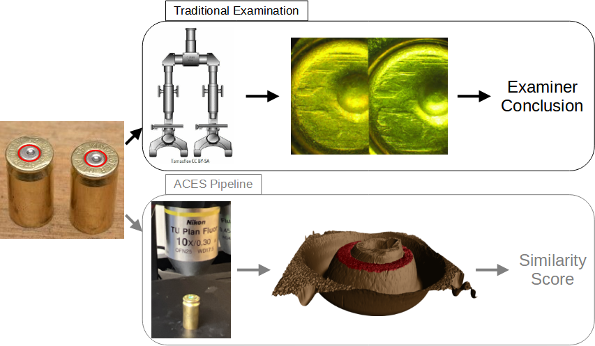
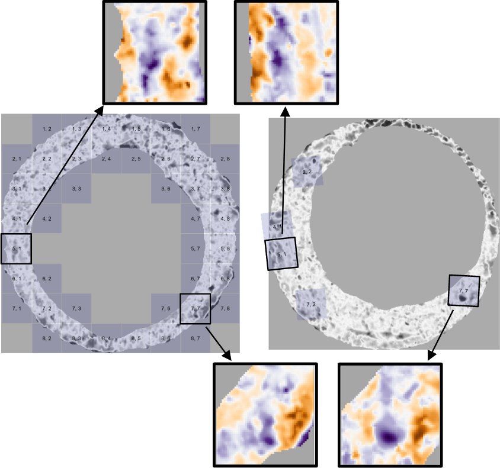

\newcommand{\hh}[1]{{\textcolor{orange}{#1}}}
\newcommand{\svp}[1]{{\textcolor{blue}{#1}}}
\newcommand{\jz}[1]{{\textcolor{olive}{#1}}}

```{r setup, include=FALSE}
options(prompt = 'R> ', continue = '+ ')
knitr::opts_chunk$set(echo = FALSE)
```

```{r load-libraries, cache = FALSE, include = FALSE}
library(cmcR) # remotes::install_github("csafe-isu/cmcR")
library(impressions) # remotes::install_github("jzemmels/impressions")
library(scored) # remotes::install_github("jzemmels/scored")

library(x3ptools)
library(tidyverse)
library(patchwork)
```

<!-- \hh{Generally for tables, no vertical lines.} -->

<!-- \hh{I think we need an overview picture to set the stage for an audience who is large unfamiliar with anything firearms related. How about you move up figure 1 and include (a) cartridge cases with an arrow pointing to the primer. (b) an image of the confocal light microscope taking an image of a cartridge case (c) a comparison microscope image (d) the marked up image (maybe even from the side). -->
<!-- I'm thinking of something along the lines of Xiao Hui's paper: https://www.semanticscholar.org/paper/Automatically-matching-topographical-measurements-a-Tai-Eddy/6532cc25b9104d42844418254641acdab01fadf8/figure/0} -->

# Introduction

A \emph{cartridge case} is the part of firearm ammunition that houses the projectile and propulsive device.
When a firearm is discharged and the projectile travels down the barrel, the cartridge case moves in the opposite direction and slams against the back wall, the \emph{breech face}, of the firearm.
Markings on the breech face are "stamped" into the surface of the cartridge case leaving so-called \emph{breech face impressions}.

In a traditional examination, forensic examiners use these impressions analogous to a fingerprint to determine whether two cartridge cases were fired from the same firearm.
The top of \autoref{fig:examination-algorithm-comparison} illustrates this procedure \citep{xiaoHui_seminar,Zheng2014,Vorburger2015}.
First, two cartridge cases are collected - perhaps one is from a crime scene and the other is collected from a suspect's gun.
An examiner places the two cartridge cases beneath a "comparison microscope" that merges the views of two compound microscopes into a single split view, similar to the side-by-side cartridge case image in \autoref{fig:examination-algorithm-comparison}.
The examiner assesses the degree of similarity between the markings on the cartridge cases and chooses one of four conclusions  \citep{AFTE1992}:

\begin{enumerate}
\item \textbf{Identification:} cartridge cases were fired from the same firearm

\item \textbf{Elimination:} cartridge cases were not fired from the same firearm

\item \textbf{Inconclusive:} the evidence is insufficient to make an identification or elimination

\item \textbf{Unsuitable:} the evidence is unsuitable for examination
\end{enumerate}


<!-- Forensic examinations measure the probative value of a piece of evidence. -->
<!-- Typically, a forensic examiner visually inspects the evidence to determine its source. -->

<!-- The "ground-truth" of a forensic comparison is a binary classification problem. -->
<!-- Briefly reference how comparisons are done by examiners currently. -->
<!-- Keep focus on firearm and toolmark evidence. -->

```{r,out.width="\\textwidth",echo=FALSE,fig.pos="htbp",fig.cap='\\label{fig:examination-algorithm-comparison} Comparison of the traditional examination vs. the currently proposed method for comparing cartridge cases. Both start with two fired cartridge cases. In traditional examination, an examiner uses a microscope to assess the "agreement" of markings on the two cartridge case surfaces. They decide whether or not the cartridge cases were fired from the same firearm, or if there is inconclusive evidence to decide. In the ACES algorithm, we take a topographical scan of the cartridge case surfaces and manually identify the regions containing distinguishable markings (shown in red). We pass these scans to the ACES algorithm, which processes and compares the two scans. The final result is a numerical measure of similarity of the two cartridge cases.'}

```

Critics of traditional forensic examinations cite a lack of "foundational validity" underlying the procedures used by firearm and toolmark examiners \citep{nas2009,pcast}.
In particular, examiners rely largely on their subjective findings rather than on a well-defined procedure to quantify similarity.
\citet{pcast} pushed for "developing and testing image-analysis algorithms" to objectively measure the similarity between cartridge cases.
An automatic comparison algorithm could supplement, inform, or dictate an examiner's conclusion \citep{swofford}.

We introduce a novel Automatic Cartridge Evidence Scoring (ACES) algorithm to objectively compare cartridge case evidence based on their breech face impressions.
Our algorithm encompasses all stages of the comparison procedure after collecting a scan of the cartridge case surface including preprocessing, comparing, and scoring.
Our ACES algorithm is available open-source as part of the [scored](https://jzemmels.github.io/scored/) R package.

In the following sections, we first review recently proposed algorithms to compare firearm evidence.
We then discuss the data collection procedure to obtain 510 cartridge scans used in training and validating the ACES algorithm.
To our knowledge, this is the largest published study of a cartridge case comparison algorithm to-date, with the next largest analyzing four different data sets totaling 195 cartridge cases \citep{chen_convergence_2017}.
After describing the ACES algorithm, we present summary results from training and testing three binary classifier models: base on a random forest, logistic regression, and classification tree.
We discuss the strengths and weaknesses of the three classifier models and compare the relative importance of the ACES features.
We also argue that the ACES algorithm combines the classification rules of previously proposed cartridge case comparison algorithms while incorporating additional nuance.
We conclude with our thoughts on how cartridge case comparison algorithms should be developed, validated, and shared going forward.

## Previous Work

Recent proposals for automatic cartridge case comparison algorithms borrow from image processing and computer vision techniques.
For example, \citet{vorburger_surface_2007} proposed using the cross-correlation function (CCF) to compare images or scans of cartridge case surfaces.
The CCF measures the similarity between two matrices for all possible translations of one matrix against the other.
Calculating the CCF while rotating one of the scans therefore allows for estimation of the optimal translation and rotation, together referred to as the \emph{registration}, between the two scans; simply choose the rotation/translation at which the CCF is maximized.
\citet{aoas} used the CCF, among other features, to compare scans of bullets.
\citet{tai_fully_2018} developed an open-source cartridge case comparison pipeline that compared cartridge case images using the CCF.

\citet{song_proposed_2013} noted that two matching cartridge cases often share similar impressions in specific regions, so calculating the CCF between two full scans may not highlight their similarities.
Instead, \citet{song_proposed_2013} proposed partitioning one cartridge case scan into a grid of "cells" and calculating the CCF between each cell and the other scan.
If two cartridge cases are truly matching, then the maximum CCF value between each cell and the other scan, particularly the cells containing distinguishable breech face impressions, should be relatively large.
Furthermore, the cells should "agree" on the registration at which the CCF is maximized.
\citet{song_proposed_2013} outlined the "Congruent Matching Cells" algorithm to determine the number of cells that agree on a particular registration.
A cell is classified as a Congruent Matching Cell (CMC) if its estimated registration is within some threshold of the median registration across all cells and its CCF value is above some threshold.
A number of follow-up papers proposed alterations to the the original CMC method \citep{tong_improved_2015,chen_convergence_2017}.
\citet{cmcR} introduced an open-source implementation of the CMC method in the cmcR R package.
As an alternative to defining Congruent Matching Cells, \citet{zhang_convergence_2021} proposed using a clustering algorithm from \citet{dbscan} to determine the number of cells in agreement on a specific registration.

Currently, there is no rigorous procedure for comparing different cartridge case comparison algorithms.
This includes selecting optimal parameters for a specific algorithm.
[Zemmels et al. (2022)] proposed an optimization criterion to select parameters for the CMC algorithm.
Analogously, \citet{aoas} developed a validation procedure to select parameters for a bullet comparison algorithm.
In this work, we introduce a novel cross-validation procedure to learn and test optimal parameters for the ACES algorithm.

# Cartridge Case Data

We use 510 cartridge cases collected as part of a study by \citet{baldwin}. 
The authors of the original study fired 800 Remington 9mm pistol cartridge cases from each of 25 new Ruger SR9, 9mm Luger centerfire pistols..
They separated the collected cartridge cases into 15 sets of four to be sent to each of 218 forensic examiner participants.
Each set of four consisted of three cartridge cases labeled as originating from the same firearm, the "known-match" cartridge cases.
Participants performed an examination to determine whether a fourth "questioned" cartridge case shared a common source with the known-match triplet (or whether the evidence was inconclusive).

\citet{baldwin} aimed to measure the false positive and false negative error rates of the 218 participants.
A false negative error occurs when truly matching cartridge cases, fired from the same firearm, are classified as non-matches.
Conversely, a false positive error occurs when non-matching cartridge cases are classified as matches.
The reported false negative error rate across all 218 examiners was 0.367% while the reported false positive error rate was 1.01%.
However, it should be noted that "inconclusive" decisions were treated as correct, no matter the ground-truth nature of the cartridge case set \citep{hofmann_inconclusives_2021}.

We scanned the 510 cartridge cases using the Cadre 3D-TopMatch High Capacity Scanner \citep{topmatch}.
Briefly, this scanner collects images under various lighting conditions of a gel pad into which the base of a cartridge case is impressed.
Proprietary software that accompanies this scanner combines these images into a 2D array called a \emph{surface matrix}.
The elements of a surface matrix represent the relative height values of the associated cartridge case surface.
This surface matrix, along with metadata concerning parameters under which the scan was taken (dimension, resolution, author, etc.), are stored in the ISO standard XML 3D Surface Profile (\texttt{x3p}) file type \citep{ISO25178-72}.

As discussed in the next section, our design differs from that used in \citet{baldwin}.
Rather than basing error rates on the comparison of three known-match cartridge cases to one questioned cartridge case (3 to 1), we consider the classification error rate of pairwise comparisons (1 to 1).
Further, we split the 510 cartridge cases by randomly selecting 10 of the 25 firearms for training and use the remaining 15 firearms for testing.
This resulted in a training set of 210 cartridge cases, $\binom{210}{2} = 21,945$ pairwise comparisons, and a testing set of 300 cartridge cases, $\binom{300}{2} = 44,850$ pairwise comparisons.

\jz{[cite eventual DFSC data-in-brief or ISU datashare repo?]}

# Methods

We now discuss the methods behind the Automatic Cartridge Evidence Scoring (ACES) algorithm. We divide the methods into three stages:

```{=tex}
\begin{enumerate}
\item \textbf{Preprocessing:} prepare cartridge case scans for comparison

\item \textbf{Comparing:} compare two cartridge cases and compute similarity features

\item \textbf{Scoring:} measure the similarity between the two cartridge cases using a trained classifier
\end{enumerate}
```

The following sections detail each of these stages.
Throughout, we treat "surface matrix" and "scan" synonymously.

The bottom of \autoref{fig:examination-algorithm-comparison} shows a summary of our procedure.
After taking a topographical scan of the cartridge case surfaces, we manually annotate the breech face impression region (shown in red).
ACES automatically preprocesses and compares the scans resulting in a similarity score, either a binary classification or class probability, derived from a classifier model.

## Preprocessing

We first use the open-source FiX3P web application \hh{cite Talen Fisher} to manually annotate the breech face impression region.
An example of a manually-annotated cartridge case scan is shown in \autoref{fig:examination-algorithm-comparison}.
The FiX3P software includes functionality to "paint" the surface of a cartridge case using a computer cursor and save the painted regions to a *mask.* A mask is a 2D array of hexidecimal color values of the same dimension as its associated surface matrix.
When initialized, every element of a mask is a shade of brown (#cd7f32) by default.
Any elements painted over by the user will be replaced with the user's selected color value.
In \autoref{fig:examination-algorithm-comparison}, the breech face impression region was manually annotated using a shade of red (#ff0000).

We preprocess the raw scans by applying a sequence of functions available in the R packages x3ptools \citep{x3ptools} and cmcR \citep{cmcR}.
\autoref{fig:preProcessEffect} shows the effect that each function has on the scan surface values.
Gray pixels in each plot represent missing values in the surface matrix.
The `x3p_delete` function removes values in the scan based on the associated mask.
Next, the `preProcess_removeTrend` function subtracts a fitted conditional median plane from the surface values to "level-out" any global tilt in the scan.
The `preProcess_gaussFilter()` function applies a bandpass Gaussian filter to remove small-scale noise and other large-scale structure, which better highlights the medium-scale breech face impressions.
Finally, the `preProcess_erode()` function applies the morphological operation of erosion on the edge of the non-missing surface values \jz{[cite erosion reference]}.
This has the effect of shaving-off values on the interior and exterior edge of the surface, which are often extreme "roll-off" values that unduly affect the comparing stage if not removed.
The final result is a cartridge case surface matrix with emphasized breech face impressions.

```{r,cache=TRUE,include=FALSE}
reference <- x3p_read("data/NIST_K013sA1.x3p")
target <- x3p_read("data/NIST_K013sA2.x3p")

reference$surface.matrix <- reference$surface.matrix*1e6
target$surface.matrix <- target$surface.matrix*1e6

reference_deleted <- reference %>%
  impressions::x3p_delete(mask_vals = "#CD7F32FF") %>%
  x3ptools::x3p_sample(m = 4)

reference_detrend <- reference %>%
  impressions::x3p_delete(mask_vals = "#CD7F32FF") %>%
  cmcR::preProcess_removeTrend(statistic = "quantile",
                               tau = .5,
                               method = "fn") %>%
  x3ptools::x3p_sample(m = 4)

reference_filtered <- reference %>%
  impressions::x3p_delete(mask_vals = "#CD7F32FF") %>%
  cmcR::preProcess_removeTrend(statistic = "quantile",
                               tau = .5,
                               method = "fn") %>%
  cmcR::preProcess_gaussFilter() %>%
  x3p_sample() %>%
  cmcR::preProcess_removeTrend(statistic = "quantile",
                               tau = .5,
                               method = "fn") %>%
  cmcR::preProcess_gaussFilter() %>%
  x3p_sample()

reference_eroded <- reference %>%
  impressions::x3p_delete(mask_vals = "#CD7F32FF") %>%
  cmcR::preProcess_removeTrend(statistic = "quantile",
                               tau = .5,
                               method = "fn") %>%
  cmcR::preProcess_gaussFilter() %>%
  x3p_sample() %>%
  cmcR::preProcess_removeTrend(statistic = "quantile",
                               tau = .5,
                               method = "fn") %>%
  cmcR::preProcess_gaussFilter() %>%
  x3p_sample() %>%
  cmcR::preProcess_erode(region = "interior",morphRadius = round(50/4)) %>% 
  cmcR::preProcess_erode(region = "exterior",morphRadius =  round(50/4)) %>%
  impressions::x3p_cropWS()

target_eroded <- target %>%
  impressions::x3p_delete(mask_vals = "#CD7F32FF") %>%
  cmcR::preProcess_removeTrend(statistic = "quantile",
                               tau = .5,
                               method = "fn") %>%
  cmcR::preProcess_gaussFilter() %>%
  x3p_sample() %>%
  cmcR::preProcess_removeTrend(statistic = "quantile",
                               tau = .5,
                               method = "fn") %>%
  cmcR::preProcess_gaussFilter() %>%
  x3p_sample() %>%
  cmcR::preProcess_erode(region = "interior",morphRadius = round(50/4)) %>% 
  cmcR::preProcess_erode(region = "exterior",morphRadius =  round(50/4)) %>%
  impressions::x3p_cropWS()
```


```{r,cache = FALSE,include=FALSE}
plts <- impressions::x3pPlot(reference_deleted,reference_detrend,reference_filtered,reference_eroded,
                             x3pNames = c("x3p_delete()","preProcess_removeTrend()",
                                          "preProcess_gaussFilter()","preProcess_erode()"),
                             type = "list",
                             legend.quantiles = c(0,.5,1)) %>%
  map(~ {
    . +
      theme(legend.position = "bottom") +
      ggplot2::guides(fill = ggplot2::guide_colourbar(barwidth = grid::unit(1.25, 
                                                                            "in"), 
                                                      barheight = grid::unit(.2,"in"),
                                                      label.theme = ggplot2::element_text(size = 6), 
                                                      title.theme = ggplot2::element_text(size = 8), 
                                                      title.vjust = .8,
                                                      frame.colour = "black",
                                                      ticks.colour = "black",
                                                      direction = "horizontal"), 
                      colour = "none") + 
      ggplot2::labs(fill = expression("Rel. Height ["*mu*"m]"))
  })

plt <- (plts[[1]] | plts[[2]] | plts[[3]] | plts[[4]])

ggsave(plot = plt,filename = "figures/preProcessEffect.png",width = 10,height = 5)
knitr::plot_crop("figures/preProcessEffect.png")
```


```{r,out.width="\\textwidth",echo=FALSE,fig.pos="htbp",fig.cap="\\label{fig:preProcessEffect} We apply a sequence of preprocessing functions to each scan. Each preprocessing step further emphasizes the breech face impressions in the scan."}
knitr::include_graphics("figures/preProcessEffect.png")
```

Next, we compute a set of similarity features for two preprocessed cartridge case scans.

## Comparing

In this section, we introduce a set of similarity features for two cartridge case scans.
We calculate features at two scales: between two full scans and between individual cells.
Analogous to how a forensic examiner uses a comparison microscope with different magnification levels, this allows us to assess the similarity between two scans at the macro and micro levels.

### Notational Conventions

First, we introduce notation that will be used to define the features.
Let $A$ and $B$ denote two surfaces matrices that we wish to compare.
For simplicity, we assume that $A,B \in \mathbb{R}^{k \times k}$ for $k > 0$.\footnote{This assumption of equally-sized, square matrices is easily enforced by padding the matrices with additional missing values.
Due to the presence of (structurally) missing values around the breech face impression region, additional padding does not interfere with the structure of the scan.}
We use lowercase letters and subscripts to denote a particular value of a matrix: $a_{ij}$ is the value in the $i$-th row and $j$-th column, starting from the top-left corner, of matrix $A$.
We refer to the two known-match cartridge cases in \autoref{fig:matchPair} as exemplar matrices $A$ and $B$.

To accommodate structurally missing values, we adapt standard matrix algebra as follows: if an element of either matrix $A$ or $B$ is missing, then any element-wise operation including this element is also missing.
Standard matrix algebra holds for non-missing elements.
For example, the addition operator is defined as:
\begin{align*}
A \oplus_{NA} B = (a_{ij} \oplus_{NA} b_{ij})_{1 \leq i,j \leq k} = 
\begin{cases}
a_{ij} + b_{ij} & \text{if both $a_{ij}$ and $b_{ij}$ are numbers} \\
NA &\text{otherwise}
\end{cases}
\end{align*}
Other element-wise operations such as $\ominus_{NA}$ are defined similarly.
For readability, we will use standard operator notation $+, -, >, <, I(\cdot), ...$ and assume the extended, element-wise operations as defined above.


```{r,cache=FALSE,include=FALSE}
plt <- impressions::x3pPlot(reference_eroded,target_eroded,x3pNames = c("Scan A","Scan B"),legendLength = grid::unit(4, "in"))

ggsave(filename = "figures/matchPair.png",plot = plt,height = 7,width = 10)
knitr::plot_crop("figures/matchPair.png")
```


```{r,out.width="\\textwidth",echo=FALSE,fig.pos="htbp",fig.cap="\\label{fig:matchPair} A matching pair of processed cartridge case scans. We measure the similarity between these cartridge cases using the distinguishable breech face impressions on their surfaces."}
knitr::include_graphics("figures/matchPair.png")
```

### Registration Estimation

A critical step in comparing $A$ and $B$ is to find a transformation of $B$ such that it aligns best to $A$ (or vice versa).
In image processing, this is called *image registration.* 
Noting that $A$ and $B$ are essentially grayscale images with structurally missing values, we rely on a standard image registration technique \citep{Brown1992}.

In our application, a registration is composed of a discrete translation by $(m,n) \in \mathbb{Z}^2$ and rotation by $\theta \in [-180^\circ,180^\circ]$.
To determine the optimal registration, we calculate the *cross-correlation function* (CCF) between $A$ and $B$, which measures the similarity between $A$ and $B$ for every possible translation of $B$, denoted $(A \star B)$.
We estimate the registration by calculating the maximum CCF value across a range of rotations of matrix $B$.
Let $B_\theta$ denote $B$ rotated by an angle $\theta \in [-180^\circ,180^\circ]$ and $b_{\theta_{mn}}$ the $m,n$-th element of $B_\theta$.
Then the estimated registration $(m^*,n^*,\theta^*)$ is: 

\begin{align*}
(m^*,n^*,\theta^*) = \arg \max_{m,n,\theta} (a \star b_\theta)_{mn}.
\end{align*} 

In practice we consider a discrete grid of rotations $\pmb{\Theta} \subset [-180^\circ,180^\circ]$.
The registration procedure is outlined in \autoref{alg:registration}.
We refer to the matrix that is rotated as the "target."
The result is the estimated registration of the target matrix to the "source" matrix.

```{=tex}
\begin{algorithm}[htbp]
\KwData{Source matrix $A$, target matrix $B$, and rotation grid $\pmb{\Theta}$}
\KwResult{Estimated registration of $B$ to $A$, $(m^*,n^*,\theta^*)$, and cross-correlation function maximum, $CCF_{\max}$}
\For{$\theta \in \pmb{\Theta}$}{
Rotate $B$ by $\theta$ to obtain $B_\theta$\;
Calculate $CCF_{\max, \theta} = \max_{m,n} (a \star b_{\theta})_{mn}$\;
Calculate translation $[m^*_\theta,n^*_\theta] = \arg \max_{m,n} (a \star b_{\theta})_{mn}$
}
Calculate overall maximum correlation $CCF_{\max} = \max_{\theta} \{CCF_{\max,\theta} : \theta \in \pmb{\Theta}\}$\;
Calculate rotation $\theta^* = \arg \max_{\theta} \{CCF_{\max,\theta} : \theta \in \pmb{\Theta}\}$\;
\Return{Estimated rotation $\theta^*$, translation $m^* = m^*_{\theta^*}$ and $n^* = n^*_{\theta^*}$, and $CCF_{\max}$}
\caption{Image Registration Procedure}
\label{alg:registration}
\end{algorithm}
```


To accommodate missing values, we also compute the *pairwise-complete correlation* using only the complete value pairs, meaning neither value is missing, between $A$ and $B$.

### Registration-Based Features

#### Full-Scan Registration

We first estimate the registration between two full scans $A$ and $B$ using \autoref{alg:registration} with a rotation grid $\pmb{\Theta} = \{-30^\circ, -27^\circ,...,27^\circ,30^\circ\}$.
This results in an estimated registration $(m^*,n^*,\theta^*)$ and similarity measure $CCF_{\max}$.
We also perform \autoref{alg:registration} with the roles of $A$ and $B$ reversed, meaning the target scan $A$ is aligned to source scan $B$.

To accommodate these two comparison directions, we introduce a new subscript $d = A,B$, referring to the source scan in \autoref{alg:registration}.
Consequently, we obtain two sets of sets of estimated registrations, $(m^*_d,n^*_d,\theta^*_d)$ and $CCF_{\max,d}$, for $d=A,B$.\footnote{In reality, the true aligning registrations in the two comparison directions are opposites of each other. However, because we compare discretely-indexed arrays using a nearest-neighbor interpolation scheme, the estimated registrations differ slightly.}
For $d = A$, we then apply the registration transformation $(m^*_A,n^*_A,\theta^*_A)$ to $B$ to obtain $B^*$ and compute the pairwise-complete correlation, $cor_{\text{full},A}$, between $A$ and $B^*$.
We repeat this in the other comparison direction to obtain $cor_{\text{full},B}$ and average the two:
\begin{align*}
cor_{\text{full}} = \frac{1}{2}\left(cor_{A,\text{full}} + cor_{B,\text{full}}\right).
\end{align*}
We assume that the **full-scan pairwise-complete correlation** is large for truly matching cartridge cases.

<!-- \hline -->
<!-- $CCF_{\max}$ & Maximum value of the cross-correlation function across a grid of rotations \\ -->

#### Cell-Based Registration

We next perform a cell-based comparison procedure, which begins with selecting one of the matrices, say $A$, as the "source" matrix that is partitioned into a grid of cells.
The left side of \autoref{fig:cellGridExample} shows an example of such a cell grid overlaid on a scan.
Each of these source cells will be compared to the "target" matrix, in this case $B^*$.
Because $A$ and $B^*$ are already partially aligned from the full-scan registration procedure, we compare each source cell to $B^*$ using a new rotation grid of $\pmb{\Theta}'_A = \{\theta^*_A - 2^\circ, \theta^*_A - 1^\circ,\theta^*_A,\theta^*_A + 1^\circ,\theta^*_A + 2^\circ\}$.

We now extend the surface matrix notation introduced previously to accommodate cells.
Let $A_{t}$ denote the $t$-th cell of matrix $A$, $t = 1,...,T_A$ where $T_A$ is the total number of cells containing non-missing values in scan $A$ (e.g., $T_A = 43$ in \autoref{fig:cellGridExample}) and let $(a_t)_{ij}$ denote the $i,j$-th element of $A_t$.

The cell-based comparison procedure is outlined in \autoref{alg:cellComparison}.

```{=tex}
\begin{algorithm}[H]
\KwData{Source matrix $A$, target matrix $B^*$, grid size $R \times C$, and rotation grid $\pmb{\Theta}'_A$}
\KwResult{Estimated translations and $CCF_{\max}$ values per cell, per rotation}
Partition $A$ into a grid of $R \times C$ cells\;
Discard cells containing only missing values, leaving $T_A$ remaining cells\;
\For{$\theta \in \pmb{\Theta}'_A$}{
Rotate $B^*$ by $\theta$ to obtain $B^*_\theta$\;
\For{$t = 1,...,T_A$}{
Calculate $CCF_{\max, A,t,\theta} = \max_{m,n} (a_t \star b^*_\theta)_{mn}$\;
Calculate translation $[m^*_{A,t,\theta},n^*_{A,t,\theta}] = \arg \max_{m,n} (a_t \star b^*_\theta)_{mn}$
}
}
\Return{$\pmb{F}_A = \{(m^*_{A,t,\theta},n^*_{A,t,\theta}, CCF_{\max,A,t,\theta}, \theta) : \theta \in \pmb{\Theta}'_A, t = 1,...,T_A\}$}
\caption{Cell-Based Comparison Procedure}
\label{alg:cellComparison}
\end{algorithm}
```

Rather than exclusively returning the registration that maximizes the overall CCF as in \autoref{alg:registration}, \autoref{alg:cellComparison} returns the set $\pmb{F}_A$ of translations and CCF values for each cell and each rotation considered.

```{r,out.width="\\textwidth",echo=FALSE,fig.pos="htbp",fig.cap="\\label{fig:cellGridExample} Estimated registrations of cells from a non-match pair of cartridge cases. A source scan (left) is separated into an $8 \\times 8$ grid of cells. We exclude cells containing only missing values (visualized here as gray pixels). Each source cell is compared to a target scan (right) to estimate where it aligns best. We show a handful of cells at their estimated alignment in the target scan and magnify the surfaces captured by cell pairs 5, 1 and 7, 7. Although the cartridge case pair is non-matching, we note that there are similarities in the surface markings for these cell pairs."}

```

\autoref{fig:cellGridExample} shows the estimated registrations of cells between two non-match cartridge cases.
We magnify the surface values captured by cell pairs 5, 1 and 7, 7 and note the similarities in the surface values; for example, the dark purple region in the middle of the cell 7, 7 pair.

Just as with the whole-scan registration, we calculate the pairwise-complete correlation between each cell $A_t$ and a matrix $B_{\theta,t}^*$ of the same size extracted from $B^*_{\theta}$ after translating by $[m^*_{A,\theta},n^*_{A,\theta}]$.
From this we obtain a set of pairwise-complete correlations for each cell and rotation: $\{cor_{A,t,\theta} : t = 1,...,T_A, \theta \in \pmb{\Theta}'_A\}$.

We repeat \autoref{alg:cellComparison} and the pairwise-complete correlation calculation using $B$ as the source scan and $A^*$ as the target, resulting in cell-based registration set $\pmb{F}_B$ and pairwise-complete correlations $\{cor_{B,t,\theta} : t = 1,...,T_B, \theta \in \pmb{\Theta}'_B\}$.

For $d = A,B$ and $t = 1,...,T_d$, define the cell-wise maximum pairwise-complete correlation as: 
\begin{align*}
cor_{d,t} &= \max_{\theta} \{cor_{d,t,\theta} : \theta \in \pmb{\Theta}'_d\}
\end{align*}

We compute two features, the \textbf{average} and \textbf{standard deviation of the cell-based pairwise-complete correlations}, using the correlation data: 
\begin{align*}
\overline{cor}_{\text{cell}} &= \frac{1}{T_A + T_B} \sum_{d \in \{A,B\}} \sum_{t=1}^{T_d} cor_{d,t} \\
s_{cor} &= \sqrt{\frac{1}{T_A + T_B - 1} \sum_{d \in \{A,B\}} \sum_{t=1}^{T_d} (cor_{d,t} - \overline{cor}_{\text{cell}})^2}
\end{align*} 

We expect $\overline{cor}_{\text{cell}}$ and $s_{cor}$ to be large for truly matching cartridge case pairs relative to non-matching pairs.

For $d = A,B$ and $t = 1,...,T_d$, define the per-cell estimated translations and rotation as: 
\begin{align*}
\theta^*_{d,t} &= \arg \max_{\theta} \{CCF_{\max,d,t,\theta} : \theta \in \pmb{\Theta}'_d\} \\
m^*_{d,t} &= m^*_{\theta^*_{d,t},d,t} \\
n^*_{d,t} &= n^*_{\theta^*_{d,t},d,t}
\end{align*} 

We compute the \textbf{standard deviation of the cell-based estimated registrations} using the estimated translations and rotations: 
\begin{align*}
s_{\theta^*} =  \sqrt{\frac{1}{T_A + T_B - 1} \sum_{d \in \{A,B\}} \sum_{t=1}^{T_d} (\theta^*_{d,t} - \bar{\theta}^*)^2} \\
s_{m^*} =  \sqrt{\frac{1}{T_A + T_B - 1} \sum_{d \in \{A,B\}} \sum_{t=1}^{T_d} (m^*_{d,t} - \bar{m}^*)^2} \\
s_{n^*} = \sqrt{\frac{1}{T_A + T_B - 1} \sum_{d \in \{A,B\}} \sum_{t=1}^{T_d} (n^*_{d,t} - \bar{n}^*)^2}
\end{align*} 
where 
\begin{align*}
\bar{m}^* &= \frac{1}{T_A + T_B} \sum_{d \in \{A,B\}}\sum_{t=1}^{T_d} m^*_{d,t} \\
\bar{n}^* &= \frac{1}{T_A + T_B} \sum_{d \in \{A,B\}} \sum_{t=1}^{T_d} n^*_{d,t} \\
\bar{\theta}^* &= \frac{1}{T_A + T_B} \sum_{d \in \{A,B\}} \sum_{t=1}^{T_d} \theta^*_{d,t}.
\end{align*}
We expect $s_{\theta^*}, s_{m^*},s_{n^*}$ to be small for truly matching cartridge case pairs relative to non-matching pairs.

From the full-scan and cell-based registration procedures, we obtain six features summarized in \autoref{tab:registrationFeatures}.

```{=tex}
\begin{table}[htbp]
\centering
\begin{tabular}{p{.11\linewidth} p{.7\linewidth}}
$cor_{\text{full}}$ & Full-scan pairwise-complete correlation \\
$\overline{cor}_{\text{cell}}$ & Average cell-based pairwise-complete correlation \\
$s_{cor}$ & Standard deviation of the cell-based pairwise-complete correlations \\
$s_{m^*}$ & Standard deviation of the cell-based vertical translations \\
$s_{n^*}$ & Standard deviation of the cell-based horizontal translations \\
$s_{\theta^*}$ & Standard deviation of the cell-based rotations
\end{tabular}
\caption{Six similarity features based on registering full scans and cells.}
\label{tab:registrationFeatures}
\end{table}
```


<!-- \hline -->
<!-- $\overline{CCF}_{\max, \cdot}$ & Average maximum value of the cross-correlation function across all cells and rotations \\ -->
<!-- \hline -->
<!-- $s_{CCF}^2$ & Sample variance of the maximum CCF values across all cells \\ -->

### Density-Based Features

We wish to identify when multiple cells agree on, or cluster around, a particular registration value.
However, pursuant with the notion that only certain regions of matching cartridge cases contain distinctive markings, it is unreasonable to assume and empirically rare that \emph{all} cells agree on a single registration.
In fact, it is common for many cells to disagree on a registration.
For example, the left scatterplot in \autoref{fig:dbscanScatterplot} shows the per-cell estimated translations $[m^*_{A,t,\theta}, n^*_{A,t,\theta}]$ when scan $A$ is used as source and $B^*$ as target rotated by $\theta = 3^\circ$.
The right scatterplot shows the per-cell estimated translations with the roles of $A$ and $B^*$ reversed for $\theta = -3^\circ$.
We see distinctive clusters, the black points, in both plots among many noisy, gray points.
The task is to isolate the clusters amongst such noise.

We use the Density-Based Spatial Clustering of Applications with Noise (DBSCAN) algorithm proposed by \citet{dbscan} to identify clusters.
Compared to other clustering algorithms such as k-means \citep{MacQueen1967}, DBSCAN does not require a pre-defined number of expected clusters.
Instead, the algorithm forms clusters if the number of points within an $\epsilon > 0$ distance of a point exceeds some pre-defined threshold, $minPts > 1$.
If a point does not belong to a cluster, then DBSCAN labels that point as "noise."
In \autoref{fig:dbscanScatterplot}, we use DBSCAN with $\epsilon = 5$ and $minPts = 5$ to identify clusters of size 14 and 13, respectively, visualized as black points.
These cluster sizes suggest that the scans match.
Additionally, the mean cluster centers are approximately opposites of each other: $(\hat{m}_A,\hat{n}_A,\hat{\theta}_A) \approx (16.9, -16.7, 3^\circ)$ when $A$ is used as source compared to $(\hat{m}_B,\hat{n}_B,\hat{\theta}_B) \approx (-16.2, 16.8, -3^\circ)$ when $B^*$ is used as source.
This provides further evidence of a match.

```{r,include=FALSE}
load("data/compData.RData")
```


```{r,cache=FALSE,include=FALSE}
estimRotations <- compData %>%
  group_by(direction,theta) %>%
  group_split() %>%
  map_dfr(function(dat){
    
    densEstim <- MASS::kde2d(x = dat$x,y = dat$y,n = 100)
    
    data.frame(maxDens = max(c(densEstim$z)),
               theta = unique(dat$theta),
               direction = unique(dat$direction))
    
  }) %>%
  group_by(direction) %>%
  dplyr::top_n(n = 1,wt = maxDens) %>%
  select(direction,theta) %>%
  rename(thetaHat = theta)

plt1 <- compData %>%
  select(-c(cellHeightValues,alignedTargetCell)) %>%
  left_join(estimRotations,by = "direction") %>%
  filter(theta == thetaHat) %>%
  mutate(direction = factor(direction,labels = c("Scan A vs. Scan B*","Scan B* vs. Scan A")),
         label = paste0(direction,", Rotation: ",theta)) %>%
  filter(direction == "Scan A vs. Scan B*") %>%
  group_by(label) %>%
  group_split() %>%
  map_dfr(function(dat){
    
    dat %>%
      mutate(clust = dbscan::dbscan(x = dat %>% select(x,y),eps = 5,minPts = 5)$cluster,
             clust = factor(ifelse(clust == 0,0,1),labels = c("Noise","Cluster")))
    
  }) %>%
  ggplot(aes(x=x,y,y,colour = clust)) +
  # geom_point() +
  geom_jitter(width = 3,height = 3,size = 1) +
  coord_fixed(expand = TRUE) +
  facet_wrap(~ label,nrow = 1) +
  theme_bw() +
  labs(x = "horizontal shift n",
       y = "vertical shift m",
       colour = "DBSCAN") +
  theme(axis.text = element_text(size = 6),
        legend.position = "bottom") +
  geom_vline(xintercept = 0,linetype = "dashed") +
  geom_hline(yintercept = 0,linetype = "dashed") +
  scale_colour_manual(values = c("gray65","black")) +
  xlim(c(-100,100)) +
  ylim(c(-100,100)) +
  theme(legend.position = "none")

plt2 <- compData %>%
  select(-c(cellHeightValues,alignedTargetCell)) %>%
  left_join(estimRotations,by = "direction") %>%
  filter(theta == thetaHat) %>%
  mutate(direction = factor(direction,labels = c("Scan A vs. Scan B*","Scan B* vs. Scan A")),
         label = paste0(direction,", Rotation: ",theta)) %>%
  filter(direction == "Scan B* vs. Scan A") %>%
  group_by(label) %>%
  group_split() %>%
  map_dfr(function(dat){
    
    dat %>%
      mutate(clust = dbscan::dbscan(x = dat %>% select(x,y),eps = 5,minPts = 5)$cluster,
             clust = factor(ifelse(clust == 0,0,1),labels = c("Noise","Cluster")))
    
  }) %>%
  ggplot(aes(x=x,y,y,colour = clust)) +
  # geom_point() +
  geom_jitter(width = 3,height = 3,size = 1) +
  coord_fixed(expand = TRUE) +
  facet_wrap(~ label,nrow = 1) +
  theme_bw() +
  labs(x = "(negative) horizontal shift n",
       y = "(negative) vertical shift m",
       colour = "DBSCAN") +
  theme(axis.text = element_text(size = 6),
        legend.position = "bottom") +
  geom_vline(xintercept = 0,linetype = "dashed") +
  geom_hline(yintercept = 0,linetype = "dashed") +
  scale_colour_manual(values = c("gray65","black")) +
  scale_x_reverse(limits = c(100,-100)) +
  scale_y_reverse(limits = c(100,-100)) +
  theme(legend.position = "none")

pltLegend <- plt1 %>%
  cowplot::get_legend() %>%
  cowplot::plot_grid()

ggsave(filename = "figures/dbscanScatterplot.png", plot = plt1+plt2, 
       width = 8, height = 4)
knitr::plot_crop("figures/dbscanScatterplot.png")
```


```{r,out.width=".8\\textwidth",echo=FALSE,fig.pos="htbp",fig.cap="\\label{fig:dbscanScatterplot} Cluster assignments based on the Density Based Spatial Clustering with Applications to Noise (DBSCAN) algorithm for estimated translations in two comparison directions. Using scan $A$ as source results in a cluster of size 14 (left) compared to 13 when scan $B^*$ is used as source (right). Noting the reversed axes in the right plot, we see that the clusters are located approximately opposite of each other. Points are jittered for visibility."}
knitr::include_graphics("figures/dbscanScatterplot.png")
```

To calculate the density-based features, we first use a 2D kernel density estimator \citep{MASS} to identify the rotation $\hat{\theta}_d$ at which the per-cell translations achieve the highest density.
Next, we compute clusters using the DBSCAN algorithm amongst the estimated translations $\{(m^*_{d,t,\hat{\theta}_d},n^*_{d,t,\hat{\theta}_d}) : t = 1,...,T_d\}$ like those shown in \autoref{fig:dbscanScatterplot}.\footnote{If more than one cluster is identified, we binarize the points based on whether they were assigned to any cluster or if they are a noise point and proceed as if there is only one cluster. We assume that two or more clusters form only because of the course rotation grid considered. Were a finer grid used, the points would coalesce into a single cluster around the true translation value. This assumption has empirical support through our experimentation.} 
Let $\pmb{C}_d$ denote the set of cells in the DBSCAN cluster.
We treat the mean cluster centers as the estimated translations $[\hat{m}_d,\hat{n}_d]$.

We calculate four features from the density-based clustering procedure: \textbf{average DBSCAN cluster size} $C$, the \textbf{DBSCAN cluster indicator} $C_0$, and the \textbf{root sum of squares of the density-estimated registrations} $(\Delta_\theta, \Delta_{\text{trans}})$ defined as:
\begin{align*}
C &= \frac{1}{2}\left(|\pmb{C}_A| + |\pmb{C}_B|\right) \\
C_0 &= I(|\pmb{C}_A| > 0 \text{ and } |\pmb{C}_B| > 0)\\
\Delta_\theta &= |\hat{\theta}_A + \hat{\theta}_B| \\
\Delta_{\text{trans}} &= \sqrt{(\hat{m}_A + \hat{m}_B)^2 + (\hat{n}_A + \hat{n}_B)^2}
\end{align*} where $|\pmb{C}_d|$ denotes the cardinality of $\pmb{C}_d$ and $I(\cdot)$ is the identity function equal to 1 if the predicate argument "$\cdot$" evaluates to TRUE and 0 otherwise.
We use both $C$ and $C_0$ because of potential missingness in the values of $C$ if no cluster is identified.
Missing $C$ values are imputed using the median non-missing value when fitting classifiers, so the missingness information is retained in $C_0$.

For truly matching cartridge case pairs, we expect $C$ to be large, $C_0$ to be 1, and $\Delta_\theta, \Delta_{\text{trans}}$ to be small relative to non-matching pairs. We obtain four density-based features summarized in \autoref{tab:dbscanFeatures}.

```{=tex}
\begin{table}[htbp]
\centering
\begin{tabular}{p{.11\linewidth} p{.7\linewidth}}
$C$ & Average DBSCAN cluster size \\
$C_0$ & DBSCAN cluster indicator \\
$\Delta_\theta$ & Absolute sum of the density-estimated rotations  \\
$\Delta_{\text{trans}}$ & Root sum of squares of the cluster-estimated translations
\end{tabular}
\caption{Four similarity features based on the density-based clustering procedure.}
\label{tab:dbscanFeatures}
\end{table}
```

### Visual Diagnostic Features

The final set of features we calculate are based on visual diagnostic tools described in [Zemmels et al. (2023)].
These numerical features quantify the qualitative observations one can make from the diagnostics.

To create the visual diagnostics, we perform element-wise matrix operations.
For a matrix $X \in \mathbb{R}^{k \times k}$ and Boolean-valued condition matrix $cond: \mathbb{R}^{k \times k} \to \{TRUE,FALSE\}^{k \times k}$, we define an element-wise filter operation $\mathcal{F}: \mathbb{R}^{k \times k} \to \mathbb{R}^{k \times k}$ as:
\begin{align*}
\mathcal{F}_{cond}(X) = 
(f_{ij})_{1 \leq i,j \leq k} =
\begin{cases}
x_{ij} &\text{if $cond$ is $TRUE$ for element $i,j$} \\
NA &\text{otherwise}
\end{cases}
\end{align*}
Of particular interest in our application is the (absolute) difference between surface matrices.
For example, $\mathcal{F}_{|A - B^*| > \tau}(A)$ contains elements of matrix $A$ where the pair of scans $A$ and $B^*$ deviate by at least $\tau > 0$.
Surface values in $A$ and $B^*$ that are "close," meaning within $\tau$ distance, to each other are replaced with $NA$ in this filtered matrix.

First, we calculate the correlation $cor_{d,\text{full},\text{diff}}$ between the filtered matrices $\mathcal{F}_{|A - B^*| > \tau}(A)$ and $\mathcal{F}_{|A - B^*| > \tau}(B^*)$ for $d = A$ and $\mathcal{F}_{|A^* - B| > \tau}(A^*)$ and $\mathcal{F}_{|A^* - B| > \tau}(B)$ for $d = B$.
We use the average \textbf{full-scan differences correlation} as a feature:
\begin{align*}
cor_{\text{full},\text{diff}} = \frac{1}{2}\left(cor_{A,\text{full},\text{diff}} + cor_{B,\text{full},\text{diff}}\right).
\end{align*}

We assume that $cor_{\text{full},\text{diff}}$ will be large for matching cartridge case pairs relative to non-matching pairs.
Said another way, we assume that regions of matching cartridge cases that are different will still follow similar trends.
This can occur due to variability in the amount of contact between a cartridge case and breech face across multiple fires of a single firearm.
We calculate the correlation by vectorizing the two filtered surface matrices and treating missing values by case-wise deletion.

As before, we extend our notation to accommodate cell comparisons $t = 1,...,T_d$ for $d = A,B$ using subscripts: $cor_{d,t,\text{diff}}$.
For example, $cor_{A,t,\text{diff}}$ is the correlation between cell filtered surface matrices $\mathcal{F}_{|A_t - B_{t,\theta_t^*}^*| > \tau}(A_t)$ and $\mathcal{F}_{|A_t - B_{t,\theta_t^*}^*| > \tau}(B_{t,\theta_t^*}^*)$ where $B_{t,\theta_t^*}^*$ is the matrix extracted from $B^*$ that maximizes the CCF with $A_t$.
We calculate the \textbf{average cell-based differences correlation} across all cells and both directions:
\begin{align*}
\overline{cor}_{\text{cell},\text{diff}} &= \frac{1}{T_A + T_B} \sum_{d \in \{A,B\}} \sum_{t=1}^{T_d} cor_{d,t,\text{diff}}
\end{align*}

<!-- s_{cor_{diff,\cdot}}^2 &= \frac{1}{T-1} \sum_{t=1}^T (cor_{diff,t} - \overline{cor}_{diff,\cdot})^2. -->

Next, we consider features based on the elements of the Boolean $cond$ matrix.
Consider \autoref{fig:filterLabeling} that shows the filtered element-wise average $\mathcal{F}_{|A - B^*| < \tau}\left(\frac{1}{2}(A + B^*)\right)$ on the left and the associated $cond$ matrix $|A - B^*| > \tau$ visualized in black-and-white in the middle with filtered elements, whose $cond$ value is $TRUE$, shown in white.

We first calculate the ratio between such a $cond$ matrix and its complement.
For $d = A$, we consider the $cond$ matrices $|A - B^*| \leq \tau$ and $|A - B^*| > \tau$.
The ratio is given by
\begin{align*}
r_{d} = \frac{\pmb{1}^T I(|A - B^*| \leq \tau) \pmb{1}}{\pmb{1}^T I(|A - B^*| > \tau) \pmb{1}}
\end{align*}
where $\pmb{1} \in \mathbb{R}^k$ is a column vector of ones and $I(\cdot)$ is the element-wise, matrix-valued indicator function.
We consider the average \textbf{full-scan similarities vs. differences ratio} across the two comparison directions:
\begin{align*}
r_{\text{full}} = \frac{1}{2}(r_A + r_B).
\end{align*}
We expect $r_{\text{full}}$ to be large for matching pairs compared to non-matching pairs.
That is, truly matching pairs will have more similarities than differences.

We also calculate features based on the ratio for cell comparisons $t = 1,...,T_d$, $d = A,B$.
Let $r_{d,t}$ denote the ratio for cell comparison $t$ in direction $d$.
We consider the \textbf{average} and \textbf{standard deviation of the cell-based similarities vs. differences ratio}:
\begin{align*}
\bar{r}_{\text{cell}} &= \frac{1}{T_A + T_B} \sum_{d \in \{A,B\}} \sum_{t = 1}^{T_d} r_{d,t} \\
s_{\text{cell}, r} &= \sqrt{\frac{1}{T_A + T_B - 1} \sum_{d \in \{A,B\}} \sum_{t = 1}^{T_d} (r_{d,t} - \bar{r}_{\text{cell}})^2}.
\end{align*}
We expect $\bar{r}_{\text{cell}}$ and $s_{\text{cell}, r}$ to be large for matching cartridge case pairs relative to non-match pairs.

Another aspect of the $cond$ matrix we consider is the size of the individual filtered regions.
For two matching cartridge cases, we expect that there are few differences compared to similarities \emph{and} that the different regions are relatively small.
We use a connected components labeling algorithm detailed in \citet{Haralock1991ComputerAR} to identify individual "neighborhoods" of filtered elements.
More precisely, the algorithm returns a set of sets $\pmb{S}_d = \{S_{d,1},S_{d,2},...,S_{d,L_d}\}$ where each $S_{d,l}$ is a set of indices of the $cond$ matrix that have a value of $TRUE$ and are connected by a chained-together sequence of 4 (Rook's) neighborhoods.
The right side of \autoref{fig:filterLabeling} shows each $S_{d,l}$ distinguished by different fill colors, $l = 1,...,L_d$.

```{r,include=FALSE,cache = FALSE}
load("data/compData_fullScans.RData")

scanA <- compData_fullScans %>%
  filter(direction == "comparison_refToTarget") %>%
  pull(cellHeightValues) %>%
  .[[1]]

scanBStar <- compData_fullScans %>%
  filter(direction == "comparison_refToTarget") %>%
  pull(alignedTargetCell) %>%
  .[[1]]

scanA$surface.matrix <- (scanA$surface.matrix*scanA$cmcR.info$scaleByVal + scanA$cmcR.info$centerByVal)

scanBStar$surface.matrix <- (scanBStar$surface.matrix*scanBStar$cmcR.info$scaleByVal + scanBStar$cmcR.info$centerByVal)

compPlt <- impressions::x3p_comparisonPlot(
  x3p1 = scanA,
  x3p2 = scanBStar,
  plotLabels = c("Scan A","Scan B*","Filtered Element-wise\nAverage",
                 "Scan A\nFiltered\nDifferences","Scan B*\nFiltered\nDifferences"),
  labelSize = 2.5,
  legendLength = grid::unit(4,"in"),
  legendHoriz = -1.3,
  legendQuantiles = c(0,.01,.05,.5,.95,.99,1))

plt1 <- ggplot_build(compPlt$patches$plots[[3]])

plt1 <- plt1$data[[2]] %>%
  ggplot(aes(x=x,y=y,fill=fill)) +
  geom_raster() +
  scale_fill_identity() +
  coord_fixed(expand = FALSE) +
  theme_void() +
  geom_path(data = plt1$data[[4]],
            aes(x=x,y=y,group=group),
            size = .2,
            colour = "gray40",
            inherit.aes = FALSE)

scanFilterBinarized <- scanA %>% 
  impressions::x3p_elemAverage(scanBStar) %>%
  impressions::x3p_to_dataFrame() %>%
  mutate(value = (abs(c({scanA$surface.matrix - scanBStar$surface.matrix})) > x3p_sd(scanA,scanBStar)))

plt2 <- scanFilterBinarized %>%
  ggplot(aes(x=x,y=y,fill=value)) +
  geom_raster() +
  scale_fill_manual(values = c("black","white"),na.value = "gray65") +
  coord_fixed(expand = FALSE) +
  theme_void() +
  theme(legend.position = "none")


scanFilterLabeled <- scanFilterBinarized %>%
  mutate(x = x + 1,y = y + 1,
         value = ifelse(!value | is.na(value),0,1)) %>%
  imager::as.cimg() %>%
  imager::label() %>%
  as.data.frame() %>%
  mutate(value = factor(value))

plt3 <- scanFilterLabeled %>%
  ggplot(aes(x=x,y=y,fill=value)) +
  geom_raster() +
  coord_fixed(expand = FALSE) +
  theme_void() +
  theme(legend.position = "none") +
  scale_fill_manual(values = c("gray65",sample(RColorBrewer::brewer.pal(12,"Paired"),size = length(unique(scanFilterLabeled$value)) - 1,replace = TRUE)))

plt <- (plt1 | plt2 | plt3) & theme(panel.border = element_rect(colour = "black",fill = NA))
```

```{r,include=FALSE}
ggsave(plot = plt,filename = "figures/filterLabeling.png")
knitr::plot_crop("figures/filterLabeling.png")
```


```{r,out.width="\\textwidth",echo=FALSE,fig.pos="htbp",fig.cap='\\label{fig:filterLabeling} (Left) After aligning two scans, we filter regions that are "different" from each other, meaning the absolute difference between surface values is larger than some threshold. (Middle) We binarize the scan into "filtered" or "non-filtered" regions - shown in white and black, respectively. (Right) Using a connected components labeling algorithm, we identify connected "neighborhoods" of filtered elements. We assume that these neighborhoods will be small, on average, if comparing truly matching cartridge cases.'}
knitr::include_graphics("figures/filterLabeling.png")
```

We calculate the following features using the full-scan labeled neighborhoods:
\begin{align*}
\overline{|S|}_{\text{full}} &= \frac{1}{L_A + L_B} \sum_{d \in \{A,B\}} \sum_{l=1}^{L_d} |S_{d,l}| \\
s_{\text{full},|S|} &= \sqrt{\frac{1}{L_A + L_B - 1} \sum_{d \in \{A,B\}} \sum_{l=1}^{L_d} (|S_{d,l}| - \overline{|S|}_{\text{full}})^2}
\end{align*}
where $|S_{d,l}|$ is the cardinality of $S_{d,l}$.
We assume that the \textbf{average} and \textbf{standard deviation of the full-scan neighborhood sizes} will be small for matching cartridge case  pairs relative to non-matching pairs.
That is to say, we assume that the the regions of $A$ and $B$ that are different will all be small, on average, and vary little in size.
This assumption is appropriate assuming that the breech face leaves consistent markings on fired cartridge cases.

Again, we extend our notation to accommodate individual cells.
Let $\pmb{S}_{d,t} = \{S_{d,t,1},...,S_{d,t,L_{d,t}}\}$ denote the set of labeled neighborhoods for a cell $t = 1,...,T_d$, $d = A,B$.
We calculate the per-cell average and standard deviation of the labeled neighborhood cell size:
\begin{align*}
\overline{|S|}_{d,t} &= \frac{1}{L_{d,t}} \sum_{l=1}^L |S_{d,t,l}| \\
s_{d,t,|S|} &= \sqrt{\frac{1}{L_{d,t} - 1} \sum_{l=1}^{L_{d,t}} (|S_{d,t,l}| - \overline{|S|}_{\text{cell},d,t})^2}.
\end{align*}

We assume that the cell-based $\overline{|S|}_{d,t}$ and $s_{d,t,|S|}$ will be small, on average, for truly matching cartridge cases.
Consequently, we use the sample average of these as features:
\begin{align*}
\overline{|S|}_{\text{cell}} &= \frac{1}{T_A + T_B} \sum_{d \in \{A,B\}} \sum_{t=1}^{T_d} \overline{|S|}_{d,t} \\
\bar{s}_{\text{cell},|S|} &= \frac{1}{T_A + T_B} \sum_{d \in \{A,B\}} \sum_{t=1}^{T_d} s_{d,t,|S|}
\end{align*}
We assume that the \textbf{average cell-wise neighborhood size} and the \textbf{average standard deviation of the cell-wise neighborhood sizes} will be small for matching cartridge case pairs relative to non-match pairs.

<!-- s^2_{|S|_{t,\cdot}} &= \frac{1}{T - 1} \sum_{t=1}^T \left(\overline{|S|}_{t,\cdot} - \overline{|S|}_{\cdot,\cdot}\right)^2 \\ -->
<!-- s^2_{s^2_{|S|, t}} &= \frac{1}{T-1} \left(s^2_{|S|, t} - \bar{s}^2_{|S|,\cdot}\right)^2. -->

\autoref{tab:visualDiagnosticFeatures} summarizes the nine features based on visual diagnostics.
This concludes our explanation of the ACES feature set.
Next, we use the 19 ACES features to train and test classifier models.

```{=tex}
\begin{table}[htbp]
\centering
\begin{tabular}{p{.11\linewidth} p{.7\linewidth}}
$cor_{\text{full},\text{diff}}$ & Full-scan differences correlation \\
$\overline{cor}_{\text{cell},\text{diff}}$ & Average cell-wise differences correlation \\
$r_{\text{full}}$ & Full-scan similarities vs. differences ratio \\
$\bar{r}_{\text{cell}}$ & Average cell-based similarities vs. differences ratio \\
$s_{\text{cell}, r}$ & Standard deviation of the cell-based similarities vs. differences ratio \\
$\overline{|S|}_{\text{full}}$ & Average full-scan neighborhood size \\
$s_{\text{full},|S|}$ & Standard deviation of the full-scan neighborhood sizes \\
$\overline{|S|}_{\text{cell}}$ & Average cell-wise neighborhood sizes \\
$\bar{s}_{\text{cell},|S|}$ & Average standard deviation of the cell-wise neighborhood sizes
\end{tabular}
\caption{Nine similarity features calculated based on visual diagnostics.}
\label{tab:visualDiagnosticFeatures}
\end{table}
```

<!-- \hline -->
<!-- $s_{cor_{diff,\cdot}}^2$ & Standard deviation of the cell pairwise-complete correlation values \\ -->
<!-- \hline -->
<!-- $s^2_{|S|_{t,\cdot}}$ & Cell-based, sample variance of the sample averages of labeled neighborhood sizes \\ -->
<!-- \hline -->
<!-- $s^2_{s^2_{|S|, t}}$ & Cell-based, sample variance of the sample variances of the labeled neighborhood sizes\\ -->

## Scoring

We use a data set of 510 cartridge cases fired from 25 firearms.
We randomly split the data into 10 firearms for training and 15 firearms for testing.
This resulted in a training data set of 210 cartridge cases, $\binom{210}{2} = 21,945$ pairwise comparisons, and a testing set of 300 cartridge cases, $\binom{300}{2} = 44,850$ pairwise comparisons.
Because we consider every pairwise comparison between these scans, there is a relatively large class imbalance between matches and non-matches in these data sets.
In particular, 19,756 of the 21,945 training comparisons (90.0%) and 41,769 of the 44,850 testing comparisons (93.1%) are non-matches.
<!-- Our experimentation with upsampling matching comparisons or downsampling non-matching comparisons did not yield noticeably different results compared to what we present below. -->

We use 10-fold cross-validation repeated thrice \citep{caret} to train three binary classifiers: based on a logistic regression, a classification tree \citep{rpart}, and a random forest \citep{breiman,randomForest}.
We use the per-comparison binary classifications and class probabilities computed by these classifiers as measures of similarity.
The following section details the results of this cross-validation procedure.

# Results

## Training Results

\autoref{fig:trainingAccuracy} shows the cross-validation estimated accuracy for the three trained models.
As a baseline we consider a binary classifier based solely on the Cluster Indicator feature $C_0$.
Namely, if the DBSCAN algorithm finds a cluster in the cell-based translations for a particular cartridge case pair, then that pair is classified as a match.
The training classification accuracy associated with this classifier is 96.5%.

The second and third facets of \autoref{fig:trainingAccuracy} show the accuracy associated with the three classifiers if trained only on an expanding feature set.
The second facet shows the training accuracy using $C_0$ and the registration-based features.
We see that the random forest (RF) model has the highest associated accuracy of 98.5%, although the logistic regression (LR) model is a close second with an accuracy of 98.4%.
This demonstrates the relative importance of the registration-based features.
The third facet shows the the training accuracy using all 19 ACES features.
Again, the random forest and logistic regression models perform comparably: 99.162% and 99.157% accuracy, respectively.
The classification tree (CART) model lags behind the other two models in both scenarios.

```{r,include=FALSE}
load("data/accuracyData.RData")

plt <- accuracyData %>%
  group_by(modelType,featureGroup) %>%
  filter(Accuracy == max(Accuracy)) %>%
  slice(1) %>%
  select(modelType,modelLabel,featureGroup,Accuracy) %>%
  ggplot(aes(x = Accuracy,
             y = modelLabel)) +
  geom_point(size = 2) +
  geom_segment(aes(x=.9485,xend=Accuracy,
                   y = modelLabel,yend = modelLabel)) +
  facet_grid(featureGroup~.,scales = "free_y",space = "free",
             switch = "y",
             labeller = label_parsed) +
  theme_bw() +
  scale_x_continuous(limits = c(.9485,1.00),
                     expand = expansion(0),
                     labels = scales::percent) +
  scale_y_discrete(position = "right") +
  theme(strip.text.y = element_text(size = 7),
        panel.grid.major.y = element_blank(),
        axis.title.y = element_blank())

ggsave(plot = plt,filename = "figures/trainingAccuracy.png",height  = 4,width = 7)
knitr::plot_crop("figures/trainingAccuracy.png")
```

```{r,fig.align='center',fig.cap='\\label{fig:trainingAccuracy} Training classification accuracy for random forest (RF), logistic  regression (LR), and classification tree (CART) models based on various subsets of the ACES feature set. We consider a classifier based on a single feature, the Cluster Indicator feature $C_0$, as a baseline. The inclusion of other ACES features results in a higher classification accuracy over the baseline with the random forest and logistic regression seeing comparably large gains.',fig.pos="htbp",out.width=".8\\textwidth"}
knitr::include_graphics("figures/trainingAccuracy.png")
```

Next, we consider the relative importance of the features by fitting 10 replicate random forests using the full ACES feature set with fixed random seeds.
For each replicate, we measure a variable's importance using the Gini Index, which measures the probability of making a misclassification for a given model \citep{hastie_elements_2008}.
A larger decrease in the Gini Index corresponds with higher importance.
\autoref{fig:rfVarImpPlt} shows the distribution of the mean Gini Index decrease for the 19 ACES features.
Noting the log scale on which these points are plotted, we see that the cell-based similarities vs. differences ratio $\bar{r}_{cell}$ is the most important variable followed by the cluster indicator $C_0$ and cell-based correlation $\overline{cor}_{\text{cell}}$ approximately tied for second.
Interestingly, we note that the top three features consist of one feature from each of the three feature groups defined in the Methods section.

```{r,eval=TRUE,include=FALSE}
load("data/varImportanceData.RData")

axisLabels <- c(expression(atop(NA,
                                atop(textstyle('Cell-Based Neighborhood'),
                                     textstyle('                 Size SD'~bar(s)[cell*','~'|'*S*'|'])))), 
                expression(atop(NA,
                                atop(textstyle("Cell-Based Correlation"),
                                     textstyle('                        SD'~s[cor])))), 
                # expression(atop(NA,
                #                 atop(textstyle('Cell-Based Differences'),
                #                      textstyle('Correlation SD'~)))),
                expression(atop(NA,
                                atop(textstyle('Average Cell-Based Differences'),
                                     textstyle('                  Correlation'~bar(cor)[cell*','~'diff'])))),
                expression(atop(NA,
                                atop(textstyle('Average Cell-Based Neighborhood'),
                                     textstyle('                                       Size'~bar('|'*S*'|')[full])))),
                expression(atop(NA,
                                atop(textstyle('Full-Scan Differences'),
                                     textstyle('Correlation'~cor[full*','~diff])))),
                expression(atop(NA,
                                atop(textstyle('Full-Scan Neighborhood'),
                                     textstyle("                Size SD"~s[full*','~'|'*S*'|'])))),
                expression('Cell-Based Rotation SD'~s[theta^{"*"}]),
                expression(atop(NA,
                                atop(textstyle('Estimated Translation'),
                                     textstyle('          Difference'~Delta[trans])))),
                expression('Cluster Size'~C),
                expression(atop(NA,
                                atop(textstyle('Cell-Based Similarities vs.'),
                                     textstyle('Differences Ratio SD'~s[cell*','~r])))),
                expression(atop(NA,
                                atop(textstyle('Average Full-Scan Neighborhood'),
                                     textstyle('                                      Size'~bar('|'*S*'|')[full])))),
                expression(atop(NA,
                                atop(textstyle('Full-Scan Similarities vs.'),
                                     textstyle("    Differences Ratio"~r[full])))),
                expression(atop(NA,
                                atop(textstyle('Estimated Rotation'),
                                     textstyle('          Difference'~Delta[theta])))),
                expression('Full-Scan Correlation'~cor[full]),
                expression(atop(NA,
                                atop(textstyle('Cell-Based Vertical'),
                                     textstyle('     Translation SD'~s[m^{'*'}])))),
                expression(atop(NA,
                                atop(textstyle('Cell-Based Horizontal'),
                                     textstyle('     Translation SD'~s[n^{'*'}])))),
                expression(atop(NA,
                                atop(textstyle('Average Cell-Based'),
                                     textstyle('      Correlation'~bar(cor)[cell])))),
                expression('Cluster Indicator'~C[0]),
                expression(atop(NA,
                                atop(textstyle('Average Cell-Based Similarities'),
                                     textstyle('          vs. Differences Ratio'~bar(r)[cell])))))

plt <-  varImportanceData %>%
  filter(varName != "Cell-Based Differences Correlation SD") %>%
  ggplot(aes(x = reorder(varName,varImportance,FUN = mean),y = varImportance)) +
  geom_jitter(size=.7,width = .1,height = 0) +
  coord_flip() +
  theme_bw() +
  labs(y = "Mean Gini Index Decrease (Log Scale)") +
  scale_x_discrete(labels = axisLabels) +
  scale_y_log10(minor_breaks = c(seq(30,100,by = 10),seq(100,1000,by = 100)),
                breaks = c(30,100,300,1000),
                labels = c("30","100","300","1000"),
                limits = c(NA,NA)) +
  theme(axis.title.y = element_blank(),
        axis.text.y = element_text(hjust = .95,
                                   vjust = .35))

ggsave(plot = plt,filename = "figures/varImportanceBoxplot.png",width = 8,height = 7)
knitr::plot_crop("figures/varImportanceBoxplot.png")
```

```{r,out.width="\\textwidth",echo=FALSE,fig.pos="htbp",fig.cap="\\label{fig:rfVarImpPlt} Variable importance measures from fitting a random forest to the training data set, repeated 10 times under various random seeds. The top three features consist of one feature from each of the three feature groups defined in the Methods section. Points are plotted on a log scale and vertically jittered for visibility.",out.width=".9\\textwidth"}
knitr::include_graphics("figures/varImportanceBoxplot.png")
```


## Testing Results

For each of the 44,850 cartridge case pairs in the testing data set, we use each model to predict whether the pair is a match or non-match.
An error occurs when this prediction does not match the ground-truth nature of the cartridge case pair.
\autoref{fig:testingAccuracy} summarizes the error rates for each method.
The Accuracy is the overall percentage of correct classifications.
The True Negative and True Positive rates are the percentage of correctly-classified non-match and match pairs, respectively.

We see that the testing accuracy across models and feature groups is similar to that of the training results in \autoref{fig:trainingAccuracy}.
Although the $C_0$ baseline classifier yields the highest true negative rate of 99.7%, the low true positive rate of 70.3% indicates a tendency to overclassify pairs as non-matches.
Compared to the classifier based solely on the Cluster Indicator feature $C_0$, the inclusion of other ACES features markedly improves classification accuracy except for the classification tree (CART) model.
Again, the random forest and logistic regression models perform comparably with the highest overall accuracy of 99.1% achieved by the the logistic regression model using the full ACES feature set.
Compared to the training results, the CART model does yield higher accuracy than the baseline classifier.
This indicates potential overfitting of the CART model to which the random forest and logistic regression models are more robust.
The logistic regression model using the full ACES feature set provides the best balance of true negative and true positive rates at 99.72% and 90.2%, respectively.

```{r,include=FALSE}
load("data/testAccuracy.RData")

testAccuracy_plt <- testAccuracy %>%
  select(modelType,featureGroup,Accuracy,truePos,trueNeg) %>%
  pivot_longer(cols = 3:5,names_to = "errorType") %>%
  mutate(errorType = ifelse(errorType == "trueNeg","True~Neg.~Rate",
                            ifelse(errorType == "truePos","True~Pos.~Rate",
                                   "Accuracy"))) %>%
  mutate(xstart = ifelse(errorType == "True~Pos.~Rate",
                         min(value) - .05*min(value),
                         .9485))

plt <- testAccuracy_plt %>%
  ggplot(aes(x = value,y = modelType)) +
  geom_point(size = 2) +
  geom_segment(aes(x=xstart,
                   xend=value,
                   y=modelType,
                   yend=modelType)) +
  facet_grid(rows = vars(featureGroup),
             cols = vars(errorType),
             labeller = label_parsed,
             scales = "free",
             space = "free_y",
             switch = "y") +
  theme_bw() +
  scale_x_continuous(expand = expansion(c(0,.04)),
                     limits = c(NA,1),
                     labels = scales::percent,
                     breaks = scales::breaks_pretty(n = 4)) +
  scale_y_discrete(labels = scales::label_wrap(width = 20),
                   position = "right") +
  labs(y = "Model Type") +
  theme(strip.text.y = element_text(size = 7),
        axis.title.x = element_blank(),
        axis.title.y = element_blank(),
        axis.text.x = element_text(size = 6),
        axis.text.y = element_text(size = 7))

ggsave(plot = plt,filename = "figures/testAccuracy.png",height = 4,width = 7)
```

```{r,fig.align='center',out.width="\\textwidth",fig.cap = "\\label{fig:testingAccuracy} Testing classification accuracy, true negative rate, and true positive rate faceted for three trained classifier models compared a baseline classifier based on the Cluster Indicator feature $C_0$. The baseline classifier tends to overclassify pairs as non-matches as evidenced by the high true negative, yet low true positive rates. For the Random Forest (RF) and Logistic Regression (LR) mdoels, the inclusion of other ACES features clearly improves the true positive rate at the expense of an only slightly lower true negative rate. The true negative rate of the classification tree (CART) model suffers more for a comparatively smaller increase in true positives making it the lowest performing model overall."}
knitr::include_graphics("figures/testAccuracy.png")
```

# Discussion

We use a $C_0$-based classifier as a baseline because it is analogous to the classification rule proposed in \citet{zhang_convergence_2021}.
Similarly, the cell-based registration features are the same as those used in \citet{song_proposed_2013}.
Together, $C_0$ and the registration-based features can viewed as a fusion of previously-proposed cartridge case comparison algorithms.
This is why we consider separate classifiers based on these features for the training and testing results shown in \autoref{fig:trainingAccuracy} and \autoref{fig:testingAccuracy}.
\autoref{tab:previousWorkComparison} summarizes the similarities between the ACES algorithm and the algorithms proposed in \citet{zhang_convergence_2021} and \citet{song_proposed_2013}.
A key difference between ACES and both of the previous algorithms is the training procedure used to optimize model parameters.

```{=tex}
\begin{table}[htbp]
\centering
\begin{tabular}{p{.18\linewidth} p{.23\linewidth} p{.23\linewidth} p{.23\linewidth}}
Original Paper & Similarities to ACES & Original Use & ACES Use \\
\hline
\citet{song_proposed_2013} & Use \autoref{alg:cellComparison} to estimate cell-based registrations & Call cells Congruent Matching Cells if their registrations are close to a reference value. Classify a cartridge case pair as a match if the CMC count is at least 6. & Compute six summative features based on full-scan and cell registrations. Use features in a classifier model. \\
\hline
\citet{zhang_convergence_2021} & Use DBSCAN algorithm to identify cells that reach a consensus registration & Classify a cartridge case pair as a match if a DBSCAN cluster is identified. & Compute four numerical features based on DBSCAN clusters across both comparison directions. Use features in a classifier model.
\end{tabular}
\caption{Comparison of the ACES algorithm to previous work. Although ACES shares similarities to previously-proposed algorithms, it includes additional nuance by computing features across both comparison directions and using these features in a classifier model.}
\label{tab:previousWorkComparison}
\end{table}
```

\autoref{tab:classifMethodComparison} shows the test classification error rates of the Congruent Matching Cells (CMC) algorithm proposed in \citet{song_proposed_2013}, the $C_0$-based classifier like the one proposed in \citet{zhang_convergence_2021}, and the ACES logistic regression model.
We obtained the CMC results by applying the implementation available in the cmcR R package \citep{cmcR} on the same test data set used in the Results section.
We used the optimization procedure described in [Zemmels et al. (2023)] to select CMC parameters.
The $C_0$-based error rates are the same as those shown in \autoref{fig:testingAccuracy}.
The ACES logistic regression model performs considerably better than the other classifiers on this test data set, most notably in identifying matching cartridge case pairs as evidenced by the small false negative error rate.

```{=tex}
\begin{table}[htbp]
\centering
\begin{tabular}{l r r r}
Classification Method & Error (\%) & False Positive (\%) & False Negative (\%)\\
\hline
CMC method & 2.8 & 0.48 & 33.9 \\
Only $C_0$ feature & 2.1 & 0.03 & 29.7 \\
ACES Logistic Regression & 0.9 & 0.28 & 9.8
\end{tabular}
\caption{Testing classification error, false positive, and false negative rates for three types of classifier models. The CMC method results are derived from the implementation available in \citet{cmcR}. The "Only $C_0$ feature" classifier is analogous to the classification rule used in \citet{zhang_convergence_2021}.}
\label{tab:classifMethodComparison}
\end{table}
```

Both the registration and density-based features aim to measure similarities between two cartridge case surfaces.
These features embody the notion that matching cartridge cases should have similar markings, so their cell-based correlations should be large and estimated registrations should agree.
However, \autoref{fig:cellGridExample} demonstrates that even non-matching cartridge case pairs may share similar markings.
We are bound to find similarities if that is all we look for, so it is important to also consider dissimilarities.
The visual diagnostic features accomplish this by partitioning scans into similar and different regions.
The similarities vs. differences ratio and labeled neighborhood size features measure how extreme the differences are between two scans while the differences correlation features determine whether there are similarities among the different regions.
This direct comparison of the surface values aligns with the Theory of Identification which says that an examination should involve the comparison of the "relative height or depth, width, curvature and spatial relationship" of cartridge case impressions \citep{AFTE1992}.
Comparison algorithms like ACES will inevitably be used to augment the opinion of a forensic examiner, who may need to present algorithmic results to judges or juries as part of their expert testimony.
As such, it is important that forensic examiners be able to interpret and explain the results of a comparison algorithm.
The visual diagnostic features are useful for explaining the behavior of the algorithm in a manner that aligns with more traditional identification theory.

Our intention in fitting three classification models across various feature sets was to explore each model's strengths and weaknesses.
A critical step in putting the ACES algorithm into practice is to settle on a single model.
Pragmatically, it seems reasonable to choose the model with the highest estimated accuracy on available test data.
Ethically however, we might favor the model that makes the fewest false positive classifications since misclassifying a truly non-matching cartridge case pair may incriminate an innocent individual.
In our case, the ACES logistic regression model yields both the highest accuracy and lowest false positive rate on the test set, but this may not generalize to other cartridge cases.
Further, there is precedent for random forest models to be robust classifiers for forensic evidence \citep{aoas,Park2019}

Another aspect to consider when choosing a model is interpretability and explainability.
If an algorithm is put into practice, then evidentiary conclusions derived from the algorithm's output will inevitably be presented to a non-expert judge or jury.
Easily interpretable models are easier for to understand, and therefore should be preferred.
The classification behavior of the logistic regression and classification tree models are arguably easier to explain than the random forest model.
For example, the logistic regression model parameters can be intuitively explained in terms of estimated increase in odds of a match.
Paired with its comparable performance to the random forest, we suggest using the logistic regression model with all 19 ACES features as the new standard to which other proposed algorithms are compared.
However, we believe that the ultimate decision of which algorithm will be put into practice needs to be deliberated among the wider forensic and legal communities.

# Conclusion

In this paper, we introduced the Automatic Cartridge Evidence Scoring (ACES) algorithm to measure the similarity between two fired cartridge cases based on their breech face impressions.
In particular, we defined a set of 19 similarity features and used these features to train and test classifier models.
We validated our algorithm on a set of 510 cartridge cases - the largest validation study of a cartridge case comparison algorithm to-date.
Compared to predominant algorithms, the ACES algorithm reduces the classification error rate by over 50% on our test data set.
We propose a logistic regression classifier trained on the ACES feature set as a new benchmark to which future proposed methods are compared.

Before the ACES algorithm can be put into practice, we must devise new stress-tests, using new ammunition and firearm combinations, to assess its robustness.
A variety of factors, such as make/model and wear, may affect the discriminative power of the 19 features defined in this paper.
As such, we view the current version of the ACES algorithm as more a foundation for future improvements than a final answer.
We expect the ACES feature set to evolve over time; for discriminatory features to replace less informative features.
Given the gravity of the application, we stress interpretability as a guiding principle for future feature engineering and model selection.
A misunderstood feature or result may lead a lay judge or juror to an incorrect conclusion.
Additionally, we urge future researchers to use a train/test procedure similar to the one outlined in this paper to validate proposed methods.

We developed the [scored](https://jzemmels.github.io/scored/) R package as an open-source companion to this paper.
The code and data used in this paper are available at \jz{[link]}.

<!-- While the registration and density-based features share similarities with previously proposed algorithms, the visual diagnostic features are completely novel. -->
<!-- The visual diagnostic features quantify what our intuition says should be true about matching cartridge case scans: that their surface markings should be similar. -->
<!-- We intend these visual diagnostics to be useful not only for engineering features for a classification algorithm, but also in explaining the behavior of the such algorithms. -->
<!-- Visuals such as the comparison plot in \autoref{fig:fullScan_comparisonPlot} partition a pair of scans into similar and different regions. -->
<!-- [Discuss features that can be explained by similarities such as correlation]. -->
<!-- The filtered differences tend to emphasize the most extreme values on the two cartridge case surfaces. -->
<!-- We have found the cell-based comparison procedure to be sensitive to such extreme regions; in particular, cells from the source scan naturally "gravitate" towards extreme regions in the target scan. -->
<!-- This phenomenon often explains noise in the cell-based estimated registrations, such as in \autoref{fig:estimatedTranslationFaceted}, which directly affects the quality of the signal in the registration and density-based features. -->
<!-- Comparison algorithms like ACES will inevitably be used to augment the opinion of a forensic examiner, who may need to present algorithmic results to judges or juries as part of their expert testimony. -->
<!-- As such, it is important that forensic examiners be able to interpret and explain the results of a comparison algorithm. -->
<!-- The visual diagnostic features discussed in this paper are demonstrably useful in understanding the ACES algorithm's behavior. -->

<!-- ## Importance of Feature Sets -->

<!-- \autoref{fig:testingAccuracy} indicates the impact that each group of features has on the true positive and true negative rate of the three classifiers. -->
<!-- Density-based features have a large impact on true negative and true positive rate.  -->
<!-- Registration-based and visual diagnostic features have more of an impact on the true positive rate. -->

<!-- \citet{zhang_convergence_2021} proposed a binary classifier using the DBSCAN algorithm: if a cluster is identified, then classify the cartridge case pair as a match and otherwise a non-match. -->
<!-- This is analogous to defining a classification rule based solely on the ACES feature $C_0$. -->
<!-- Given the importance of $C_0$ indicated in \autoref{fig:rfVarImpPlt}, our results indicate that basing a classifier on $C_0$ is reasonable. -->
<!-- However, information about the size and location of clusters in a classifier adds nuance as indicated by the ranking of $\Delta_{\theta}$, $\Delta_{\text{trans}}$, and $C$ in \autoref{fig:rfVarImpPlt}. -->
<!-- For example, although one non-match pair in the training data was assigned a DBSCAN cluster, this pair's estimated translation difference, $\Delta_{\text{trans}}$, was relatively large - 23.9 pixels as shown in \autoref{fig:densityDistributions}. -->
<!-- While a classifier based solely on $C_0$ would misclassify this pair, the ACES random forest and logistic regression models correctly classify this pair as a non-match. -->

<!-- Cells identified as part of a DBSCAN cluster could be considered an alternative definition of a "Congruent Matching Cell" (CMC) to the one given in \citep{song_proposed_2013}. -->
<!-- While the intention behind the CMC method and the density-based ACES features is the same, which is to determine the number of cells that "agree" on a registration value, the manner in which agreement is measured differs. -->
<!-- In the original CMC algorithm, a cell is called a CMC if its estimated registration is within some threshold of a reference value, typically the median registration across all cells. -->
<!-- The registration thresholds are set manually in most CMC papers except for [Zemmels et al. (2022)] where they are selected based on an optimization criterion. -->
<!-- As discussed in [Zemmels et al. (2022)], the CMC algorithm is quite sensitive to the choice of thresholds as well as to noisiness in the cell-based registrations. -->
<!-- In the ACES algorithm, we measure agreement as the number of cells that are close to each other rather than to a reference registration. -->
<!-- The estimated registration is simply a byproduct of the DBSCAN algorithm (e.g., treating cluster centroids as the estimated translations). -->
<!-- Further, we simplify optimization by defining "closeness" through the single $\epsilon$ parameter of the DBSCAN algorithm instead of three threshold parameters (horizontal/vertical translation and rotation) in the CMC algorithm. -->

<!-- \citet{song_proposed_2013} measures the similarity between two cartridge cases using the total number of CMCs and proposes classifying a pair as matching if the CMC count exceeds five. -->
<!-- Considering the DBSCAN cluster size $C$ as analogous to the CMC count, a decision boundary for $C$ equal to five seems reasonable; especially in light of the distribution of $C$ shown in \autoref{fig:densityDistributions}. -->
<!-- Similarly, reasonable decision boundaries based on \autoref{fig:densityDistributions} are $3^\circ$ for rotation $\Delta_{\theta}$ and 10 pixels for translation $\Delta_{\text{trans}}$. -->
<!-- These are similar to manually-selected thresholds chosen in various CMC papers \citep{tong_improved_2015,chen_convergence_2017}. -->

<!-- The ACES algorithm substantiates the conclusions made by previous authors of cartridge case comparison algorithms. -->
<!-- It also combines their decision rules while adding important nuance. -->

<!-- \jz{[Include why it's important to focus on similarities, measured with the correlation, etc., as well as differences to fully understand whether a pair of cartridge cases match.  -->
<!-- We're bound to find similarities between two cartridge cases if that's all we look for.]} -->

<!-- While the registration and density-based features share similarities with previously proposed algorithms, the visual diagnostic features are completely novel. -->
<!-- The visual diagnostic features quantify what our intuition says should be true about matching cartridge case scans: that their surface markings should be similar. -->
<!-- We intend these visual diagnostics to be useful not only for engineering features for a classification algorithm, but also in explaining the behavior of the such algorithms. -->
<!-- Visuals such as the comparison plot in \autoref{fig:fullScan_comparisonPlot} partition a pair of scans into similar and different regions. -->
<!-- [Discuss features that can be explained by similarities such as correlation]. -->
<!-- The filtered differences tend to emphasize the most extreme values on the two cartridge case surfaces. -->
<!-- We have found the cell-based comparison procedure to be sensitive to such extreme regions; in particular, cells from the source scan naturally "gravitate" towards extreme regions in the target scan. -->
<!-- This phenomenon often explains noise in the cell-based estimated registrations, such as in \autoref{fig:estimatedTranslationFaceted}, which directly affects the quality of the signal in the registration and density-based features. -->
<!-- Comparison algorithms like ACES will inevitably be used to augment the opinion of a forensic examiner, who may need to present algorithmic results to judges or juries as part of their expert testimony. -->
<!-- As such, it is important that forensic examiners be able to interpret and explain the results of a comparison algorithm. -->
<!-- The visual diagnostic features discussed in this paper are demonstrably useful in understanding the ACES algorithm's behavior. -->

<!-- ## Comparing Models -->

<!-- Our intention in fitting different classification models across various feature sets was to explore each model's strengths and weaknesses. -->
<!-- As indicated by \autoref{fig:testingAccuracy}, the random forest have similar testing accuracies with the random forest being more robust to changes in feature group. -->
<!-- In particular, the random forest model is better at identifying truly matching cartridge cases than the logistic regression classifier, yet worse at identifying non-matches. -->

<!-- A major benefit of the CART and logistic regression models is their interpretability compared to the random forest model. -->
<!-- For example, \autoref{fig:trainedCART} illustrates that classifications under the CART follow a simple set of binary rules. -->
<!-- \jz{[More on CART?]} -->
<!-- The estimated coefficients in the logistic regression model help us understand the effect that each feature has on the odds that a cartridge case pair matches. -->
<!-- \autoref{tab:logistOddsMult} shows the multiplicative change in the odds that a cartridge case pair matches for a one unit increase in the associated feature value. -->
<!-- We show the top five features in terms of odds multiplier. -->
<!-- For example, the odds that a cartridge case pair matches if $C_0 = 1$ is $3.8 \times 10^{43}$ times odds that it matches if $C_0 = 0$, holding all other features constant. -->
<!-- This again underscores the importance of the $C_0$ feature. -->


<!-- - Logistic regression and random forest provide continuous scores that can be used to compute SLRs -->

<!-- Pragmatically, it seems reasonable to choose the model with the highest estimated accuracy. -->
<!-- Ethically however, we might favor the model that makes the fewest false positive classifications since misclassifying a truly non-matching cartridge case pair may incriminate an innocent individual. -->
<!-- Based on our results, the logistic regression model balances high accuracy and interpretability. -->
<!-- However, while the input of forensic statisticians is important, this decision needs to be weighed by the wider forensic and legal communities. -->

<!-- Discuss benefits of three models here -->

<!-- - CART model is a clear set of binary "rules" that lead to a classification -->

<!-- - Logistic Regression provides estimate of how odds of match change with a one unit increase of each feature -->
<!-- - It also performs similar to the random forest -->

<!-- - Random Forest seems to be more robust to changes -->

<!-- \jz{[Compare results to our best CMC method results (and Baldwin?).]} -->

<!-- ```{r} -->
<!-- cmcTest <- data.frame(errorType = rep(c("Accuracy","True Neg. Rate","True Pos. Rate"), -->
<!--                                       each = 2), -->
<!--                       value = c(.963,.969,.9994,.994,.477,.631), -->
<!--                       modelType = rep(c("CMC with Song et al. (2014) params", -->
<!--                                         "CMC with Song et al. (2018) params"), -->
<!--                                       times = 3), -->
<!--                       featureGroup = "CMC") -->
<!-- ``` -->


\newpage

# Computational Details {.unnumbered}

If necessary or useful, information about certain computational details such as version numbers, operating systems, or compilers could be included in an unnumbered section.
Also, auxiliary packages (say, for visualizations, maps, tables, \dots) that are not cited in the main text can be credited here.

The results in this paper were obtained using \proglang{R}\~3.5.1. \hh{I think this version of R is outdated :)} \cite{R}
\proglang{R} itself and all packages used are available from the Comprehensive \proglang{R} Archive Network (CRAN) at \url{https://CRAN.R-project.org/}.

\hh{acknowledge knitr, the tidyverse, RStudio IDE}

# Acknowledgments {.unnumbered}

All acknowledgments should be collected in this unnumbered section before the references.
It may contain the usual information about funding and feedback from colleagues/reviewers/etc.
Furthermore, information such as relative contributions of the authors may be added here (if any).

\hh{XXX CSAFE funding text}

\bibliography{refs}

\newpage

```{=tex}
\setcounter{section}{0}
\renewcommand{\thesection}{\Alph{section}}
```

# Appendix {.unnumbered}

## Registration Procedure Details

In our application, a registration is composed of a discrete translation by $(m,n) \in \mathbb{Z}^2$ and rotation by $\theta \in [-180^\circ,180^\circ]$.
Under this transformation, the index $i,j$ maps to a new index $i^*,j^*$ by: \begin{align*}
\begin{pmatrix} j^* \\ i^* \end{pmatrix} =
\begin{pmatrix} n \\ m \end{pmatrix} +
\begin{pmatrix} \cos(\theta) & -\sin(\theta) \\ \sin(\theta) & \cos(\theta) \end{pmatrix} \begin{pmatrix} j \\ i \end{pmatrix}.
\end{align*}

The value $b_{ij}$ now occupies the index $i^*, j^*$. 
In practice, we use *nearest-neighbor interpolation* meaning $i^*$ and $j^*$ are rounded to the nearest integer.
<!-- \footnote{Technical note: We pad the dimensions of matrix $B$ as-needed assuming free boundary conditions (0-padding) so as to not crop-out any of the original values [cite a boundary condition reference here]. For notational simplicity, we'll refer to this padded matrix as $B$ also.} -->

To determine the optimal registration, we calculate the *cross-correlation function* (CCF) between $A$ and $B$, which measures the similarity between $A$ and $B$ for every possible translation of $B$.
Denoted $(A \star B)$, the CCF between $A$ and $B$ is a 2D array of dimension $2k - 1 \times 2k - 1$ with the $m,n$-th element given by:
\begin{align*}
(a \star b)_{mn} = \sum_{i=1}^k \sum_{j=1}^k a_{mn} \cdot b_{i + m, j + n}
\end{align*} 
where $1 \leq m,n \leq 2k - 1$.
The value $(a \star b)_{mn}$ quantifies the similarity between $A$ and $B$ after $B$ is translated $m$ elements horizontally and $n$ elements vertically.
The CCF is often normalized between -1 and 1 for interpretability.

The above definition of the CCF is computationally taxing, particularly for large matrices.
The Cross-Correlation Theorem provides an equivalent expression for the CCF:
\begin{align*}
(A \star B) = \mathcal{F}^{-1}\left(\overline{\mathcal{F}(A)} \odot \mathcal{F}(B)\right)
\end{align*}
where $\mathcal{F}$ and $\mathcal{F}^{-1}$ are the discrete Fourier and inverse discrete Fourier transforms, respectively, $\overline{\mathcal{F}(A)}$ is the complex conjugate, and $\odot$ is an element-wise (Hadamard) product \citep{fft_brigham}.
We trade the moving sum computation from the previous CCF expression for two forward Fourier transforms, an element-wise product, and an inverse Fourier transform.
The Fast Fourier Transform (FFT) algorithm reduces the computational load considerably [cite Tukey].

We estimate the registration by calculating the maximum CCF value across a range of rotations of matrix $B$.
Let $B_\theta$ denote $B$ rotated by an angle $\theta \in [-180^\circ,180^\circ]$ and $b_{\theta_{mn}}$ the $m,n$-th element of $B_\theta$.
Then the estimated registration $(m^*,n^*,\theta^*)$ is: 

\begin{align*}
(m^*,n^*,\theta^*) = \arg \max_{m,n,\theta} (a \star b_\theta)_{mn}.
\end{align*} 

In practice we consider a discrete grid of rotations $\pmb{\Theta} \subset [-180^\circ,180^\circ]$.
The registration procedure is outlined in \autoref{alg:registration}.
We refer to the matrix that is rotated as the "target."
The result is the estimated registration of the target matrix to the "source" matrix.

The Fast Fourier Transform algorithm used in \autoref{alg:registration} does not permit missing values in $A$ or $B$.
It is common for cartridge case scans to contain many missing values - the gray regions in \autoref{fig:matchPair} represent structural values in the scan.
Thus, when calculating the CCF we impute these missing values with the average non-missing value in the scan.
To measure the similarity between $A$ and $B$ while accounting for missingness, we calculate the correlation between the non-missing intersection of the aligned scans.

### Cell-Based Registration Details

Following the full-scan registration, we next perform a cell-based registration procedure.
\citet{song_proposed_2013} points out that breech face impressions rarely appear uniformly on a cartridge case surface.
Rather, distinguishing markings appear in specific, usually small, regions of a scan (the author refers to these as *valid correlation regions*).
Calculating a correlation between two whole scans does not necessarily capture the similarity between these regions.
\citet{song_proposed_2013} proposes partitioning a scan into a rectangular grid of "cells" to isolate the valid correlation regions.
\autoref{fig:cellGridExample} shows an example of two non-match cartridge cases where the source matrix (left) is partitioned into an $8 \times 8$ grid of cells.

The cell-based comparison procedure begins with selecting one of the matrices, say $A$, as the "source" matrix to be partitioned into a grid of cells.
Each of these source cells will be compared to the "target" matrix, in this case $B^*$.
Because $A$ and $B^*$ are already partially aligned based on the course rotation grid $\pmb{\Theta}$, we compare each source cell to $B^*$ using a new rotation grid of $\pmb{\Theta}'_A = \{\theta^*_A - 2^\circ, \theta^*_A - 1^\circ,\theta^*_A,\theta^*_A + 1^\circ,\theta^*_A + 2^\circ\}$.

If two cartridge cases are truly matching, then we assume that multiple cells will "agree" on a particular translation value at the true rotation.
This agreement phenomenon is illustrated in \autoref{fig:estimatedTranslationFaceted} where each point represents the translation that maximizes the CCF for a particular cell and rotation.
The points appear randomly distributed for most of the rotation values except around $\theta = 3$ where a tight cluster of points forms around translation $[m,n] \approx [17,-16]$.
This is evidence to suggest that a true registration exists for these two cartridge cases, implying that they match.
The task is to determine when cells reach a registration consensus.

```{r,eval=TRUE,include=FALSE}
if (!file.exists("data/compData.RData")) {
  compData <- 
    dplyr::bind_rows(map_dfr(seq(-30,30,by = 3),
                             ~ cmcR::comparison_allTogether(reference = reference_eroded,
                                                            target = target_eroded,
                                                            theta = .,
                                                            numCells = c(8,8),
                                                            maxMissingProp = .99,
                                                            returnX3Ps = TRUE)) %>%
                       mutate(direction = "comparison_refToTarget"),
                     map_dfr(seq(-30,30,by = 3),
                             ~ cmcR::comparison_allTogether(reference = target_eroded,
                                                            target = reference_eroded,
                                                            theta = .,
                                                            numCells = c(8,8),
                                                            maxMissingProp = .99,
                                                            returnX3Ps = TRUE)) %>%
                       mutate(direction = "comparison_targetToRef"))
  
  save(compData,file = "data/compData.RData")
}
```

```{r, include=FALSE}
load("data/compData.RData")
plt <- compData %>%
  select(-c(cellHeightValues,alignedTargetCell)) %>%
  filter(direction == "comparison_refToTarget") %>%
  filter(theta >= -3 & theta <= 9) %>%
  ggplot(aes(x=x,y,y)) +
  geom_vline(xintercept = 0,linetype = "dashed", colour = "grey50") +
  geom_hline(yintercept = 0,linetype = "dashed", colour = "grey50") +
  # geom_point() +
  geom_jitter(width = 3,height = 3, alpha=.8) +
  coord_fixed(expand = TRUE) +
  facet_wrap(~ theta,nrow = 1,labeller = label_both) +
  theme_bw() +
  labs(x = "horizontal shift n", y = "vertical shift m") +
  theme(axis.text = element_text(size = 6)) 
ggsave(plt, filename = "figures/estimatedTranslationFaceted.png", width = 12, height = 3)
knitr::plot_crop("figures/estimatedTranslationFaceted.png")
```

```{r,out.width="\\textwidth",echo=FALSE,fig.pos="htbp", fig.cap="\\label{fig:estimatedTranslationFaceted} A scatterplot where points represent the cell-wise estimated translations faceted by rotation for a matching pair of cartridge cases. As evidenced by the tight cluster in the middle facet, it appears that multiple cells agree on a translation of $[m, n] \\approx  [17,-16]$ after rotating by $3^\\circ$. Points are jittered for visibility."}
knitr::include_graphics("figures/estimatedTranslationFaceted.png")
```

### Registration-Based Feature Distributions

\autoref{fig:registrationDensities} shows density plots of the registration-based features for 21,945 cartridge case pairs.
The first two rows show densities for the sample mean and standard deviation of the cell-based registrations, respectively.
The third row shows densities for the pairwise-complete correlation features.
The standard deviation of the cell-based registrations discriminate more between match vs. non-match pairs than the sample means, which justifies their inclusion in the final feature set.
\jz{[More to say here?]}

```{r,out.width="\\textwidth",echo=FALSE,fig.pos="htbp",fig.cap = '\\label{fig:registrationDensities} Density plots of the Registration-Based features for 21,945 cartridge case pairs. The standard deviation of the cell-based registrations distinguish between match and non-match pairs better than the mean values.'}
knitr::include_graphics("images/registrationFeatureDensities.png")
```

## DBSCAN Algorithm Details

<!-- \autoref{fig:dbscanIllustration} depicts an illustration of the DBSCAN algorithm [cite Wikimedia commons]. \hh{XXX get rid of this figure - I'm sure that you can explain the dbscan algorithm as well without giving space to figures that aren't yours. Space is the most valuable resource in a paper :)} -->
DBSCAN has two parameters: a neighborhood radius $\epsilon$ and a minimum point threshold $Minpts$.
<!-- In \autoref{fig:dbscanIllustration}, $Minpts = 4$ and $\epsilon$ is arbitrary and represented by the radius of the circles drawn around each point - each circle represents the $\epsilon$-neighborhood for its center point. -->
First, the algorithm identifies cluster "core" points that contain at least $Minpts$ points within an $\epsilon$ distance.\footnote{Euclidean distance, in our application} 
These points form the beginning of a cluster.
All points within an $\epsilon$-neighborhood of a core point are included in the associated cluster.
Clusters whose core points are within each other's $\epsilon$-neighborhood are combined into a single cluster.
Any point outside of the $\epsilon$-neighborhood of a core point are called "noise points."
Unlike other clustering algorithms, the DBSCAN algorithm does not require a specified number of expected clusters as a parameter; any points not belonging to a cluster are "noise." 
<!-- and are shown in red in \autoref{fig:dbscanIllustration}. -->
<!-- The yellow points $B$ and $C$ are within the $\epsilon$-neighborhood of a core point, but are not themselves core points. -->
<!-- They are also included in the cluster making the overall cluster size 8. -->
<!-- Finally, the blue point labelled $N$ is not in any core point's $\epsilon$-neighborhood and is thus classified as a "noise point." -->

\jz{[Add image to illustrate DBSCAN?]}

<!-- ```{r,out.width=".7\\textwidth",echo=FALSE,fig.pos="htbp",fig.cap = '\\label{fig:dbscanIllustration} Illustration of the DBSCAN algorithm [cite]. Red and yellow points are part of the same cluster with the former forming the "core" of the cluster. The blue point is not part of a cluster and is classified as a "noise point." Figure by Chire - Own work, CC BY-SA 3.0, https://commons.wikimedia.org/w/index.php?curid=17045963'} -->
<!-- knitr::include_graphics("images/dbscanIllustration.png") -->
<!-- ``` -->

### Density-Based Feature Distributions

\autoref{fig:densityDistributions} shows the distributions of the density-based features $C$, $\Delta_\theta$, and $\Delta_{\text{trans}}$. 
The stacked bar chart in the top-left shows the proportion of comparisons where no DBSCAN cluster is identified by outcome (match or non-match).
We see that the vast majority of comparisons for which no DBSCAN cluster is identified are non-match comparisons. indicating that $C_0$ is a good indicator of ground-truth.
In fact, there is only one non-match comparison that resulted in a DBSCAN cluster.
It's difficult to see in the plots, but the $C$ value for this non-match pair is 5 and the $\Delta_{\text{trans}}$ value is 23.9.
As expected, $C$ tends to be relatively large for matching comparisons while $\Delta_{\theta}$ and $\Delta_{\text{trans}}$ tends to be small.

```{r,out.width="\\textwidth",echo=FALSE,fig.pos="htbp",fig.cap = '\\label{fig:densityDistributions} Distributions of the density-based features for 21,945 cartridge case pairs. The Cluster Size and Estimated Translation Difference features may be missing (\\texttt{NA}) if no DBSCAN cluster is identified, which commonly occurs for non-matching cartridge case pairs as evidenced by the stacked bar chart in the top left. This explains the near absence of non-matching comparisons from Cluster Size and Estimated Translation Difference plots. Whether a cluster is identified for a particular comparison strongly predicts whether it is a match or a non-match, which justifies the inclusion of the cluster indicator feature $C_0$.'}
knitr::include_graphics("images/densityFeatureDistributions.png")
```

## Visual Diagnostic Details

The Complementary Comparison Plot visualizes the similarities and differences between two scans.
\autoref{fig:fullScan_comparisonPlot} shows a Complementary Comparison plot between scan $A$ and $B^*$ defined previously.
The left column shows Scans $A$ and $B^*$.
The middle column shows a filtered element-wise average between $A$ and $B^*$; namely $\mathcal{F}_{|A - B^*| < \tau}\left(\frac{1}{2}(A + B^*)\right)$.
This filtered element-wise average emphasizes similarities between $A$ and $B^*$.
The right column shows $\mathcal{F}_{|A - B^*| > \tau}(A)$ and $\mathcal{F}_{|A - B^*| > \tau}(B^*)$ on top and bottom, respectively.
These plots emphasize the differences between the two scans.
The complementary comparison plot is a powerful tool for assessing the estimated alignment and identifying similarities and differences between two surface matrices.
We repeat this in the other comparison direction $(d = B)$ to obtain filtered matrices $\mathcal{F}_{|A^* - B| < \tau}\left(\frac{1}{2}(A^* + B)\right)$, $\mathcal{F}_{|A^* - B| > \tau}(A^*)$ and $\mathcal{F}_{|A^* - B| > \tau}(B)$.\footnote{As with the registration-based features, in reality these matrices should be equivalent across the two comparison directions. However, there are slight differences due to the discretely-indexed nature of the surface matrices.}

```{r,cache=TRUE,include=FALSE}
if(!file.exists("data/compData_fullScans.RData")){
  compData_fullScans <- 
    bind_rows(map_dfr(seq(-30,30,by = 3),
                      ~ cmcR::comparison_allTogether(reference = reference_eroded,
                                                     target = target_eroded,
                                                     theta = .,
                                                     numCells = c(1,1),
                                                     maxMissingProp = .99,
                                                     sideLengthMultiplier = 1.1,
                                                     returnX3Ps = TRUE)) %>%
                mutate(direction = "comparison_refToTarget") %>%
                filter(pairwiseCompCor == max(pairwiseCompCor)),
              map_dfr(seq(-30,30,by = 3),
                      ~ cmcR::comparison_allTogether(reference = target_eroded,
                                                     target = reference_eroded,
                                                     theta = .,
                                                     numCells = c(1,1),
                                                     maxMissingProp = .99,
                                                     sideLengthMultiplier = 1.1,
                                                     returnX3Ps = TRUE)) %>%
                mutate(direction = "comparison_targetToRef") %>%
                filter(pairwiseCompCor == max(pairwiseCompCor)))
  
  save(compData_fullScans,file = "data/compData_fullScans.RData")
}
```

```{r,cache=FALSE,include=FALSE}
compPlt <- impressions::x3p_comparisonPlot(
  x3p1 = scanA,
  x3p2 = scanBStar,
  plotLabels = c("Scan A","Scan B*","Filtered Element-wise\nAverage",
                 "Scan A\nFiltered\nDifferences","Scan B*\nFiltered\nDifferences"),
  labelSize = 2.5,
  legendLength = grid::unit(4,"in"),
  legendHoriz = -1.3,
  legendQuantiles = c(0,.01,.05,.5,.95,.99,1))
```

```{r,include=FALSE}
ggsave(plot = compPlt,filename = "figures/fullScan_comparisonPlot.png",dpi = 500)
knitr::plot_crop("figures/fullScan_comparisonPlot.png")
```


```{r,out.width="\\textwidth",echo=FALSE,fig.pos="htbp",fig.cap="\\label{fig:fullScan_comparisonPlot} Full scan comparison plot."}
knitr::include_graphics("figures/fullScan_comparisonPlot.png")
```

We make a series of qualitative assumptions related to how a Complementary Comparison Plot will look for matching and non-matching cartridge case pairs.
We develop a set of features that measure the degree to which these assumptions are met by a particular cartridge case pair.
<!-- We now describe each feature and their associated assumptions. -->

### Visual Diagnostic Feature Distributions

\autoref{fig:visualDiagnosticDensities} shows the distribution of the six visual diagnostic-based features.
As expected, matching comparisons at the full-scan and cell-based levels tend to have smaller neighborhood sizes and higher correlation values on average.


```{r,out.width="\\textwidth",echo=FALSE,fig.pos="htbp",fig.cap = '\\label{fig:visualDiagnosticDensities} Distributions of the visual diagnostic-based features for 21,945 cartridge case pairs. Matching comparisons tend to have smaller neighborhood sizes on average and higher correlation values than non-matches indicating their utility in a classifier.'}
knitr::include_graphics("images/visualDiagnosticDensities.png")
```

## Model-Specific Results

\jz{[Write full logistic regression model here]}

```{r,fig.pos="H",fig.align='center',out.extra=''}
load("data/logisticRegOddsMultipliers.RData")

logisticRegOddsFactors %>%
  slice(1:5) %>%
  mutate(logistOddsFactor = case_when(varName == "noClusterIndTRUE" ~ "$2.8 \\times 10^{40}$",
                                      varName == "differenceCor_ave" ~ "9,934.6",
                                      varName == "cell_theta_sd" ~ "243.7",
                                      varName == "clustCenterDiff" ~ "1.5",
                                      varName == "cell_y_sd" ~ "1.1",
                                      TRUE ~ "")) %>%
  mutate(varName = case_when(varName == "noClusterIndTRUE" ~ "Cluster Indicator",
                             varName == "differenceCor_ave" ~ "Full-Scan Differences Correlation",
                             varName == "cell_theta_sd" ~ "Cell-Based Rotation SD",
                             varName == "clustCenterDiff" ~ "Estimated Translation Difference",
                             varName == "cell_y_sd" ~ "Cell-Based Horizontal Translation SD",
                             TRUE ~ "")) %>%
  knitr::kable(col.names = c("Feature Name","Odds Multiplier"),
               align = c("l","r"),label = "logistOddsMult",
               caption = "Logistic regression-estimated multiplicative increase in the odds that a cartridge case pair is truly matching for a one unit increase in the associated feature, holding all other features constant. For brevity, we consider the top five features in terms of the odds multiplier. Note that the Cluster Indicator feature only takes on values 0 or 1.",
               format = "latex",booktabs = TRUE,escape = FALSE)
```

\autoref{fig:trainedCART} shows the trained CART model.
For each node, The first line is the predicted class if it were treated as a terminal node.
The second line is the estimated probability that an observation is a non-match given that it falls into the node.
The third line is the percentage of all observations that fall into the node.
We see that splits are made on the three variables that are ranked as most important in \autoref{fig:rfVarImpPlt}; namely, $C_0$, $\overline{cor}_{\text{cell}}$, and $s_{m^*}$.

```{r,out.width=".8\\textwidth",echo=FALSE,fig.pos="htbp",fig.cap="\\label{fig:trainedCART} Trained Classification and Regression Tree model."}
knitr::include_graphics("images/trainedCART_labeled.png")
```
