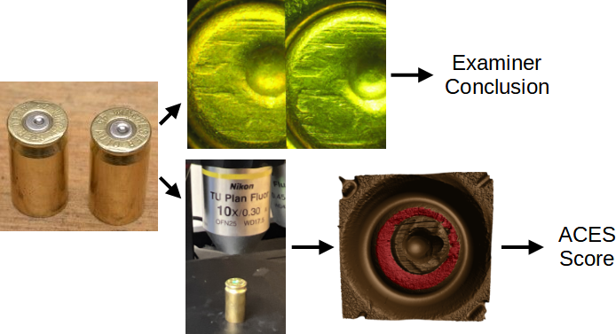

\newcommand{\hh}[1]{{\textcolor{orange}{#1}}}
\newcommand{\svp}[1]{{\textcolor{blue}{#1}}}
\newcommand{\jz}[1]{{\textcolor{olive}{#1}}}

```{r setup, include=FALSE}
options(prompt = 'R> ', continue = '+ ')
knitr::opts_chunk$set(echo = FALSE)
```

```{r load-libraries, cache = FALSE, include = FALSE}
library(cmcR) # remotes::install_github("csafe-isu/cmcR")
library(impressions) # remotes::install_github("jzemmels/impressions")
library(scored) # remotes::install_github("jzemmels/scored")

library(x3ptools)
library(tidyverse)
library(patchwork)
```
\hh{Generally for tables, no vertical lines.}

\hh{I think we need an overview picture to set the stage for an audience who is large unfamiliar with anything firearms related. How about you move up figure 1 and include (a) cartridge cases with an arrow pointing to the primer. (b) an image of the confocal light microscope taking an image of a cartridge case (c) a comparison microscope image (d) the marked up image (maybe even from the side).
I'm thinking of something along the lines of Xiao Hui's paper: https://www.semanticscholar.org/paper/Automatically-matching-topographical-measurements-a-Tai-Eddy/6532cc25b9104d42844418254641acdab01fadf8/figure/0}
# Introduction

A \emph{cartridge case} is part of firearm ammunition that houses the projectile and propulsive device.
When a firearm is discharged and the projectile travels down the barrel, the cartridge case moves in the opposite direction and slams against the back wall, the \emph{breech face}, of the firearm.
Markings on the breech face are "stamped" into the surface of the cartridge case leaving so-called \emph{breech face impressions}.

Forensic examiners use these impressions analogous to a fingerprint to determine whether two cartridge cases were fired from the same firearm.
Typically, the examination involves the use of a microscope to assess the "agreement" between the markings on two cartridge cases.
Depending on the outcome of this comparison, the forensic examiner decides if the cartridge cases share or do not share a common source or if there is "inconclusive" evidence to decide \citep{AFTE1992}.
The top of \autoref{fig:examination-algorithm-comparison} illustrates this procedure \citep{Vorburger2015,xiaoHui_seminar}.

<!-- Forensic examinations measure the probative value of a piece of evidence. -->
<!-- Typically, a forensic examiner visually inspects the evidence to determine its source. -->

<!-- The "ground-truth" of a forensic comparison is a binary classification problem. -->
<!-- Briefly reference how comparisons are done by examiners currently. -->
<!-- Keep focus on firearm and toolmark evidence. -->

```{r,out.width="\\textwidth",echo=FALSE,fig.pos="htbp",fig.cap='\\label{fig:examination-algorithm-comparison} Comparison of the traditional examination vs. the currently proposed method for comparing cartridge cases. Both start with two fired cartridge cases. In traditional examination, an examiner uses a microscope to assess the "agreement" of markings on the two cartridge case surfaces. They decide whether or not the cartridge cases were fired from the same firearm, or if there is inconclusive evidence to decide. In the ACES algorithm, we take a topographical scan of the cartridge case surfaces and manually identify the regions containing distinguishable markings (shown in red). We pass these scans to the ACES algorithm, which processes and compares the two scans. The final result is a numerical measure of similarity of the two cartridge cases.'}

```

Critics of traditional comparisons cite a lack of "foundational validity" underlying the procedures used by firearm and toolmark examiners \citep{nas2009,pcast}.
In particular, examiners rely largely on their subjective findings rather than on a well-defined procedure to quantify similarity.
\citet{pcast} pushed for "developing and testing image-analysis algorithms" to objectively measure the similarity between cartridge cases.
An automatic comparison algorithm could supplement, inform, or dictate an examiner's conclusion \citep{swofford}.

We introduce a novel Automatic Cartridge Evidence Scoring (ACES) algorithm to objectively compare cartridge case evidence based on their breech face impressions.
Our algorithm encompasses all stages of the comparison procedure after collecting a scan of the cartridge case surface including preprocessing, comparing, and scoring.
Our ACES algorithm is available open-source as part of the [scored](https://jzemmels.github.io/scored/) R package.

We first review recently proposed algorithms to compare firearm evidence.
We then discuss the data collection procedure to obtain 510 cartridge scans used in training and validating the ACES algorithm.
To our knowledge, this is the largest published study of a cartridge case comparison algorithm to-date, with the next largest analyzing four different data sets totaling 195 cartridge cases \citep{chen_convergence_2017}.
After describing the ACES algorithm, we present summary results from training and testing three binary classifier models: base on a random forest, logistic regression, and classification tree.
We discuss the strengths and weaknesses of the three classifier models and compare the relative importance of the ACES features.
We also argue that the ACES algorithm combines the classification rules of previously proposed cartridge case comparison algorithms while incorporating additional nuance.
We conclude with our thoughts on how cartridge case comparison algorithms should be developed, validated, and shared going forward.

# Previous Work

\citet{vorburger_surface_2007} proposed using the cross-correlation function (CCF) to compare images or scans of cartridge case surfaces.
The CCF measures the similarity between two matrices for all possible translations of one matrix against the other.
Calculating the CCF while rotating one of the scans therefore allows for estimation of the optimal translation and rotation, together referred to as the \emph{registration}, between the two scans; simply choose the rotation/translation at which the CCF is maximized.
\citet{aoas} used the CCF, among other features, to compare scans of bullets.
\citet{tai_fully_2018} developed a "fully automatic," open-source cartridge case comparison pipeline that compared cartridge case images using the CCF.

\citet{song_proposed_2013} noted that two matching cartridge cases often share similar impressions in specific regions, so calculating the CCF between two full scans may not highlight their similarities.
Instead, \citet{song_proposed_2013} proposed partitioning one cartridge case scan into a grid of "cells" and calculating the CCF between each cell and the other scan.
If two cartridge cases are truly matching, then the maximum CCF value between each cell and the other scan, particularly the cells containing distinguishable breech face impressions, should be relatively large.
Furthermore, the cells should "agree" on the registration at which the CCF is maximized.
\citet{song_proposed_2013} outlined the "Congruent Matching Cells" algorithm to determine the number of cells that agree on a particular registration.
A cell is classified as a Congruent Matching Cell (CMC) if its estimated registration is within some threshold of the median registration across all cells and its CCF value is above some threshold.
A number of follow-up papers proposed alterations to the the original CMC method \citep{tong_improved_2015,chen_convergence_2017}.
[Zemmels et al. (2022)] introduce an open-source implementation of the CMC method in the cmcR R package \citep{cmcR}.
As an alternative to defining Congruent Matching Cells, \citet{zhang_convergence_2021} proposed using a clustering algorithm from \cite{dbscan} to determine the number of cells in agreement on a specific registration.

Currently, there is no rigorous procedure for comparing different cartridge case comparison algorithms.
This includes selecting optimal parameters for a specific algorithm.
[Zemmels et al. (2022)] proposed an optimization criterion to select parameters for the CMC algorithm.
Analogously, \citet{aoas} developed a validation procedure to select parameters for a bullet comparison algorithm.
In this work, we introduce a novel cross-validation procedure to learn and test optimal parameters for our algorithm.

# Cartridge Case Data

We use 510 cartridge cases collected as part of a study by \citet{baldwin} where 80 cartridge cases were fired from each of 25 Ruger SR9 handguns.
According to \citet{pcast}, this is the only study to-date to be "appropriately designed to test the foundational validity and estimate reliability [of firearm and toolmark examiner conclusions]."
The goal of the original study was to measure the false negative and false positive error rates of 218 forensic examiners.
A false negative error occurs when truly matching cartridge cases, fired from the same firearm, are classified as non-matches.
Conversely, a false positive error occurs when non-matching cartridge cases are classified as matches.
For each comparison, examiners were provided a set of three known-match cartridge cases and a single unknown-source cartridge case.
Their task was to determine whether the unknown-source cartridge case matched the other three.
The reported false negative error rate across all 218 examiners was 0.367% while the reported false positive error rate was 1.01%.
However, it should be noted that "inconclusive" decisions were treated as correct, no matter the ground-truth nature of the cartridge case set \citep{hofmann_inconclusives_2021}.

We scanned the 510 cartridge cases using the Cadre 3D-TopMatch High Capacity Scanner \citep{topmatch}.
Briefly, this scanner collects images under various lighting conditions of a gel pad into which the cartridge case surface is impressed.
Proprietary software that accompanies this scanner combines these images into a regular 2D array called a \emph{surface matrix}.
This surface matrix, along with metadata concerning parameters under which the scan was taken (size, resolution, author, etc.), are stored in the ISO standard XML 3D Surface Profile (\texttt{x3p}) file type \citep{ISO25178-72}.


\jz{[cite eventual DFSC data-in-brief or ISU datashare repo?]}

# Methods

We now discuss the methods behind the Automatic Cartridge Evidence Scoring (ACES) algorithm. We divide the methods into three stages:

```{=tex}
\begin{enumerate}
\item \textbf{Preprocessing:} prepare cartridge case scans for comparison

\item \textbf{Comparing:} compare two cartridge cases and compute similarity features

\item \textbf{Scoring:} measure the similarity between the two cartridge cases using a trained classifier
\end{enumerate}
```

The following sections detail each of these stages.
Throughout, we treat "surface matrix" and "scan" synonymously.

The bottom of \autoref{fig:examination-algorithm-comparison} shows a summary of our procedure.
After taking a topographical scan of the cartridge case surfaces, we manually annotate the breech face impression region (shown in red).
ACES automatically preprocesses and compares the scans resulting in a similarity score derived from a classification model.

## Preprocessing

We first use the open-source FiX3P web application \hh{cite Talen Fisher} to manually annotate the breech face impression region.
An example of a manually-annotated cartridge case scan is shown in \autoref{fig:examination-algorithm-comparison}.
The FiX3P software includes functionality to "paint" the surface of a cartridge case using a computer cursor and save the painted regions to a *mask.* A mask is a 2D array of hexidecimal color values of the same dimension as its associated surface matrix.
When initialized, every element of a mask is a shade of brown (#cd7f32) by default.
Any elements painted over by the user will be replaced with the user's selected color value.
In \autoref{fig:examination-algorithm-comparison}, the breech face impression region was manually annotated using a shade of red (#ff0000).

Once read into an R environment, we apply a sequence of functions available in the R packages x3ptools \citep{x3ptools} and cmcR \citep{cmcR} to preprocess the raw scans.
<!-- [Code] demonstrates how the [magrittr] pipe (`%>%`) operator strings together these functions. --> \autoref{fig:preProcessEffect} shows the effect that each function has on the scan surface values.
Gray pixels in each plot represent missing values in the surface matrix.
The `x3p_delete` function removes values in the scan based on the associated mask.
Next, the `preProcess_removeTrend` function subtracts a fitted conditional median plane from the surface values to "level-out" any global tilt in the scan.
The `preProcess_gaussFilter()` function applies a bandpass Gaussian filter to remove small-scale noise and other large-scale structure, which better highlights the medium-scale breech face impressions.
Finally, the `preProcess_erode()` function applies the morphological operation of erosion on the edge of the non-missing surface values [cite erosion reference].
This has the effect of shaving-off values on the interior and exterior edge of the surface, which are often extreme "roll-off" values that unduly affect the comparing stage if not removed.
The final result is a cartridge case surface matrix with emphasized breech face impressions.

```{r,cache=TRUE,include=FALSE}
reference <- x3p_read("data/NIST_K013sA1.x3p")
target <- x3p_read("data/NIST_K013sA2.x3p")

reference$surface.matrix <- reference$surface.matrix*1e6
target$surface.matrix <- target$surface.matrix*1e6

reference_deleted <- reference %>%
  impressions::x3p_delete(mask_vals = "#CD7F32FF") %>%
  x3ptools::x3p_sample(m = 4)

reference_detrend <- reference %>%
  impressions::x3p_delete(mask_vals = "#CD7F32FF") %>%
  cmcR::preProcess_removeTrend(statistic = "quantile",
                               tau = .5,
                               method = "fn") %>%
  x3ptools::x3p_sample(m = 4)

reference_filtered <- reference %>%
  impressions::x3p_delete(mask_vals = "#CD7F32FF") %>%
  cmcR::preProcess_removeTrend(statistic = "quantile",
                               tau = .5,
                               method = "fn") %>%
  cmcR::preProcess_gaussFilter() %>%
  x3p_sample() %>%
  cmcR::preProcess_removeTrend(statistic = "quantile",
                               tau = .5,
                               method = "fn") %>%
  cmcR::preProcess_gaussFilter() %>%
  x3p_sample()

reference_eroded <- reference %>%
  impressions::x3p_delete(mask_vals = "#CD7F32FF") %>%
  cmcR::preProcess_removeTrend(statistic = "quantile",
                               tau = .5,
                               method = "fn") %>%
  cmcR::preProcess_gaussFilter() %>%
  x3p_sample() %>%
  cmcR::preProcess_removeTrend(statistic = "quantile",
                               tau = .5,
                               method = "fn") %>%
  cmcR::preProcess_gaussFilter() %>%
  x3p_sample() %>%
  cmcR::preProcess_erode(region = "interior",morphRadius = round(50/4)) %>% 
  cmcR::preProcess_erode(region = "exterior",morphRadius =  round(50/4)) %>%
  impressions::x3p_cropWS()

target_eroded <- target %>%
  impressions::x3p_delete(mask_vals = "#CD7F32FF") %>%
  cmcR::preProcess_removeTrend(statistic = "quantile",
                               tau = .5,
                               method = "fn") %>%
  cmcR::preProcess_gaussFilter() %>%
  x3p_sample() %>%
  cmcR::preProcess_removeTrend(statistic = "quantile",
                               tau = .5,
                               method = "fn") %>%
  cmcR::preProcess_gaussFilter() %>%
  x3p_sample() %>%
  cmcR::preProcess_erode(region = "interior",morphRadius = round(50/4)) %>% 
  cmcR::preProcess_erode(region = "exterior",morphRadius =  round(50/4)) %>%
  impressions::x3p_cropWS()
```


```{r,cache = FALSE,include=FALSE}
plts <- impressions::x3pPlot(reference_deleted,reference_detrend,reference_filtered,reference_eroded,
                             x3pNames = c("x3p_delete()","preProcess_removeTrend()",
                                          "preProcess_gaussFilter()","preProcess_erode()"),
                             type = "list",
                             legend.quantiles = c(0,.5,1)) %>%
  map(~ {
    . +
      theme(legend.position = "bottom") +
      ggplot2::guides(fill = ggplot2::guide_colourbar(barwidth = grid::unit(1.25, 
                                                                            "in"), 
                                                      barheight = grid::unit(.2,"in"),
                                                      label.theme = ggplot2::element_text(size = 6), 
                                                      title.theme = ggplot2::element_text(size = 8), 
                                                      title.vjust = .8,
                                                      frame.colour = "black",
                                                      ticks.colour = "black",
                                                      direction = "horizontal"), 
                      colour = "none") + 
      ggplot2::labs(fill = expression("Rel. Height ["*mu*"m]"))
  })

plt <- (plts[[1]] | plts[[2]] | plts[[3]] | plts[[4]])

ggsave(plot = plt,filename = "figures/preProcessEffect.png",width = 10,height = 5)
knitr::plot_crop("figures/preProcessEffect.png")
```


```{r,out.width="\\textwidth",echo=FALSE,fig.pos="htbp",fig.cap="\\label{fig:preProcessEffect} We apply a sequence of preprocessing functions to each scan. Each preprocessing step further emphasizes the breech face impressions in the scan."}
knitr::include_graphics("figures/preProcessEffect.png")
```

Next, we compute a set of similarity features for two preprocessed cartridge case scans.

## Comparing

In this section, we introduce a set of similarity features for two cartridge case scans.
We calculate features at two scales: between two full scans and between individual cells similar to the CMC method.
Analogous to how a forensic examiner uses a comparison microscope with different magnification levels, this allows us to assess the similarity between two scans at the macro and micro levels.

### Notational Conventions

First, we introduce notation that will be used to define the features.
Let $A$ and $B$ denote two surfaces matrices that we wish to compare.
For simplicity, we assume that $A,B \in \mathbb{R}^{k \times k}$ for $k > 0$.\footnote{This assumption of equally-sized, square matrices is easily enforced by padding the matrices with additional missing values.
Due to the presence of (structurally) missing values around the breech face impression region, additional padding does not interfere with the structure of the scan.}
We use lowercase letters and subscripts to denote a particular value of a matrix: $a_{ij}$ is the value in the $i$th row and $j$th column, starting from the top-left corner, of matrix $A$.
We refer to the two known-match cartridge cases in \autoref{fig:matchPair} as exemplar matrices $A$ and $B$.

To accommodate structurally-missing values, we adapt standard matrix algebra as follows: if an element of either matrix $A$ or $B$ is missing, then any element-wise operation including this element is also missing, otherwise standard matrix algebra holds.
For example, the addition operator is defined as:
\begin{align*}
A \oplus_{NA} B = (a_{ij} \oplus_{NA} b_{ij})_{1 \leq i,j \leq k} = 
\begin{cases}
a_{ij} + b_{ij} & \text{if both $a_{ij}$ and $b_{ij}$ are numbers} \\
NA &\text{otherwise}
\end{cases}
\end{align*}
Other element-wise operations such as $\ominus_{NA}$ are defined similarly.
For readability, we will use standard operator notation $+, -, >, <, ...$ and assume the extended operations as defined above.


```{r,cache=FALSE,include=FALSE}
plt <- impressions::x3pPlot(reference_eroded,target_eroded,x3pNames = c("Scan A","Scan B"),legendLength = grid::unit(4, "in"))

ggsave(filename = "figures/matchPair.png",plot = plt,height = 7,width = 10)
knitr::plot_crop("figures/matchPair.png")
```


```{r,out.width="\\textwidth",echo=FALSE,fig.pos="htbp",fig.cap="\\label{fig:matchPair} A matching pair of processed cartridge case scans. We measure the similarity between these cartridge cases using the distinguishable breech face impressions on their surfaces."}
knitr::include_graphics("figures/matchPair.png")
```

### Registration Estimation

A critical step in comparing $A$ and $B$ is to find a transformation of $B$ such that it aligns best to $A$ (or vice versa).
In image processing, this is called *image registration.* Noting that $A$ and $B$ are essentially grayscale images, we rely on a standard image registration technique \citep{Brown1992}.

In our application, a registration is composed of a discrete translation by $(m,n) \in \mathbb{Z}^2$ and rotation by $\theta \in [-180^\circ,180^\circ]$.
To determine the optimal registration, we calculate the *cross-correlation function* (CCF) between $A$ and $B$, which measures the similarity between $A$ and $B$ for every possible translation of $B$, denoted $(A \star B)$.
We estimate the registration by calculating the maximum CCF value across a range of rotations of matrix $B$.
Let $B_\theta$ denote $B$ rotated by an angle $\theta \in [-180^\circ,180^\circ]$ and $b_{\theta_{mn}}$ the $m,n$-th element of $B_\theta$.
Then the estimated registration $(m^*,n^*,\theta^*)$ is: 

\begin{align*}
(m^*,n^*,\theta^*) = \arg \max_{m,n,\theta} (a \star b_\theta)_{mn}.
\end{align*} 

In practice we consider a discrete grid of rotations $\pmb{\Theta} \subset [-180^\circ,180^\circ]$.
The registration procedure is outlined in \autoref{alg:registration}.
We refer to the matrix that is rotated as the "target."
The result is the estimated registration of the target matrix to the "source" matrix.

```{=tex}
\begin{algorithm}[htbp]
\KwData{Source matrix $A$, target matrix $B$, and rotation grid $\pmb{\Theta}$}
\KwResult{Estimated registration of $B$ to $A$, $(m^*,n^*,\theta^*)$, and cross-correlation function maximum, $CCF_{\max}$}
\For{$\theta \in \pmb{\Theta}$}{
Rotate $B$ by $\theta$ to obtain $B_\theta$\;
Calculate $CCF_{\max, \theta} = \max_{m,n} (a \star b_{\theta})_{mn}$\;
Calculate translation $[m^*_\theta,n^*_\theta] = \arg \max_{m,n} (a \star b_{\theta})_{mn}$
}
Calculate overall maximum correlation $CCF_{\max} = \max_{\theta} \{CCF_{\max,\theta} : \theta \in \pmb{\Theta}\}$\;
Calculate rotation $\theta^* = \arg \max_{\theta} \{CCF_{\max,\theta} : \theta \in \pmb{\Theta}\}$\;
\Return{Estimated rotation $\theta^*$, translation $m^* = m^*_{\theta^*}$ and $n^* = n^*_{\theta^*}$, and $CCF_{\max}$}
\caption{Image Registration Procedure}
\label{alg:registration}
\end{algorithm}
```


To accommodate missing values, we also compute the *pairwise-complete correlation* using only the complete value pairs, meaning neither value is missing, between $A$ and $B$.

### Registration-Based Features

#### Full-Scan Registration

We first estimate the registration between two full scans $A$ and $B$ using \autoref{alg:registration} with a rotation grid $\pmb{\Theta} = \{-30^\circ, -27^\circ,...,27^\circ,30^\circ\}$.
This results in an estimated registration $(m^*,n^*,\theta^*)$ and similarity measure $CCF_{\max}$.
We also perform \autoref{alg:registration} with the roles of $A$ and $B$ reversed, meaning the target scan $A$ is aligned to source scan $B$ to obtain $A^*$.

To accommodate these two comparison directions, we introduce a new subscript $d = A,B$, referring to the source scan in \autoref{alg:registration}.
Consequently, we obtain two sets of sets of estimated registrations, $(m^*_d,n^*_d,\theta^*_d)$ and $CCF_{\max,d}$ for $d=A,B$.\footnote{In reality, the true aligning registrations in the two comparison directions are opposites of each other. However, because we compare discretely-indexed arrays using a nearest-neighbor interpolation scheme, the estimated registrations differ slightly.}
For $d = A$, we then apply the registration transformation $(m^*_A,n^*_A,\theta^*_A)$ to $B$ to obtain $B^*$ and compute the pairwise-complete correlation, $cor_{\text{full},A}$, between $A$ and $B^*$.
We repeat this in the other comparison direction to obtain $cor_{\text{full},B}$ and average the two:
\begin{align*}
cor_{\text{full}} = \frac{1}{2}\left(cor_{A,\text{full}} + cor_{B,\text{full}}\right).
\end{align*}
We assume that the **full-scan pairwise-complete correlation** is large for truly matching cartridge cases.

<!-- \hline -->
<!-- $CCF_{\max}$ & Maximum value of the cross-correlation function across a grid of rotations \\ -->

#### Cell-Based Registration

We next perform a cell-based registration procedure.
The cell-based comparison procedure begins with selecting one of the matrices, say $A$, as the "source" matrix that is partitioned into a grid of cells.
Each of these source cells will be compared to the "target" matrix, in this case $B^*$.
Because $A$ and $B^*$ are already partially aligned based on the course rotation grid $\pmb{\Theta}$, we compare each source cell to $B^*$ using a new rotation grid of $\pmb{\Theta}'_A = \{\theta^*_A - 2^\circ, \theta^*_A - 1^\circ,\theta^*_A,\theta^*_A + 1^\circ,\theta^*_A + 2^\circ\}$.

We now extend the surface matrix notation introduced previously to accommodate cells.
Let $A_{t}$ denote the $t$th cell of matrix $A$, $t = 1,...,T_A$ where $T_A$ is the total number of cells containing non-missing values (e.g., $T_A = 43$ in \autoref{fig:cellGridExample}) in scan $A$ and let $(a_t)_{ij}$ denote the $i,j$-th element of $A_t$.

The cell-based comparison procedure is outlined in \autoref{alg:cellComparison}.

```{=tex}
\begin{algorithm}[H]
\KwData{Source matrix $A$, target matrix $B^*$, cell grid size $R \times C$, and rotation grid $\pmb{\Theta}'_A$}
\KwResult{Estimated translations and $CCF_{\max}$ values per cell, per rotation}
Partition $A$ into a grid of $R \times C$ cells\;
Discard cells containing only missing values, leaving $T_A$ remaining cells\;
\For{$\theta \in \pmb{\Theta}'_A$}{
Rotate $B^*$ by $\theta$ to obtain $B^*_\theta$\;
\For{$t = 1,...,T_A$}{
Calculate $CCF_{\max, A,t,\theta} = \max_{m,n} (a_t \star b^*_\theta)_{mn}$\;
Calculate translation $[m^*_{A,t,\theta},n^*_{A,t,\theta}] = \arg \max_{m,n} (a_t \star b^*_\theta)_{mn}$
}
}
\Return{$\pmb{F}_A = \{(m^*_{A,t,\theta},n^*_{A,t,\theta}, CCF_{\max,A,t,\theta}, \theta) : \theta \in \pmb{\Theta}'_A, t = 1,...,T_A\}$}
\caption{Cell-Based Comparison Procedure}
\label{alg:cellComparison}
\end{algorithm}
```

Rather than exclusively returning the registration that maximizes the overall CCF as in \autoref{alg:registration}, \autoref{alg:cellComparison} returns the set $\pmb{F}_A$ of translations and CCF values for each cell and each rotation considered.

```{r,out.width="\\textwidth",echo=FALSE,fig.pos="htbp",fig.cap="\\label{fig:cellGridExample} Estimated registrations of cells from a non-match pair of cartridge cases. A source scan (left) is separated into an $8 \\times 8$ grid of cells. We exclude cells containing only missing values (visualized here as gray pixels). Each source cell is compared to a target scan (right) to estimate where it aligns best. We show a handful of cells at their estimated alignment in the target scan and magnify the surfaces captured by cell pairs 5, 1 and 7, 7. Although the cartridge case pair is non-matching, we note that there are similarities in the surface markings for these cell pairs."}
knitr::include_graphics("images/cellGridExample_nonMatch.png")
```

\autoref{fig:cellGridExample} shows the estimated registrations of cells between two non-match cartridge cases.
We magnify the surface values captured by cell pairs 5, 1 and 7, 7 and note the similarities in the surface values; for example, the dark purple region in the middle of the cell 7, 7 pair.

Just as with the whole-scan registration, we calculate the pairwise-complete correlation between each cell $A_t$ and a matrix $B_{\theta,t}^*$ of the same size extracted from $B^*_{\theta}$ after translating by $[m^*_{A,\theta},n^*_{A,\theta}]$.
From this we obtain a set of pairwise-complete correlations for each cell and rotation: $\{cor_{A,t,\theta} : t = 1,...,T_A, \theta \in \pmb{\Theta}'_A\}$.
This whole procedure is repeated using $B$ as the source scan and $A^*$ as the target, resulting in registration set $\pmb{F}_B$ and pairwise-complete correlations $\{cor_{B,t,\theta} : t = 1,...,T_B, \theta \in \pmb{\Theta}'_B\}$.

For $d = A,B$ and $t = 1,...,T_d$, define the cell-wise maximum CCF and pairwise-complete correlation as: 
\begin{align*}
CCF_{\max,d,t} &= \max_{\theta} \{CCF_{\max,d,t,\theta} : \theta \in \pmb{\Theta}'_d\} \\
cor_{d,t} &= \max_{\theta} \{cor_{d,t,\theta} : \theta \in \pmb{\Theta}'_d\}
\end{align*}

We compute the \textbf{average} and \textbf{standard deviation of the cell-based pairwise-complete correlations} features using the correlation data: 
\begin{align*}
\overline{cor}_{\text{cell}} &= \frac{1}{T_A + T_B} \sum_{d \in \{A,B\}} \sum_{t=1}^{T_d} cor_{d,t} \\
s_{cor} &= \sqrt{\frac{1}{T_A + T_B - 1} \sum_{d \in \{A,B\}} \sum_{t=1}^{T_d} (cor_{d,t} - \overline{cor}_{\text{cell}})^2}
\end{align*} 

<!-- \overline{CCF}_{\max, \cdot} &= \frac{1}{T} \sum_{t=1}^T CCF_{\max,t} \\ -->
<!-- s_{CCF}^2 &= \frac{1}{T-1} \sum_{t=1}^T (CCF_{\max,t} - \overline{CCF}_{\max, \cdot})^2  \\ -->

We expect the $\overline{cor}_{\text{cell}}$ to be large and the $s_{cor}$ small for truly matching cartridge case pairs.

For $d = A,B$ and $t = 1,...,T_d$, define the per-cell estimated translations and rotation as: 
\begin{align*}
\theta^*_{d,t} &= \arg \max_{\theta} \{CCF_{\max,d,t,\theta} : \theta \in \pmb{\Theta}'_d\} \\
m^*_{d,t} &= m^*_{\theta^*_{d,t},d,t} \\
n^*_{d,t} &= n^*_{\theta^*_{d,t},d,t}
\end{align*} 

We compute the \textbf{standard deviation of the cell-based estimated registration} using the estimated cell translations and rotations: 
\begin{align*}
s_{\theta^*} =  \sqrt{\frac{1}{T_A + T_B - 1} \sum_{d \in \{A,B\}} \sum_{t=1}^{T_d} (\theta^*_{d,t} - \bar{\theta}^*)^2} \\
s_{m^*} =  \sqrt{\frac{1}{T_A + T_B - 1} \sum_{d \in \{A,B\}} \sum_{t=1}^{T_d} (m^*_{d,t} - \bar{m}^*)^2} \\
s_{n^*} = \sqrt{\frac{1}{T_A + T_B - 1} \sum_{d \in \{A,B\}} \sum_{t=1}^{T_d} (n^*_{d,t} - \bar{n}^*)^2}
\end{align*} 
where 
\begin{align*}
\bar{m}^* &= \frac{1}{T_A + T_B} \sum_{d \in \{A,B\}}\sum_{t=1}^{T_d} m^*_{d,t} \\
\bar{n}^* &= \frac{1}{T_A + T_B} \sum_{d \in \{A,B\}} \sum_{t=1}^{T_d} n^*_{d,t} \\
\bar{\theta}^* &= \frac{1}{T_A + T_B} \sum_{d \in \{A,B\}} \sum_{t=1}^{T_d} \theta^*_{d,t}.
\end{align*}
We expect the $s_{\theta^*}, s_{m^*},s_{n^*}$ to be small for truly matching cartridge case pairs.

From the full-scan and cell-based registration procedures, we obtain six features summarized in \autoref{tab:registrationFeatures}.

```{=tex}
\begin{table}[htbp]
\centering
\begin{tabular}{|p{.11\linewidth}|p{.7\linewidth}|}
\hline
Notation & Feature Description \\
\hline
$cor_{\text{full}}$ & \textbf{Full-scan pairwise-complete correlation} after aligning the scans. \\
\hline
$\overline{cor}_{\text{cell}}$ & \textbf{Average cell-based pairwise-complete correlation} after aligning source cells to the target matrix using the cross-correlation function \\
\hline
$s_{cor}$ & \textbf{Standard deviation of the cell-based pairwise-complete correlation} after aligning source cells to the target matrix using the cross-correlation function \\
\hline
$s_{m^*}$ & \textbf{Standard deviation of the cell-based vertical translations} \\
\hline
$s_{n^*}$ & \textbf{Standard deviation of the cell-based horizontal translations} \\
\hline
$s_{\theta^*}$ & \textbf{Standard deviation of the cell-based rotations} \\
\hline
\end{tabular}
\caption{Six similarity features based on registering full scans or cells.}
\label{tab:registrationFeatures}
\end{table}
```


<!-- \hline -->
<!-- $\overline{CCF}_{\max, \cdot}$ & Average maximum value of the cross-correlation function across all cells and rotations \\ -->
<!-- \hline -->
<!-- $s_{CCF}^2$ & Sample variance of the maximum CCF values across all cells \\ -->

### Density-Based Features

As discussed in the last section, we wish to identify when multiple cells agree on a particular registration.
\citet{zhang_convergence_2021} proposed using the Density-Based Spatial Clustering of Applications with Noise (DBSCAN) algorithm to identify clusters of points based on their density.

```{r,include=FALSE}
load("data/compData.RData")
```


```{r,cache=FALSE,include=FALSE}
estimRotations <- compData %>%
  group_by(direction,theta) %>%
  group_split() %>%
  map_dfr(function(dat){
    
    densEstim <- MASS::kde2d(x = dat$x,y = dat$y,n = 100)
    
    data.frame(maxDens = max(c(densEstim$z)),
               theta = unique(dat$theta),
               direction = unique(dat$direction))
    
  }) %>%
  group_by(direction) %>%
  dplyr::top_n(n = 1,wt = maxDens) %>%
  select(direction,theta) %>%
  rename(thetaHat = theta)

plt1 <- compData %>%
  select(-c(cellHeightValues,alignedTargetCell)) %>%
  left_join(estimRotations,by = "direction") %>%
  filter(theta == thetaHat) %>%
  mutate(direction = factor(direction,labels = c("Scan A vs. Scan B","Scan B vs. Scan A")),
         label = paste0(direction,", Rotation: ",theta)) %>%
  filter(direction == "Scan A vs. Scan B") %>%
  group_by(label) %>%
  group_split() %>%
  map_dfr(function(dat){
    
    dat %>%
      mutate(clust = dbscan::dbscan(x = dat %>% select(x,y),eps = 5,minPts = 5)$cluster,
             clust = factor(ifelse(clust == 0,0,1),labels = c("Noise","Cluster")))
    
  }) %>%
  ggplot(aes(x=x,y,y,colour = clust)) +
  # geom_point() +
  geom_jitter(width = 3,height = 3,size = 1) +
  coord_fixed(expand = TRUE) +
  facet_wrap(~ label,nrow = 1) +
  theme_bw() +
  labs(x = "horizontal shift n",
       y = "vertical shift m",
       colour = "DBSCAN") +
  theme(axis.text = element_text(size = 6),
        legend.position = "bottom") +
  geom_vline(xintercept = 0,linetype = "dashed") +
  geom_hline(yintercept = 0,linetype = "dashed") +
  scale_colour_manual(values = c("gray65","black")) +
  xlim(c(-100,100)) +
  ylim(c(-100,100)) +
  theme(legend.position = "none")

plt2 <- compData %>%
  select(-c(cellHeightValues,alignedTargetCell)) %>%
  left_join(estimRotations,by = "direction") %>%
  filter(theta == thetaHat) %>%
  mutate(direction = factor(direction,labels = c("Scan A vs. Scan B","Scan B vs. Scan A")),
         label = paste0(direction,", Rotation: ",theta)) %>%
  filter(direction == "Scan B vs. Scan A") %>%
  group_by(label) %>%
  group_split() %>%
  map_dfr(function(dat){
    
    dat %>%
      mutate(clust = dbscan::dbscan(x = dat %>% select(x,y),eps = 5,minPts = 5)$cluster,
             clust = factor(ifelse(clust == 0,0,1),labels = c("Noise","Cluster")))
    
  }) %>%
  ggplot(aes(x=x,y,y,colour = clust)) +
  # geom_point() +
  geom_jitter(width = 3,height = 3,size = 1) +
  coord_fixed(expand = TRUE) +
  facet_wrap(~ label,nrow = 1) +
  theme_bw() +
  labs(x = "(negative) horizontal shift n",
       y = "(negative) vertical shift m",
       colour = "DBSCAN") +
  theme(axis.text = element_text(size = 6),
        legend.position = "bottom") +
  geom_vline(xintercept = 0,linetype = "dashed") +
  geom_hline(yintercept = 0,linetype = "dashed") +
  scale_colour_manual(values = c("gray65","black")) +
  scale_x_reverse(limits = c(100,-100)) +
  scale_y_reverse(limits = c(100,-100)) +
  theme(legend.position = "none")

pltLegend <- plt1 %>%
  cowplot::get_legend() %>%
  cowplot::plot_grid()


ggsave(filename = "figures/dbscanScatterplot.png", plot = plt1+plt2, 
       width = 8, height = 4)
knitr::plot_crop("figures/dbscanScatterplot.png")
```

\autoref{fig:dbscanScatterplot} shows an example of DBSCAN cluster assignments for the known-match pair $A$ and $B$ shown in \autoref{fig:matchPair}.
The left scatterplot shows the per-cell estimated translations $[m^*_{d,t,\theta}, n^*_{d,t,\theta}]$ for $\theta = 3^\circ$ when scan $A$ is used as source and $B^*$ as target, resulting a cluster of size 14.
The right scatterplot shows the per-cell estimated translations with the roles of $A$ and $B^*$ reversed: now $B^*$ is partitioned into a grid of source cells that are compared to $A$, resulting in a cluster of size 13.

```{r,out.width=".8\\textwidth",echo=FALSE,fig.pos="htbp",fig.cap="\\label{fig:dbscanScatterplot} Cluster assignments based on the Density Based Spatial Clustering with Applications to Noise (DBSCAN) algorithm for estimated translations in two comparison directions. Using scan $A$ as source results in a cluster of size 14 (left) compared to 13 when scan $B$ is used as source (right). Noting the reversed axes in the right plot, we see that the clusters are located approximately opposite of each other. Points are jittered for visibility."}
knitr::include_graphics("figures/dbscanScatterplot.png")
```

Because $A$ and $B$ are truly matching, we expect the estimated registrations in these two comparison directions to be opposites.
Indeed, the mean cluster centers in \autoref{fig:dbscanScatterplot} are $(\hat{m}_A,\hat{n}_A,\hat{\theta}_A) \approx (16.9, -16.7, 3^\circ)$ when $A$ is used as source compared to $(\hat{m}_B,\hat{n}_B,\hat{\theta}_B) \approx (-16.2, 16.8, -3^\circ)$ when $B^*$ is used as source.

We calculate numerical features based on the DBSCAN cluster assignments.
We first use a 2D kernel density estimator \citep{MASS} to identify the rotation $\hat{\theta}_d$ at which the per-cell translations achieve the highest density.
Next, we compute clusters using the DBSCAN algorithm amongst the estimated translations $\{(m^*_{d,t,\hat{\theta}_d},n^*_{d,t,\hat{\theta}_d}) : t = 1,...,T_d\}$ like those shown in \autoref{fig:dbscanScatterplot}.\footnote{If more than one cluster is identified, we binarize the points based on whether they were assigned to any cluster or if they are a noise point and proceed as if there is only one cluster. We assume that two or more clusters form only because of the course rotation grid considered. Were a finer grid used, the points would coalesce into a single cluster around the true translation value. This assumption has empirical support through our experimentation.} 
Let $\pmb{C}_d$ denote the set of cells in the DBSCAN cluster.
We treat the mean cluster centers as the estimated translations $[\hat{m}_d,\hat{n}_d]$.

We consider features related to whether a DBSCAN cluster is identified in both comparison directions and, if such clusters are identified, the average size of the clusters.
We also compare the density-estimated rotations and translations across the two comparison directions.
These are summarized in the \textbf{average DBSCAN cluster size}, the \textbf{DBSCAN cluster indicator}, and the \textbf{root squared sum of the density-estimated registrations}:
\begin{align*}
C &= \frac{1}{2}\left(|\pmb{C}_A| + |\pmb{C}_B|\right) \\
C_0 &= I(|\pmb{C}_A| > 0 \text{ and } |\pmb{C}_B| > 0)\\
\Delta_\theta &= |\hat{\theta}_A + \hat{\theta}_B| \\
\Delta_{\text{trans}} &= \sqrt{(\hat{m}_A + \hat{m}_B)^2 + (\hat{n}_A + \hat{n}_B)^2}
\end{align*} where $|\pmb{C}_d|$ denotes the cardinality of $\pmb{C}_d$ and $I(\cdot)$ is the identity function equal to 1 if the predicate argument "$\cdot$" evaluates to TRUE and 0 otherwise.
We use both $C$ and $C_0$ because of potential missingness in the values of $C$ if no cluster is identified.
Missing $C$ values are imputed using the median non-missing value when fitting classifiers, so the missingness information is retained in $C_0$.


For truly matching cartridge case pairs, we expect the $C$ to be large, $C_0$ to be 1, and $\Delta_\theta, \Delta_{\text{trans}}$ to be small. We obtain four density-based features summarized in \autoref{tab:dbscanFeatures}.

```{=tex}
\begin{table}[htbp]
\centering
\begin{tabular}{|p{.11\linewidth}|p{.7\linewidth}|}
\hline
Notation & Feature Description \\
\hline
$C$ & \textbf{Average DBSCAN cluster size} across both comparison directions \\
\hline
$C_0$ & \textbf{DBSCAN cluster indicator} of whether DBSCAN clusters exist in both comparison directions \\
\hline
$\Delta_\theta$ & \textbf{Absolute sum of the density-estimated rotations} between both comparison directions  \\
\hline
$\Delta_{\text{trans}}$ & \textbf{Root sum of squares of the cluster-estimated translations} between both comparison directions \\
\hline
\end{tabular}
\caption{Four similarity features based on the density-based clustering procedure.}
\label{tab:dbscanFeatures}
\end{table}
```

### Visual Diagnostic Features

The final set of features we calculate are based on visual diagnostic tools described in [Zemmels et al. (2023)].
These numerical features quantify the qualitative observations one can make from the diagnostics.

To create the visual diagnostics, we perform element-wise matrix operations.
In particular, for a matrix $X \in \mathbb{R}^{k \times k}$ and condition $cond: \mathbb{R}^{k \times k} \to \{TRUE,FALSE\}^{k \times k}$, we define an element-wise filter operation $\mathcal{F}: \mathbb{R}^{k \times k} \to \mathbb{R}^{k \times k}$ as:
\begin{align*}
\mathcal{F}_{cond}(X) = 
(f_{ij})_{1 \leq i,j \leq k} =
\begin{cases}
x_{ij} &\text{if $cond$ is $TRUE$ for element $i,j$} \\
NA &\text{otherwise}
\end{cases}
\end{align*}
Of particular interest in our application is the (absolute) difference between surface matrices.
For example, $\mathcal{F}_{|A - B| > \tau}(A)$ contains elements of matrix $A$ where the pair of scans $A$ and $B$ deviate by at least $\tau \in \mathbb{R}$.
Surface values in $A$ and $B^*$ that are "close," meaning within $\tau$ distance, to each other are replaced with $NA$ in this filtered matrix.

We first consider the correlation $cor_{d,\text{full},\text{filt}}$ between the filtered matrices $\mathcal{F}_{|A - B^*| > \tau}(A)$ and $\mathcal{F}_{|A - B^*| > \tau}(B^*)$ when $d = A$ and $\mathcal{F}_{|A^* - B| > \tau}(A^*)$ and $\mathcal{F}_{|A^* - B| > \tau}(B)$ when $d = B$.
The average of these is used as a feature:
\begin{align*}
\overline{cor}_{\text{full},\text{filt}} = \frac{1}{2}\left(cor_{A,\text{full},\text{filt}} + cor_{B,\text{full},\text{filt}}\right).
\end{align*}
We assume that \textbf{average filtered full-scan pairwise-complete correlation} will be larger for truly matching $A$ and $B$ than non-matching.
Said another way, we assume that even surface regions of $A$ and $B$ that are different will follow similar trends, which can occur due to variability in the amount of contact between a cartridge case and breech face across multiple fires of a single firearm.
The correlation is calculated by vectorizing the two filtered surface matrices and treating missing values by case-wise deletion.

As before, we extend this notation to accommodate cell comparisons $t = 1,...,T_d$ for $d = A,B$ using subscripts: $cor_{d,t,\text{filt}}$.
For example, $cor_{A,t,\text{filt}}$ is the correlation between cell filtered surface matrices $\mathcal{F}_{|A_t - B_{t,\theta_t^*}^*| > \tau}(A_t)$ and $\mathcal{F}_{|A_t - B_{t,\theta_t^*}^*| > \tau}(B_{t,\theta_t^*}^*)$ where $B_{t,\theta_t^*}^*$ is the matrix extracted from $B^*$ that maximizes the CCF with $A_t$.
We calculate the sample mean 
<!-- and variance  -->
of the filtered correlation values across all cells and both directions:
\begin{align*}
\overline{cor}_{\text{cell},\text{filt}} &= \frac{1}{T_A + T_B} \sum_{d \in \{A,B\}} \sum_{t=1}^{T_d} cor_{d,t,\text{filt}}
\end{align*}

<!-- s_{cor_{filt,\cdot}}^2 &= \frac{1}{T-1} \sum_{t=1}^T (cor_{filt,t} - \overline{cor}_{filt,\cdot})^2. -->

Next, we consider features based on the elements of the Boolean $cond$ matrix.
Consider \autoref{fig:filterLabeling} that shows the filtered element-wise average $\mathcal{F}_{|A - B^*| < \tau}\left(\frac{1}{2}(A + B^*)\right)$ on the left and the associated $cond$ matrix $|A - B^*| < \tau$ visualized in black-and-white in the middle where filtered elements are shown in white.
We use a connected components labeling algorithm detailed in [Haralick and Shapiro (1992)] to identify individual neighborhoods of filtered elements.
More precisely, the algorithm returns a set of sets $\pmb{S}_d = \{S_{d,1},S_{d,2},...,S_{d,L_d}\}$ where each $S_{d,l}$ is a set of indices of the $cond$ matrix that have a value of $TRUE$ and are connected by a chained-together sequence of 4 (Rook's) neighborhoods.
The right side of \autoref{fig:filterLabeling} shows each $S_{d,l}$ distinguished by different fill colors, $l = 1,...,L_d$.

```{r,include=FALSE,cache = FALSE}
load("data/compData_fullScans.RData")

scanA <- compData_fullScans %>%
  filter(direction == "comparison_refToTarget") %>%
  pull(cellHeightValues) %>%
  .[[1]]

scanBStar <- compData_fullScans %>%
  filter(direction == "comparison_refToTarget") %>%
  pull(alignedTargetCell) %>%
  .[[1]]

scanA$surface.matrix <- (scanA$surface.matrix*scanA$cmcR.info$scaleByVal + scanA$cmcR.info$centerByVal)

scanBStar$surface.matrix <- (scanBStar$surface.matrix*scanBStar$cmcR.info$scaleByVal + scanBStar$cmcR.info$centerByVal)

compPlt <- impressions::x3p_comparisonPlot(
  x3p1 = scanA,
  x3p2 = scanBStar,
  plotLabels = c("Scan A","Scan B*","Filtered Element-wise\nAverage",
                 "Scan A\nFiltered\nDifferences","Scan B*\nFiltered\nDifferences"),
  labelSize = 2.5,
  legendLength = grid::unit(4,"in"),
  legendHoriz = -1.3,
  legendQuantiles = c(0,.01,.05,.5,.95,.99,1))

plt1 <- ggplot_build(compPlt$patches$plots[[3]])

plt1 <- plt1$data[[2]] %>%
  ggplot(aes(x=x,y=y,fill=fill)) +
  geom_raster() +
  scale_fill_identity() +
  coord_fixed(expand = FALSE) +
  theme_void() +
  geom_path(data = plt1$data[[4]],
            aes(x=x,y=y,group=group),
            size = .2,
            colour = "gray40",
            inherit.aes = FALSE)

scanFilterBinarized <- scanA %>% 
  impressions::x3p_elemAverage(scanBStar) %>%
  impressions::x3p_to_dataFrame() %>%
  mutate(value = (abs(c({scanA$surface.matrix - scanBStar$surface.matrix})) > x3p_sd(scanA,scanBStar)))

plt2 <- scanFilterBinarized %>%
  ggplot(aes(x=x,y=y,fill=value)) +
  geom_raster() +
  scale_fill_manual(values = c("black","white"),na.value = "gray65") +
  coord_fixed(expand = FALSE) +
  theme_void() +
  theme(legend.position = "none")


scanFilterLabeled <- scanFilterBinarized %>%
  mutate(x = x + 1,y = y + 1,
         value = ifelse(!value | is.na(value),0,1)) %>%
  imager::as.cimg() %>%
  imager::label() %>%
  as.data.frame() %>%
  mutate(value = factor(value))

plt3 <- scanFilterLabeled %>%
  ggplot(aes(x=x,y=y,fill=value)) +
  geom_raster() +
  coord_fixed(expand = FALSE) +
  theme_void() +
  theme(legend.position = "none") +
  scale_fill_manual(values = c("gray65",sample(RColorBrewer::brewer.pal(12,"Paired"),size = length(unique(scanFilterLabeled$value)) - 1,replace = TRUE)))

plt <- (plt1 | plt2 | plt3) & theme(panel.border = element_rect(colour = "black",fill = NA))
```

```{r,include=FALSE}
ggsave(plot = plt,filename = "figures/filterLabeling.png")
knitr::plot_crop("figures/filterLabeling.png")
```


```{r,out.width="\\textwidth",echo=FALSE,fig.pos="htbp",fig.cap='\\label{fig:filterLabeling} (Left) After aligning two scans, we filter regions that are "different" from each other, meaning the absolute difference between surface values is larger than some threshold. (Middle) We binarize the scan into "filtered" or "non-filtered" regions - shown in white and black, respectively. (Right) Using a connected components labeling algorithm, we identify connected "neighborhoods" of filtered elements. We assume that these neighborhoods will be small, on average, if comparing truly matching cartridge cases.'}
knitr::include_graphics("figures/filterLabeling.png")
```

We calculate the following features using the full-scan labeled neighborhoods:
\begin{align*}
\overline{|S|}_{\text{full}} &= \frac{1}{L_A + L_B} \sum_{d \in \{A,B\}} \sum_{l=1}^{L_d} |S_{d,l}| \\
s_{\text{full},|S|} &= \sqrt{\frac{1}{L_A + L_B - 1} \sum_{d \in \{A,B\}} \sum_{l=1}^{L_d} (|S_{d,l}| - \overline{|S|}_{\text{full}})^2}
\end{align*}
where $|S_{d,l}|$ is the size of the set $S_{d,l}$.
We assume that the \textbf{average} and \textbf{standard deviation of the filtered full-scan neighborhood sizes} will be small for truly matching cartridge cases.
That is to say, we assume that the the surface regions of $A$ and $B$ that are different will all be small, on average, and vary little in size.
This assumption is appropriate assuming that the breech face leaves consistent markings on fired cartridge cases.

Again, we extend the notation to accommodate individual cells.
Let $\pmb{S}_{d,t} = \{S_{d,t,1},...,S_{d,t,L_{d,t}}\}$ denote the set of labeled neighborhoods for a cell $t = 1,...,T_d$, $d = A,B$.
We calculate the per-cell average and standard deviation of the labeled neighborhood cell size:
\begin{align*}
\overline{|S|}_{d,t} &= \frac{1}{L_{d,t}} \sum_{l=1}^L |S_{d,t,l}| \\
s_{d,t,|S|} &= \sqrt{\frac{1}{L_{d,t} - 1} \sum_{l=1}^{L_{d,t}} (|S_{d,t,l}| - \overline{|S|}_{\text{cell},d,t})^2}.
\end{align*}

We assume that the cell-based $\overline{|S|}_{d,t}$ and $s^2_{d,t,|S|}$ will be small, on average, for truly matching cartridge cases.
Consequently, we use the sample average of these as features:
\begin{align*}
\overline{|S|}_{\text{cell}} &= \frac{1}{T_A + T_B} \sum_{d \in \{A,B\}} \sum_{t=1}^{T_d} \overline{|S|}_{d,t} \\
\bar{s}_{\text{cell},|S|} &= \frac{1}{T_A + T_B} \sum_{d \in \{A,B\}} \sum_{t=1}^{T_d} s_{d,t,|S|}
\end{align*}
Again, we assume that the \textbf{average cell-wise neighborhood size} and the \textbf{average standard deviation of the cell-wise neighborhood sizes} will be small for truly matching cartridge cases.

<!-- s^2_{|S|_{t,\cdot}} &= \frac{1}{T - 1} \sum_{t=1}^T \left(\overline{|S|}_{t,\cdot} - \overline{|S|}_{\cdot,\cdot}\right)^2 \\ -->
<!-- s^2_{s^2_{|S|, t}} &= \frac{1}{T-1} \left(s^2_{|S|, t} - \bar{s}^2_{|S|,\cdot}\right)^2. -->

\autoref{tab:visualDiagnosticFeatures} summarizes the six features calculated based on the visual diagnostics.

```{=tex}
\begin{table}[htbp]
\centering
\begin{tabular}{|p{.11\linewidth}|p{.7\linewidth}|}
\hline
Notation & Feature Description \\
\hline
$\overline{cor}_{\text{full},\text{filt}}$ & \textbf{Average filtered full-scan correlation} across both comparison directions \\
\hline
$\overline{cor}_{\text{cell},\text{filt}}$ & \textbf{Average filtered cell-wise correlation} across all cells in both comparison directions \\
\hline
$\overline{|S|}_{\text{full}}$ & \textbf{Average filtered full-scan neighborhood size} across both comparison directions \\
\hline
$s_{\text{full},|S|}$ & \textbf{Standard deviation of the filtered full-scan neighborhood sizes} across both comparison directions \\
\hline
$\overline{|S|}_{\text{cell}}$ & \textbf{Average filtered cell-wise neighborhood sizes} across all cells in both comparison directions \\
\hline
$\bar{s}_{\text{cell},|S|}$ & \textbf{Average standard deviation of the cell-wise neighborhood sizes} across all cells in both comparison direction \\
\hline
\end{tabular}
\caption{Six similarity features calculated based on visual diagnostics.}
\label{tab:visualDiagnosticFeatures}
\end{table}
```

<!-- \hline -->
<!-- $s_{cor_{filt,\cdot}}^2$ & Standard deviation of the cell pairwise-complete correlation values \\ -->
<!-- \hline -->
<!-- $s^2_{|S|_{t,\cdot}}$ & Cell-based, sample variance of the sample averages of labeled neighborhood sizes \\ -->
<!-- \hline -->
<!-- $s^2_{s^2_{|S|, t}}$ & Cell-based, sample variance of the sample variances of the labeled neighborhood sizes\\ -->

## Scoring

We randomly split the cartridge case data set into 10 barrels for training and 15 barrels for testing.
Multiple cartridge cases were fired from each barrel, so this resulted in a training data set of 210 cartridge cases, $\binom{210}{2} = 21,945$ pairwise comparisons, and a testing set of 300 cartridge cases, $\binom{300}{2} = 44,850$ pairwise comparisons.
We compute the 16 ACES features for each comparison.

We perform 10-fold cross-validation to train binary classifiers.
We compare the results of three classifiers: based on a logistic regression, a classification tree \citep{rpart}, and a random forest \citep{randomForest, breiman}. We make use of the training/testing infrastructure of the \pkg{caret} R package \citep{caret}. 

We use the per-comparison binary classifications and class probabilities computed by these classifiers as measures of similarity.
The following section details the results of this cross-validation procedure.

# Results

## Training Results

\autoref{fig:trainingAccuracy} shows the cross-validation estimated accuracy for the three trained models.
We consider the performance of the three models under different subsets of the ACES feature set, which provides insight into the importance of the various feature groups.
Namely, the first facet shows the cross-validated classification accuracy based on the the full ACES feature set.
The remaining plots show the accuracy based on using a combination of two of the three feature groups.

We see that the random forest trained on the full ACES data set results in the highest overall accuracy of $98.9\%$.
For each feature group, the the random forest yields the highest accuracy followed by the logistic regression and CART models.
We see that the removing the density-based features has a notable impact on the accuracy of the logistic regression and CART models, while the random forest is more is more robust.
Removal of the registration and visual diagnostic features have less of a significant impact.

```{r,include=FALSE}
load("data/accuracyData.RData")

accuracyData %>%
  group_by(modelType,featureGroup) %>%
  filter(Accuracy == max(Accuracy)) %>%
  mutate(Accuracy = round(Accuracy,3)) %>%
  select(modelType,featureGroup,Accuracy)

plt <- accuracyData %>%
  group_by(modelType,featureGroup) %>%
  filter(Accuracy == max(Accuracy)) %>%
  mutate(Accuracy = round(Accuracy,3)) %>%
  select(modelType,featureGroup,Accuracy) %>%
  mutate(featureGroup = factor(featureGroup,
                               levels = c('All Features', 'Relevant Features', 
                                          'Relevant without noClusterInd', 
                                          'Relevant without Registration features', 
                                          'Relevant without Cluster-Based features',
                                          'Relevant without Visual Diagnostic features',
                                          'Relevant with absolute value of cell-based registration'),
                               labels = c("ACES Features + Others",
                                          "ACES Features",
                                          "ACES Features without noClusterInd",
                                          "Density-Based + Visual Diagnostic Features",
                                          "Registration-Based + Visual Diagnostic Features",
                                          "Registration-Based + Density-Based Features",
                                          "ACES with abs. cell-based reg.")),
         modelType = ifelse(modelType == "Random Forest","RF",
                            ifelse(modelType == "Logistic Regression","LR",
                                   "CART"))) %>%
  filter(featureGroup %in% c("ACES Features",
                             "Density-Based + Visual Diagnostic Features",
                             "Registration-Based + Visual Diagnostic Features",
                             "Registration-Based + Density-Based Features")) %>%
  ggplot(aes(x = Accuracy,y = modelType)) +
  geom_point(size = 2) +
  geom_segment(aes(x=.9485,xend=Accuracy,y=modelType,yend=modelType)) +
  facet_wrap(~featureGroup,ncol = 1) +
  theme_bw() +
  scale_x_continuous(limits = c(.9485,1.00),
                     expand = expansion(0),
                     labels = scales::percent) +
  scale_y_discrete(position = "right") +
  labs(y = "Model Type") +
  theme(panel.grid.major.y = element_blank())

ggsave(plot = plt,filename = "figures/trainingAccuracy.png",height  = 5,width = 7)
knitr::plot_crop("figures/trainingAccuracy.png")
```

```{r,fig.align='center',fig.cap='\\label{fig:trainingAccuracy} Training classification accuracy for random forest (RF), logistic  regression (LR), and classification and regression tree (CART) models based on various subsets of the training data set features. These accuracies are estimated based on 10-fold cross validation repeated thrice. In general, the Classification and Regression Tree (CART) model performs poorest while the Random Forest performs best. Removing the density-based features has the largest impact on the accuracies.',fig.pos="htbp",out.width=".8\\textwidth"}
knitr::include_graphics("figures/trainingAccuracy.png")
```


<!-- ```{=tex} -->
<!-- \begin{table}[htbp] -->
<!-- \centering -->
<!-- \begin{tabular}{|l|r|r|r|} -->
<!-- \hline -->
<!-- \textbf{Model} & \textbf{Overall Error} (\%) & \textbf{False Positive} (\%) & \textbf{False Negative} (\%) \\ -->
<!-- \hline -->
<!-- CART & 1.6 & 0.3 & 13.4  \\ -->
<!-- Random Forest & 1.2 & 0.2 & 10.0 \\ -->
<!-- \hline -->
<!-- \end{tabular} -->
<!-- \caption{Cross-validation estimated error rates for CART and and random forest models.} -->
<!-- \label{tab:trainingAccuracy} -->
<!-- \end{table} -->
<!-- ``` -->


<!-- ```{r,out.width="\\textwidth",echo=FALSE,fig.pos="htbp",fig.cap="\\label{fig:trainedCART} Trained Classification and Regression Tree model."} -->
<!-- # knitr::include_graphics("images/trainedCART.png") -->
<!-- knitr::include_graphics("figures/cartModel_allFeatures.png") -->
<!-- ``` -->


\autoref{fig:rfVarImpPlt} shows the distribution of a variable importance measure for each feature across fittings of a random forest model using 10 random seeds.
For each replicate, we measure a variable's importance using the Gini Index, which measures the probability of making a misclassification for a given model \citep{hastie_elements_2008}.
\jz{[More exposition on Gini Index?]}
Noting the log scale on which these points are plotted, we see that the cluster indicator $C_0$ and cell-based pairwise complete correlation $\overline{cor}_{\text{cell}}$ variables are considered by far the most important variable across the random forest fittings.
Overall, the results indicate that the density-based aggregation and cell-based registration features are considered most important by the random forest models.

```{r,eval=TRUE}
load("data/varImportanceData.RData")

plt <- varImportanceData %>%
  ggplot(aes(x = reorder(varName,varImportance),y = varImportance)) +
  # geom_boxplot() +
  # geom_point(size = .5) +
  geom_jitter(size=.7,width = .1,height = 0) +
  coord_flip() +
  theme_bw() +
  labs(x = "Feature Name",
       y = "Mean Gini Index Decrease (Log Scale)") +
  scale_x_discrete(labels = function(x) str_wrap(x,width = 25)) +
  scale_y_log10(minor_breaks = c(seq(30,100,by = 10),seq(100,1000,by = 100)),
                breaks = c(30,100,300,1000),
                labels = c("30","100","300","1000"),
                limits = c(30,NA))

ggsave(plot = plt,filename = "figures/varImportanceBoxplot.png",width = 6,height = 6)
```

```{r,out.width="\\textwidth",echo=FALSE,fig.pos="htbp",fig.cap="\\label{fig:rfVarImpPlt} Variable importance measures from fitting a random forest to the training data set, repeated 10 times under various random seeds. Points are plotted on a log scale and vertically jittered for visibility. The Cluster Indicator feature $C_0$ and cell-based pairwise complete correlation $\\overline{cor}_{\\text{cell}}$ features are by far the most important, as measured by the mean decrease in the Gini index.",out.width=".9\\textwidth"}
knitr::include_graphics("figures/varImportanceBoxplot.png")
```


<!-- ```{=tex} -->
<!-- \begin{table}[htbp] -->
<!-- \centering -->
<!-- \begin{tabular}{|l|r|} -->
<!-- \hline -->
<!-- \textbf{Feature Name} & \textbf{Relative Importance} \\ -->
<!-- \hline -->
<!-- $C$ & 100.0 \\ -->
<!-- $\overline{CCF}_{\max,\cdot}$ & 29.2 \\ -->
<!-- $\Delta_{\text{trans}}$ & 29.0 \\ -->
<!-- $\overline{|S|}_{\cdot}$ & 6.7 \\ -->
<!-- $\overline{cor}_{\text{comp},\cdot}$ & 6.1 \\ -->
<!-- $CCF_{\max}$ & 2.7 \\ -->
<!-- $\Delta_\theta$ & 2.2 \\ -->
<!-- $\overline{|S|}_{\cdot, \cdot}$ & 1.8 \\ -->
<!-- $cor_{\text{comp}}$ & 1.4 \\ -->
<!-- $\sigma_{m^*}^2$ & 1.3 -->
<!-- \\ \hline -->
<!-- \end{tabular} -->
<!-- \caption{Ten most important variables as measured by permutation feature importance in a random forest} -->
<!-- \label{tab:variableImportance} -->
<!-- \end{table} -->
<!-- ``` -->


## Testing Results

For each of the 44,850 cartridge case pairs in the testing data set, we use each model to predict whether the pair is a match or non-match.
An error occurs when this prediction does not match the ground-truth nature of the cartridge case pair.
\autoref{fig:testingAccuracy} summarizes the error rates for each method.
The Accuracy is the overall percentage of correct classifications.
The True Negative rate is percentage of correctly-classified non-match pairs.
Conversely, the True Positive rate is the percentage of correctly-classified matching pairs.

We see that the testing accuracy across models and feature groups is similar to that of the training results in \autoref{fig:trainingAccuracy}.
The random forest is more robust to changes in feature group while the CART model generally performs worse than the other models.
Interestingly, the logistic regression model performs slightly better than the random forest for some feature groups.
Considering the true positive and negative rates, this can be explained by the specificity of the models: the logistic regression model classifies non-matches more effectively in these instances, although this difference is slight.
Similar to the training results, the CART model has a comparable true negative rate to the other models, but a lower true positive rate.

In contrast to the training results, excluding the registration-based features has a more dramatic impact on the testing accuracy than excluding either of the other two feature groups.
Excluding the visual diagnostic features seemingly as the least impact on accuracy, although it does noticeably affect the true positive rate.

```{r,include=FALSE}
load("data/testAccuracy.RData")

testAccuracy_plt <- testAccuracy %>%
  select(modelType,featureGroup,Accuracy,truePos,trueNeg) %>%
  pivot_longer(cols = 3:5,names_to = "errorType") %>%
  mutate(errorType = ifelse(errorType == "trueNeg","True Neg. Rate",
                            ifelse(errorType == "truePos","True Pos. Rate",
                                   "Accuracy"))) %>%
  mutate(featureGroup = factor(featureGroup,
                               levels = 
                                 c('All Features', 
                                   'Relevant Features', 
                                   'Relevant without noClusterInd', 
                                   'Relevant without Registration features', 
                                   'Relevant without Cluster-Based features',
                                   'Relevant without Visual Diagnostic features',
                                   'Relevant with absolute value of cell-based registration'),
                               labels = 
                                 c("ACES + ",
                                   "ACES Features",
                                   "ACES, no noClusterInd",
                                   "Density-Based + Visual Diag.",
                                   "Regist.-Based + Visual Diag.",
                                   "Regist-Based  + Density-Based",
                                   "ACES w/ abs. cell-based regist.")
  ),
  modelType = factor(modelType,levels = c("CART","Logistic Regression",
                                          "Random Forest"),
                     labels = c("CART","LR","RF"))) %>%
  filter(featureGroup %in% c("ACES Features",
                             "Density-Based + Visual Diag.",
                             "Regist.-Based + Visual Diag.",
                             "Regist-Based  + Density-Based")) %>%
  select(featureGroup,modelType,everything()) %>%
  group_by(errorType) %>%
  mutate(xstart = ifelse(errorType == "True Pos. Rate",min(value) - .05*min(value),
                         .97))

plt <- testAccuracy_plt %>%
  ggplot(aes(x = value,y = modelType)) +
  geom_point(size = 2) +
  geom_segment(aes(x=xstart,xend=value,y=modelType,yend=modelType)) +
  facet_grid(rows = vars(featureGroup),
             cols = vars(errorType),
             labeller = label_wrap_gen(width = 15),
             scales = "free",
             switch = "y") +
  theme_bw() +
  scale_x_continuous(expand = expansion(c(0,.2)),
                     labels = scales::percent,
                     breaks = scales::breaks_pretty(n = 3)) +
  scale_y_discrete(labels = scales::label_wrap(width = 20),
                   position = "right") +
  labs(y = "Model Type") +
  theme(strip.text.y = element_text(size = 7),
        axis.title.x = element_blank(),
        axis.title.y = element_blank(),
        axis.text.x = element_text(size = 6),
        axis.text.y = element_text(size = 7))

ggsave(plot = plt,filename = "figures/testAccuracy.png",height = 4.5,width = 7)
```

```{r,fig.align='center',out.width="\\textwidth",fig.cap = "\\label{fig:testingAccuracy} Testing classification accuracy, false negative rate, and false positive rate faceted by various subsets of the testing data set features. The Random Forest and Logistic Regression models have similar accuracies. However, this is primarily because the Logistic Regression model is has a higher true negative rate while the Random Forest model has a higher true positive rate. The CART model lags behind in accuracy due to its lower true positive rate, but has a comparable true negative rate to the other models."}
knitr::include_graphics("figures/testAccuracy.png")
```


<!-- ```{=tex} -->
<!-- \begin{table}[htbp] -->
<!-- \centering -->
<!-- \begin{tabular}{|p{.3\textwidth}|r|r|r|} -->
<!-- \hline -->
<!-- \textbf{Model} & \textbf{Overall} (\%) & \textbf{False +} (\%) & \textbf{False -} (\%) \\ -->
<!-- \hline -->
<!-- CART &  1.3 & 0.3 & 13.7 \\ -->
<!-- \hline -->
<!-- Random Forest & 1.1 & 0.4 & 11.3\\ -->
<!-- \hline -->
<!-- CMC with Song et al. (2014) parameters & 3.7 & 0.06 & 53.3 \\ -->
<!-- \hline -->
<!-- CMC with Song et al. (2018) parameters & 3.1 & 0.6 & 36.1 \\ -->
<!-- \hline -->
<!-- \end{tabular} -->
<!-- \caption{Test set prediction error rates for CART, random forest, and an implementation of the Congruent Method Cells method from Zemmels et al. (2022) using parameter settings from previous papers.} -->
<!-- \label{tab:testingAccuracy} -->
<!-- \end{table} -->
<!-- ``` -->
<!-- \hline -->

<!-- Examiner conclusions in Baldwin et al. (2014) & 0.8 & 1.0 & 0.4 \\ -->

# Discussion

```{=tex}
\begin{table}[htbp]
\centering
\begin{tabular}{|p{.11\linewidth}|p{.25\linewidth}|p{.25\linewidth}|p{.25\linewidth}|}
\hline
\textbf{Original Paper} & \textbf{Similarities to ACES} & \textbf{Original Use} & \textbf{ACES Use} \\
\hline
\citet{song_proposed_2013} & Use the cell-based comparison procedure outline in \autoref{alg:cellComparison} to compute estimated registrations & Call cells Congruent Matching Cells if their registrations are close to a reference value. Classify a cartridge case pair as a match if the CMC count is at least 6. & Compute six summative features based on full-scan and cell registrations. Use features in a classifier model. \\
\hline
\citet{zhang_convergence_2021} & Use DBSCAN algorithm to identify cells that reach a consensus registration & Classify a cartridge case pair as a match if a DBSCAN cluster is identified. & Compute four numerical features based on DBSCAN clusters across both comparison directions. Use features in a classifier model. \\
\hline
\end{tabular}
\caption{Comparison of the ACES algorithm to previous work. Although ACES shares similarities to previously-proposed algorithms, it includes additional nuance by computing features across both comparison directions and using these features in a classifier model.}
\label{tab:previousWorkComparison}
\end{table}
```

The cell-based registration features used in the ACES algorithm are functionally the same as the features used in the Congruent Matching Cells algorithm proposed by \citet{song_proposed_2013}.
However, we augment these features with features from the density-based registration procedure, which tends to be more robust to parameter choice and noisiness than the CMC method.
In the CMC method, cell registrations are compared to some reference value, typically the median registration across cells.
The reference value could be considered the "estimated" registration for the CMC method. 
This requires choosing four parameters: three registration thresholds and one CCF threshold.
As discussed in [Zemmels et al. (2022)], the CMC method is rather sensitive to choosing these thresholds.
In contrast, the density-based registration procedure compares cell registrations to each other rather than to an arbitrary reference value.
An estimated registration is simply a byproduct of the clustering algorithm (e.g., the cluster medioids).
Further, there are only two parameters in the DBSCAN algorithm to be selected, the neighborhood radius $\epsilon$ and minimum neighborhood size $Minpts$, which simplifies optimization.

```{=tex}
\begin{table}[htbp]
\centering
\begin{tabular}{|l|r|r|r|}
\hline
\textbf{Classification Method} & \textbf{Accuracy} & \textbf{True Negative} & \textbf{True Positive} \\
\hline
CMC method & \% & \% & \% \\
\hline
Only $C_0$ feature & 97.9\% & 99.98\%\% & 70.3\% \\
\hline
ACES Random Forest & 98.8\% & 99.7\% & 87.2\% \\
\hline
\end{tabular}
\caption{Accuracy, True Negative, and True Positive rates for three types of classifier models. The CMC method results are derived from the implementation available in \citet{cmcR}. The "Only $C_0$ feature" classifier is analogous to the classification rule used in \citet{zhang_convergence_2021}.}
\label{tab:classifMethodComparison}
\end{table}
```

It should be noted that the original implementation of the CMC method is not openly available at the time of writing.
Instead, we compare the ACES algorithm to an implementation of the CMC method available in the cmcR package \citep{cmcR}.
When we applied this implementation to the data set discussed in this paper, we obtained a test classification accuracy of \jz{[x]%}, consisting of \jz{[y]%} true positive and \jz{[z]%} true negative rates.
These results highlight the fact that the ACES algorithm is more robust than the CMC algorithm.

Similarly, \citet{zhang_convergence_2021} proposed a binary classifier using the DBSCAN algorithm: if a cluster is identified, then classify the cartridge case pair as a match and otherwise a non-match.
This is analogous to defining a classification rule based solely on the ACES feature $C_0$.
Given the importance of $C_0$ indicated in \autoref{fig:rfVarImpPlt}, our results indicate that basing a classifier on $C_0$ is reasonable.
However, ACES expands upon this decision rule by also comparing the size and location of the clusters across the two comparison directions.
For example, although one non-match pair in the training data was assigned a DBSCAN cluster, this pair's estimated translation difference, $\Delta_{\text{trans}}$, was relatively large - 23.9 pixels as shown in \autoref{fig:densityDistributions}.
While a classifier based solely on $C_0$ misclassifies this pair, the ACES random forest and logistic regression models correctly classify this pair as a non-match.
This illustrates how the added nuance of ACES improves upon previously-proposed algorithms.

Both the registration and density-based features aim to measure similarities between two cartridge case surfaces.
These features embody the notion that matching cartridge cases should have similar markings, so their cell-based correlations should be large and estimated registrations should agree.
However, \autoref{fig:cellGridExample} demonstrates that even non-matching cartridge case pairs may share similar markings.
We are bound to find similarities if that is all we look for, so it is important to also consider dissimilarities.
The visual diagnostic features accomplish this by partitioning scans into similar and different regions.
The labeled neighborhood size features measure how extreme the differences are while the filtered correlation features measure similarities amongst the differences.
This direct comparison of the surface values aligns with the Theory of Identification which says that an examination should involve the comparison of the "relative height or depth, width, curvature and spatial relationship" of cartridge case impressions \citep{AFTE1992}.
Comparison algorithms like ACES will inevitably be used to augment the opinion of a forensic examiner, who may need to present algorithmic results to judges or juries as part of their expert testimony.
As such, it is important that forensic examiners be able to interpret and explain the results of a comparison algorithm.
The visual diagnostic features are useful for explaining the behavior of the algorithm in a manner that aligns with more traditional identification theory.

<!-- While the registration and density-based features share similarities with previously proposed algorithms, the visual diagnostic features are completely novel. -->
<!-- The visual diagnostic features quantify what our intuition says should be true about matching cartridge case scans: that their surface markings should be similar. -->
<!-- We intend these visual diagnostics to be useful not only for engineering features for a classification algorithm, but also in explaining the behavior of the such algorithms. -->
<!-- Visuals such as the comparison plot in \autoref{fig:fullScan_comparisonPlot} partition a pair of scans into similar and different regions. -->
<!-- [Discuss features that can be explained by similarities such as correlation]. -->
<!-- The filtered differences tend to emphasize the most extreme values on the two cartridge case surfaces. -->
<!-- We have found the cell-based comparison procedure to be sensitive to such extreme regions; in particular, cells from the source scan naturally "gravitate" towards extreme regions in the target scan. -->
<!-- This phenomenon often explains noise in the cell-based estimated registrations, such as in \autoref{fig:estimatedTranslationFaceted}, which directly affects the quality of the signal in the registration and density-based features. -->
<!-- Comparison algorithms like ACES will inevitably be used to augment the opinion of a forensic examiner, who may need to present algorithmic results to judges or juries as part of their expert testimony. -->
<!-- As such, it is important that forensic examiners be able to interpret and explain the results of a comparison algorithm. -->
<!-- The visual diagnostic features discussed in this paper are demonstrably useful in understanding the ACES algorithm's behavior. -->

<!-- ## Importance of Feature Sets -->

<!-- \autoref{fig:testingAccuracy} indicates the impact that each group of features has on the true positive and true negative rate of the three classifiers. -->
<!-- Density-based features have a large impact on true negative and true positive rate.  -->
<!-- Registration-based and visual diagnostic features have more of an impact on the true positive rate. -->

<!-- \citet{zhang_convergence_2021} proposed a binary classifier using the DBSCAN algorithm: if a cluster is identified, then classify the cartridge case pair as a match and otherwise a non-match. -->
<!-- This is analogous to defining a classification rule based solely on the ACES feature $C_0$. -->
<!-- Given the importance of $C_0$ indicated in \autoref{fig:rfVarImpPlt}, our results indicate that basing a classifier on $C_0$ is reasonable. -->
<!-- However, information about the size and location of clusters in a classifier adds nuance as indicated by the ranking of $\Delta_{\theta}$, $\Delta_{\text{trans}}$, and $C$ in \autoref{fig:rfVarImpPlt}. -->
<!-- For example, although one non-match pair in the training data was assigned a DBSCAN cluster, this pair's estimated translation difference, $\Delta_{\text{trans}}$, was relatively large - 23.9 pixels as shown in \autoref{fig:densityDistributions}. -->
<!-- While a classifier based solely on $C_0$ would misclassify this pair, the ACES random forest and logistic regression models correctly classify this pair as a non-match. -->

<!-- Cells identified as part of a DBSCAN cluster could be considered an alternative definition of a "Congruent Matching Cell" (CMC) to the one given in \citep{song_proposed_2013}. -->
<!-- While the intention behind the CMC method and the density-based ACES features is the same, which is to determine the number of cells that "agree" on a registration value, the manner in which agreement is measured differs. -->
<!-- In the original CMC algorithm, a cell is called a CMC if its estimated registration is within some threshold of a reference value, typically the median registration across all cells. -->
<!-- The registration thresholds are set manually in most CMC papers except for [Zemmels et al. (2022)] where they are selected based on an optimization criterion. -->
<!-- As discussed in [Zemmels et al. (2022)], the CMC algorithm is quite sensitive to the choice of thresholds as well as to noisiness in the cell-based registrations. -->
<!-- In the ACES algorithm, we measure agreement as the number of cells that are close to each other rather than to a reference registration. -->
<!-- The estimated registration is simply a byproduct of the DBSCAN algorithm (e.g., treating cluster centroids as the estimated translations). -->
<!-- Further, we simplify optimization by defining "closeness" through the single $\epsilon$ parameter of the DBSCAN algorithm instead of three threshold parameters (horizontal/vertical translation and rotation) in the CMC algorithm. -->

<!-- \citet{song_proposed_2013} measures the similarity between two cartridge cases using the total number of CMCs and proposes classifying a pair as matching if the CMC count exceeds five. -->
<!-- Considering the DBSCAN cluster size $C$ as analogous to the CMC count, a decision boundary for $C$ equal to five seems reasonable; especially in light of the distribution of $C$ shown in \autoref{fig:densityDistributions}. -->
<!-- Similarly, reasonable decision boundaries based on \autoref{fig:densityDistributions} are $3^\circ$ for rotation $\Delta_{\theta}$ and 10 pixels for translation $\Delta_{\text{trans}}$. -->
<!-- These are similar to manually-selected thresholds chosen in various CMC papers \citep{tong_improved_2015,chen_convergence_2017}. -->

<!-- The ACES algorithm substantiates the conclusions made by previous authors of cartridge case comparison algorithms. -->
<!-- It also combines their decision rules while adding important nuance. -->

<!-- \jz{[Include why it's important to focus on similarities, measured with the correlation, etc., as well as differences to fully understand whether a pair of cartridge cases match.  -->
<!-- We're bound to find similarities between two cartridge cases if that's all we look for.]} -->

<!-- While the registration and density-based features share similarities with previously proposed algorithms, the visual diagnostic features are completely novel. -->
<!-- The visual diagnostic features quantify what our intuition says should be true about matching cartridge case scans: that their surface markings should be similar. -->
<!-- We intend these visual diagnostics to be useful not only for engineering features for a classification algorithm, but also in explaining the behavior of the such algorithms. -->
<!-- Visuals such as the comparison plot in \autoref{fig:fullScan_comparisonPlot} partition a pair of scans into similar and different regions. -->
<!-- [Discuss features that can be explained by similarities such as correlation]. -->
<!-- The filtered differences tend to emphasize the most extreme values on the two cartridge case surfaces. -->
<!-- We have found the cell-based comparison procedure to be sensitive to such extreme regions; in particular, cells from the source scan naturally "gravitate" towards extreme regions in the target scan. -->
<!-- This phenomenon often explains noise in the cell-based estimated registrations, such as in \autoref{fig:estimatedTranslationFaceted}, which directly affects the quality of the signal in the registration and density-based features. -->
<!-- Comparison algorithms like ACES will inevitably be used to augment the opinion of a forensic examiner, who may need to present algorithmic results to judges or juries as part of their expert testimony. -->
<!-- As such, it is important that forensic examiners be able to interpret and explain the results of a comparison algorithm. -->
<!-- The visual diagnostic features discussed in this paper are demonstrably useful in understanding the ACES algorithm's behavior. -->

<!-- ## Comparing Models -->

<!-- Our intention in fitting different classification models across various feature sets was to explore each model's strengths and weaknesses. -->
<!-- As indicated by \autoref{fig:testingAccuracy}, the random forest have similar testing accuracies with the random forest being more robust to changes in feature group. -->
<!-- In particular, the random forest model is better at identifying truly matching cartridge cases than the logistic regression classifier, yet worse at identifying non-matches. -->

<!-- A major benefit of the CART and logistic regression models is their interpretability compared to the random forest model. -->
<!-- For example, \autoref{fig:trainedCART} illustrates that classifications under the CART follow a simple set of binary rules. -->
<!-- \jz{[More on CART?]} -->
<!-- The estimated coefficients in the logistic regression model help us understand the effect that each feature has on the odds that a cartridge case pair matches. -->
<!-- \autoref{tab:logistOddsMult} shows the multiplicative change in the odds that a cartridge case pair matches for a one unit increase in the associated feature value. -->
<!-- We show the top five features in terms of odds multiplier. -->
<!-- For example, the odds that a cartridge case pair matches if $C_0 = 1$ is $3.8 \times 10^{43}$ times odds that it matches if $C_0 = 0$, holding all other features constant. -->
<!-- This again underscores the importance of the $C_0$ feature. -->


<!-- - Logistic regression and random forest provide continuous scores that can be used to compute SLRs -->

<!-- Pragmatically, it seems reasonable to choose the model with the highest estimated accuracy. -->
<!-- Ethically however, we might favor the model that makes the fewest false positive classifications since misclassifying a truly non-matching cartridge case pair may incriminate an innocent individual. -->
<!-- Based on our results, the logistic regression model balances high accuracy and interpretability. -->
<!-- However, while the input of forensic statisticians is important, this decision needs to be weighed by the wider forensic and legal communities. -->

<!-- Discuss benefits of three models here -->

<!-- - CART model is a clear set of binary "rules" that lead to a classification -->

<!-- - Logistic Regression provides estimate of how odds of match change with a one unit increase of each feature -->
<!-- - It also performs similar to the random forest -->

<!-- - Random Forest seems to be more robust to changes -->

<!-- \jz{[Compare results to our best CMC method results (and Baldwin?).]} -->

<!-- ```{r} -->
<!-- cmcTest <- data.frame(errorType = rep(c("Accuracy","True Neg. Rate","True Pos. Rate"), -->
<!--                                       each = 2), -->
<!--                       value = c(.963,.969,.9994,.994,.477,.631), -->
<!--                       modelType = rep(c("CMC with Song et al. (2014) params", -->
<!--                                         "CMC with Song et al. (2018) params"), -->
<!--                                       times = 3), -->
<!--                       featureGroup = "CMC") -->
<!-- ``` -->

# Conclusion

More experimentation is needed.
It is reasonable to assume that the version of ACES discussed in this paper would be effective at classifying cartridge cases of the same brand, fired from the same make/model of firearm, and scanned using the same topographical scanner [cite TopMatch].
Further exploration into the generalizability of these fitted models to other types of ammunition or firearm is required.

The train/test procedure outlined in this manuscript should be adopted by any future researchers to validate proposed methods.
[Discuss availability of data and code]

Nonetheless, this paper provides the largest study of automatic cartridge case comparison algorithms published to-date.
Our results indicate that there exist effective, robust, and interpretable automatic classifiers for cartridge case evidence.

We expect the ACES feature set to evolve over time; for discriminatory features to replace less informative features.
We stress interpretability as a guiding principle for future feature engineering.
Ideally, forensic practitioners will eventually use such algorithms to supplement their expert opinion.
We believe it paramount that practitioners understand and can explain, at least at a high level,  to a jury of lay people the features used for classification.
[More on why this is important]

\newpage

# Computational Details {.unnumbered}

If necessary or useful, information about certain computational details such as version numbers, operating systems, or compilers could be included in an unnumbered section.
Also, auxiliary packages (say, for visualizations, maps, tables, \dots) that are not cited in the main text can be credited here.

The results in this paper were obtained using \proglang{R}\~3.5.1. \hh{I think this version of R is outdated :)} \cite{R}
\proglang{R} itself and all packages used are available from the Comprehensive \proglang{R} Archive Network (CRAN) at \url{https://CRAN.R-project.org/}.

\hh{acknowledge knitr, the tidyverse, RStudio IDE}

# Acknowledgments {.unnumbered}

All acknowledgments should be collected in this unnumbered section before the references.
It may contain the usual information about funding and feedback from colleagues/reviewers/etc.
Furthermore, information such as relative contributions of the authors may be added here (if any).

\hh{XXX CSAFE funding text}

\bibliography{refs}

\newpage

```{=tex}
\setcounter{section}{0}
\renewcommand{\thesection}{\Alph{section}}
```

# Appendix {.unnumbered}

## Registration Procedure Details

In our application, a registration is composed of a discrete translation by $(m,n) \in \mathbb{Z}^2$ and rotation by $\theta \in [-180^\circ,180^\circ]$.
Under this transformation, the index $i,j$ maps to a new index $i^*,j^*$ by: \begin{align*}
\begin{pmatrix} j^* \\ i^* \end{pmatrix} =
\begin{pmatrix} n \\ m \end{pmatrix} +
\begin{pmatrix} \cos(\theta) & -\sin(\theta) \\ \sin(\theta) & \cos(\theta) \end{pmatrix} \begin{pmatrix} j \\ i \end{pmatrix}.
\end{align*}

The value $b_{ij}$ now occupies the index $i^*, j^*$. 
In practice, we use *nearest-neighbor interpolation* meaning $i^*$ and $j^*$ are rounded to the nearest integer.
<!-- \footnote{Technical note: We pad the dimensions of matrix $B$ as-needed assuming free boundary conditions (0-padding) so as to not crop-out any of the original values [cite a boundary condition reference here]. For notational simplicity, we'll refer to this padded matrix as $B$ also.} -->

To determine the optimal registration, we calculate the *cross-correlation function* (CCF) between $A$ and $B$, which measures the similarity between $A$ and $B$ for every possible translation of $B$.
Denoted $(A \star B)$, the CCF between $A$ and $B$ is a 2D array of dimension $2k - 1 \times 2k - 1$ with the $m,n$-th element given by:
\begin{align*}
(a \star b)_{mn} = \sum_{i=1}^k \sum_{j=1}^k a_{mn} \cdot b_{i + m, j + n}
\end{align*} 
where $1 \leq m,n \leq 2k - 1$.
The value $(a \star b)_{mn}$ quantifies the similarity between $A$ and $B$ after $B$ is translated $m$ elements horizontally and $n$ elements vertically.
The CCF is often normalized between -1 and 1 for interpretability.

The above definition of the CCF is computationally taxing, particularly for large matrices.
The Cross-Correlation Theorem provides an equivalent expression for the CCF:
\begin{align*}
(A \star B) = \mathcal{F}^{-1}\left(\overline{\mathcal{F}(A)} \odot \mathcal{F}(B)\right)
\end{align*}
where $\mathcal{F}$ and $\mathcal{F}^{-1}$ are the discrete Fourier and inverse discrete Fourier transforms, respectively, $\overline{\mathcal{F}(A)}$ is the complex conjugate, and $\odot$ is an element-wise (Hadamard) product \citep{fft_brigham}.
We trade the moving sum computation from the previous CCF expression for two forward Fourier transforms, an element-wise product, and an inverse Fourier transform.
The Fast Fourier Transform (FFT) algorithm reduces the computational load considerably [cite Tukey].

We estimate the registration by calculating the maximum CCF value across a range of rotations of matrix $B$.
Let $B_\theta$ denote $B$ rotated by an angle $\theta \in [-180^\circ,180^\circ]$ and $b_{\theta_{mn}}$ the $m,n$-th element of $B_\theta$.
Then the estimated registration $(m^*,n^*,\theta^*)$ is: 

\begin{align*}
(m^*,n^*,\theta^*) = \arg \max_{m,n,\theta} (a \star b_\theta)_{mn}.
\end{align*} 

In practice we consider a discrete grid of rotations $\pmb{\Theta} \subset [-180^\circ,180^\circ]$.
The registration procedure is outlined in \autoref{alg:registration}.
We refer to the matrix that is rotated as the "target."
The result is the estimated registration of the target matrix to the "source" matrix.

The Fast Fourier Transform algorithm used in \autoref{alg:registration} does not permit missing values in $A$ or $B$.
It is common for cartridge case scans to contain many missing values - the gray regions in \autoref{fig:matchPair} represent structural values in the scan.
Thus, when calculating the CCF we impute these missing values with the average non-missing value in the scan.
To measure the similarity between $A$ and $B$ while accounting for missingness, we calculate the correlation between the non-missing intersection of the aligned scans.

### Cell-Based Registration Details

Following the full-scan registration, we next perform a cell-based registration procedure.
\citet{song_proposed_2013} points out that breech face impressions rarely appear uniformly on a cartridge case surface.
Rather, distinguishing markings appear in specific, usually small, regions of a scan (the author refers to these as *valid correlation regions*).
Calculating a correlation between two whole scans does not necessarily capture the similarity between these regions.
\citet{song_proposed_2013} proposes partitioning a scan into a rectangular grid of "cells" to isolate the valid correlation regions.
\autoref{fig:cellGridExample} shows an example of two non-match cartridge cases where the source matrix (left) is partitioned into an $8 \times 8$ grid of cells.

The cell-based comparison procedure begins with selecting one of the matrices, say $A$, as the "source" matrix to be partitioned into a grid of cells.
Each of these source cells will be compared to the "target" matrix, in this case $B^*$.
Because $A$ and $B^*$ are already partially aligned based on the course rotation grid $\pmb{\Theta}$, we compare each source cell to $B^*$ using a new rotation grid of $\pmb{\Theta}'_A = \{\theta^*_A - 2^\circ, \theta^*_A - 1^\circ,\theta^*_A,\theta^*_A + 1^\circ,\theta^*_A + 2^\circ\}$.

If two cartridge cases are truly matching, then we assume that multiple cells will "agree" on a particular translation value at the true rotation.
This agreement phenomenon is illustrated in \autoref{fig:estimatedTranslationFaceted} where each point represents the translation that maximizes the CCF for a particular cell and rotation.
The points appear randomly distributed for most of the rotation values except around $\theta = 3$ where a tight cluster of points forms around translation $[m,n] \approx [17,-16]$.
This is evidence to suggest that a true registration exists for these two cartridge cases, implying that they match.
The task is to determine when cells reach a registration consensus.

```{r,eval=TRUE,include=FALSE}
if (!file.exists("data/compData.RData")) {
  compData <- 
    dplyr::bind_rows(map_dfr(seq(-30,30,by = 3),
                             ~ cmcR::comparison_allTogether(reference = reference_eroded,
                                                            target = target_eroded,
                                                            theta = .,
                                                            numCells = c(8,8),
                                                            maxMissingProp = .99,
                                                            returnX3Ps = TRUE)) %>%
                       mutate(direction = "comparison_refToTarget"),
                     map_dfr(seq(-30,30,by = 3),
                             ~ cmcR::comparison_allTogether(reference = target_eroded,
                                                            target = reference_eroded,
                                                            theta = .,
                                                            numCells = c(8,8),
                                                            maxMissingProp = .99,
                                                            returnX3Ps = TRUE)) %>%
                       mutate(direction = "comparison_targetToRef"))
  
  save(compData,file = "data/compData.RData")
}
```

```{r, include=FALSE}
load("data/compData.RData")
plt <- compData %>%
  select(-c(cellHeightValues,alignedTargetCell)) %>%
  filter(direction == "comparison_refToTarget") %>%
  filter(theta >= -3 & theta <= 9) %>%
  ggplot(aes(x=x,y,y)) +
  geom_vline(xintercept = 0,linetype = "dashed", colour = "grey50") +
  geom_hline(yintercept = 0,linetype = "dashed", colour = "grey50") +
  # geom_point() +
  geom_jitter(width = 3,height = 3, alpha=.8) +
  coord_fixed(expand = TRUE) +
  facet_wrap(~ theta,nrow = 1,labeller = label_both) +
  theme_bw() +
  labs(x = "horizontal shift n", y = "vertical shift m") +
  theme(axis.text = element_text(size = 6)) 
ggsave(plt, filename = "figures/estimatedTranslationFaceted.png", width = 12, height = 3)
knitr::plot_crop("figures/estimatedTranslationFaceted.png")
```

```{r,out.width="\\textwidth",echo=FALSE,fig.pos="htbp", fig.cap="\\label{fig:estimatedTranslationFaceted} A scatterplot where points represent the cell-wise estimated translations faceted by rotation for a matching pair of cartridge cases. As evidenced by the tight cluster in the middle facet, it appears that multiple cells agree on a translation of $[m, n] \\approx  [17,-16]$ after rotating by $3^\\circ$. Points are jittered for visibility."}
knitr::include_graphics("figures/estimatedTranslationFaceted.png")
```

### Registration-Based Feature Distributions

\autoref{fig:registrationDensities} shows density plots of the registration-based features for 21,945 cartridge case pairs.
The first two rows show densities for the sample mean and standard deviation of the cell-based registrations, respectively.
The third row shows densities for the pairwise-complete correlation features.
The standard deviation of the cell-based registrations discriminate more between match vs. non-match pairs than the sample means, which justifies their inclusion in the final feature set.
\jz{[More to say here?]}

```{r,out.width="\\textwidth",echo=FALSE,fig.pos="htbp",fig.cap = '\\label{fig:registrationDensities} Density plots of the Registration-Based features for 21,945 cartridge case pairs. The standard deviation of the cell-based registrations distinguish between match and non-match pairs better than the mean values.'}
knitr::include_graphics("images/registrationFeatureDensities.png")
```

## DBSCAN Algorithm Details

<!-- \autoref{fig:dbscanIllustration} depicts an illustration of the DBSCAN algorithm [cite Wikimedia commons]. \hh{XXX get rid of this figure - I'm sure that you can explain the dbscan algorithm as well without giving space to figures that aren't yours. Space is the most valuable resource in a paper :)} -->
DBSCAN has two parameters: a neighborhood radius $\epsilon$ and a minimum point threshold $Minpts$.
<!-- In \autoref{fig:dbscanIllustration}, $Minpts = 4$ and $\epsilon$ is arbitrary and represented by the radius of the circles drawn around each point - each circle represents the $\epsilon$-neighborhood for its center point. -->
First, the algorithm identifies cluster "core" points that contain at least $Minpts$ points within an $\epsilon$ distance.\footnote{Euclidean distance, in our application} 
These points form the beginning of a cluster.
All points within an $\epsilon$-neighborhood of a core point are included in the associated cluster.
Clusters whose core points are within each other's $\epsilon$-neighborhood are combined into a single cluster.
Any point outside of the $\epsilon$-neighborhood of a core point are called "noise points."
Unlike other clustering algorithms, the DBSCAN algorithm does not require a specified number of expected clusters as a parameter; any points not belonging to a cluster are "noise." 
<!-- and are shown in red in \autoref{fig:dbscanIllustration}. -->
<!-- The yellow points $B$ and $C$ are within the $\epsilon$-neighborhood of a core point, but are not themselves core points. -->
<!-- They are also included in the cluster making the overall cluster size 8. -->
<!-- Finally, the blue point labelled $N$ is not in any core point's $\epsilon$-neighborhood and is thus classified as a "noise point." -->

\jz{[Add image to illustrate DBSCAN?]}

<!-- ```{r,out.width=".7\\textwidth",echo=FALSE,fig.pos="htbp",fig.cap = '\\label{fig:dbscanIllustration} Illustration of the DBSCAN algorithm [cite]. Red and yellow points are part of the same cluster with the former forming the "core" of the cluster. The blue point is not part of a cluster and is classified as a "noise point." Figure by Chire - Own work, CC BY-SA 3.0, https://commons.wikimedia.org/w/index.php?curid=17045963'} -->
<!--  -->
<!-- ``` -->

### Density-Based Feature Distributions

\autoref{fig:densityDistributions} shows the distributions of the density-based features $C$, $\Delta_\theta$, and $\Delta_{\text{trans}}$. 
The stacked bar chart in the top-left shows the proportion of comparisons where no DBSCAN cluster is identified by outcome (match or non-match).
We see that the vast majority of comparisons for which no DBSCAN cluster is identified are non-match comparisons. indicating that $C_0$ is a good indicator of ground-truth.
In fact, there is only one non-match comparison that resulted in a DBSCAN cluster.
It's difficult to see in the plots, but the $C$ value for this non-match pair is 5 and the $\Delta_{\text{trans}}$ value is 23.9.
As expected, $C$ tends to be relatively large for matching comparisons while $\Delta_{\theta}$ and $\Delta_{\text{trans}}$ tends to be small.

```{r,out.width="\\textwidth",echo=FALSE,fig.pos="htbp",fig.cap = '\\label{fig:densityDistributions} Distributions of the density-based features for 21,945 cartridge case pairs. The Cluster Size and Estimated Translation Difference features may be missing (\\texttt{NA}) if no DBSCAN cluster is identified, which commonly occurs for non-matching cartridge case pairs as evidenced by the stacked bar chart in the top left. This explains the near absence of non-matching comparisons from Cluster Size and Estimated Translation Difference plots. Whether a cluster is identified for a particular comparison strongly predicts whether it is a match or a non-match, which justifies the inclusion of the cluster indicator feature $C_0$.'}
knitr::include_graphics("images/densityFeatureDistributions.png")
```

## Visual Diagnostic Details

The Complementary Comparison Plot visualizes the similarities and differences between two scans.
\autoref{fig:fullScan_comparisonPlot} shows a Complementary Comparison plot between scan $A$ and $B^*$ defined previously.
The left column shows Scans $A$ and $B^*$.
The middle column shows a filtered element-wise average between $A$ and $B^*$; namely $\mathcal{F}_{|A - B^*| < \tau}\left(\frac{1}{2}(A + B^*)\right)$.
This filtered element-wise average emphasizes similarities between $A$ and $B^*$.
The right column shows $\mathcal{F}_{|A - B^*| > \tau}(A)$ and $\mathcal{F}_{|A - B^*| > \tau}(B^*)$ on top and bottom, respectively.
These plots emphasize the differences between the two scans.
The complementary comparison plot is a powerful tool for assessing the estimated alignment and identifying similarities and differences between two surface matrices.
We repeat this in the other comparison direction $(d = B)$ to obtain filtered matrices $\mathcal{F}_{|A^* - B| < \tau}\left(\frac{1}{2}(A^* + B)\right)$, $\mathcal{F}_{|A^* - B| > \tau}(A^*)$ and $\mathcal{F}_{|A^* - B| > \tau}(B)$.\footnote{As with the registration-based features, in reality these matrices should be equivalent across the two comparison directions. However, there are slight differences due to the discretely-indexed nature of the surface matrices.}

```{r,cache=TRUE,include=FALSE}
if(!file.exists("data/compData_fullScans.RData")){
  compData_fullScans <- 
    bind_rows(map_dfr(seq(-30,30,by = 3),
                      ~ cmcR::comparison_allTogether(reference = reference_eroded,
                                                     target = target_eroded,
                                                     theta = .,
                                                     numCells = c(1,1),
                                                     maxMissingProp = .99,
                                                     sideLengthMultiplier = 1.1,
                                                     returnX3Ps = TRUE)) %>%
                mutate(direction = "comparison_refToTarget") %>%
                filter(pairwiseCompCor == max(pairwiseCompCor)),
              map_dfr(seq(-30,30,by = 3),
                      ~ cmcR::comparison_allTogether(reference = target_eroded,
                                                     target = reference_eroded,
                                                     theta = .,
                                                     numCells = c(1,1),
                                                     maxMissingProp = .99,
                                                     sideLengthMultiplier = 1.1,
                                                     returnX3Ps = TRUE)) %>%
                mutate(direction = "comparison_targetToRef") %>%
                filter(pairwiseCompCor == max(pairwiseCompCor)))
  
  save(compData_fullScans,file = "data/compData_fullScans.RData")
}
```

```{r,cache=FALSE,include=FALSE}
compPlt <- impressions::x3p_comparisonPlot(
  x3p1 = scanA,
  x3p2 = scanBStar,
  plotLabels = c("Scan A","Scan B*","Filtered Element-wise\nAverage",
                 "Scan A\nFiltered\nDifferences","Scan B*\nFiltered\nDifferences"),
  labelSize = 2.5,
  legendLength = grid::unit(4,"in"),
  legendHoriz = -1.3,
  legendQuantiles = c(0,.01,.05,.5,.95,.99,1))
```

```{r,include=FALSE}
ggsave(plot = compPlt,filename = "figures/fullScan_comparisonPlot.png",dpi = 500)
knitr::plot_crop("figures/fullScan_comparisonPlot.png")
```


```{r,out.width="\\textwidth",echo=FALSE,fig.pos="htbp",fig.cap="\\label{fig:fullScan_comparisonPlot} Full scan comparison plot."}
knitr::include_graphics("figures/fullScan_comparisonPlot.png")
```

We make a series of qualitative assumptions related to how a Complementary Comparison Plot will look for matching and non-matching cartridge case pairs.
We develop a set of features that measure the degree to which these assumptions are met by a particular cartridge case pair.
<!-- We now describe each feature and their associated assumptions. -->

### Visual Diagnostic Feature Distributions

\autoref{fig:visualDiagnosticDensities} shows the distribution of the six visual diagnostic-based features.
As expected, matching comparisons at the full-scan and cell-based levels tend to have smaller neighborhood sizes and higher correlation values on average.


```{r,out.width="\\textwidth",echo=FALSE,fig.pos="htbp",fig.cap = '\\label{fig:visualDiagnosticDensities} Distributions of the visual diagnostic-based features for 21,945 cartridge case pairs. Matching comparisons tend to have smaller neighborhood sizes on average and higher correlation values than non-matches indicating their utility in a classifier.'}
knitr::include_graphics("images/visualDiagnosticDensities.png")
```

## Model-Specific Results

\jz{[Write full logistic regression model here]}

```{r,fig.pos="H",fig.align='center',out.extra=''}
load("data/logisticRegOddsMultipliers.RData")

logisticRegOddsFactors %>%
  slice(1:5) %>%
  mutate(logistOddsFactor = case_when(varName == "noClusterIndTRUE" ~ "$2.8 \\times 10^{40}$",
                             varName == "differenceCor_ave" ~ "9,934.6",
                             varName == "cell_theta_sd" ~ "243.7",
                             varName == "clustCenterDiff" ~ "1.5",
                             varName == "cell_y_sd" ~ "1.1",
                             TRUE ~ "")) %>%
  mutate(varName = case_when(varName == "noClusterIndTRUE" ~ "Cluster Indicator",
                             varName == "differenceCor_ave" ~ "Full-Scan Filtered Correlation",
                             varName == "cell_theta_sd" ~ "Cell-Based Rotation SD",
                             varName == "clustCenterDiff" ~ "Estimated Translation Difference",
                             varName == "cell_y_sd" ~ "Cell-Based Horizontal Translation SD",
                             TRUE ~ "")) %>%
  knitr::kable(col.names = c("Feature Name","Odds Multiplier"),
               align = "c",label = "logistOddsMult",
               caption = "Logistic regression-estimated multiplicative increase in the odds that a cartridge case pair is truly matching for a one unit increase in the associated feature, holding all other features constant. For brevity, we consider the top five features in terms of the odds multiplier. Note that the Cluster Indicator feature only takes on values 0 or 1.",
               format = "latex",booktabs = TRUE,escape = FALSE)
```

\autoref{fig:trainedCART} shows the trained CART model.
For each node, The first line is the predicted class if it were treated as a terminal node.
The second line is the estimated probability that an observation is a non-match given that it falls into the node.
The third line is the percentage of all observations that fall into the node.
We see that splits are made on the three variables that are ranked as most important in \autoref{fig:rfVarImpPlt}; namely, $C_0$, $\overline{cor}_{\text{cell}}$, and $s_{m^*}$.

```{r,out.width=".8\\textwidth",echo=FALSE,fig.pos="htbp",fig.cap="\\label{fig:trainedCART} Trained Classification and Regression Tree model."}
knitr::include_graphics("images/trainedCART_labeled.png")
```
