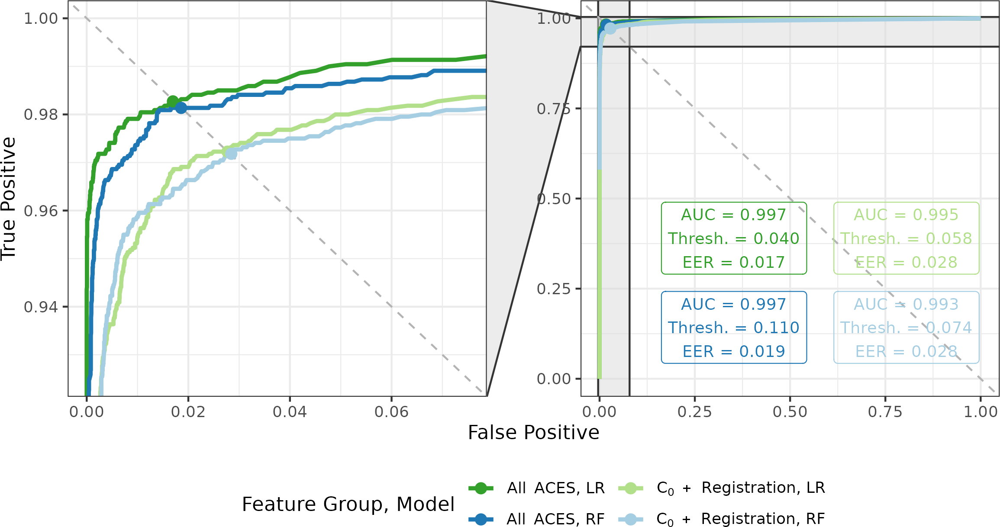

\newcommand{\hh}[1]{{\textcolor{orange}{#1}}}
\newcommand{\svp}[1]{{\textcolor{blue}{#1}}}
\newcommand{\jz}[1]{{\textcolor{olive}{#1}}}

```{r setup, include=FALSE}
options(prompt = 'R> ', continue = '+ ')
knitr::opts_chunk$set(echo = FALSE)
```

```{r load-libraries, cache = FALSE, include = FALSE}
library(cmcR) # remotes::install_github("csafe-isu/cmcR")
library(impressions) # remotes::install_github("jzemmels/impressions")
library(scored) # remotes::install_github("jzemmels/scored")

library(x3ptools)
library(tidyverse)
library(patchwork)
```

<!-- \hh{Generally for tables, no vertical lines.} -->

<!-- \hh{I think we need an overview picture to set the stage for an audience who is large unfamiliar with anything firearms related. How about you move up figure 1 and include (a) cartridge cases with an arrow pointing to the primer. (b) an image of the confocal light microscope taking an image of a cartridge case (c) a comparison microscope image (d) the marked up image (maybe even from the side). -->
<!-- I'm thinking of something along the lines of Xiao Hui's paper: https://www.semanticscholar.org/paper/Automatically-matching-topographical-measurements-a-Tai-Eddy/6532cc25b9104d42844418254641acdab01fadf8/figure/0} -->

# Introduction

A \emph{cartridge case} is the part of firearm ammunition that houses the projectile and propulsive device.
When a firearm is discharged and the projectile travels down the barrel, the cartridge case moves in the opposite direction and slams against the back wall, the \emph{breech face}, of the firearm.
Markings on the breech face are "stamped" into the surface of the cartridge case leaving so-called \emph{breech face impressions}.

In a traditional examination, forensic examiners use these impressions analogous to a fingerprint to determine whether two cartridge cases were fired from the same firearm.
The top of \autoref{fig:examination-algorithm-comparison} illustrates this procedure \citep{xiaoHui_seminar,Zheng2014,Vorburger2015}.
First, two cartridge cases are collected - perhaps one is from a crime scene and the other is collected from a suspect's gun.
An examiner places the two cartridge cases beneath a "comparison microscope" that merges the views of two compound microscopes into a single split view, similar to the side-by-side cartridge case image in \autoref{fig:examination-algorithm-comparison}.
The examiner assesses the degree of similarity between the markings on the cartridge cases and chooses one of four conclusions  \citep{AFTE1992}:

\begin{enumerate}
\item \textbf{Identification:} cartridge cases were fired from the same firearm

\item \textbf{Elimination:} cartridge cases were not fired from the same firearm

\item \textbf{Inconclusive:} the evidence is insufficient to make an identification or elimination

\item \textbf{Unsuitable:} the evidence is unsuitable for examination
\end{enumerate}


<!-- Forensic examinations measure the probative value of a piece of evidence. -->
<!-- Typically, a forensic examiner visually inspects the evidence to determine its source. -->

<!-- The "ground-truth" of a forensic comparison is a binary classification problem. -->
<!-- Briefly reference how comparisons are done by examiners currently. -->
<!-- Keep focus on firearm and toolmark evidence. -->

```{r,out.width="\\textwidth",echo=FALSE,fig.pos="htbp",fig.cap='\\label{fig:examination-algorithm-comparison} Comparison of the traditional examination vs. the currently proposed method for comparing cartridge cases. Both start with two fired cartridge cases. In traditional examination, an examiner uses a microscope to assess the "agreement" of markings on the two cartridge case surfaces. They decide whether or not the cartridge cases were fired from the same firearm, or if there is inconclusive evidence to decide. In the ACES algorithm, we take a topographical scan of the cartridge case surfaces and manually identify the regions containing distinguishable markings (shown in red). We pass these scans to the ACES algorithm, which processes and compares the two scans. The final result is a numerical measure of similarity of the two cartridge cases.'}
knitr::include_graphics("images/Cartridge on Sensofar Scope/examination_vs_algorithm_comparison_oneScanSideView.png")
```

Critics of traditional forensic examinations cite a lack of "foundational validity" underlying the procedures used by firearm and toolmark examiners \citep{nas2009,pcast}.
In particular, examiners rely largely on their subjective findings rather than on a well-defined procedure to measure similarity.
\citet{pcast} pushed for "developing and testing image-analysis algorithms" to objectively measure the similarity between cartridge cases.
An automatic comparison algorithm could supplement, inform, or dictate an examiner's conclusion \citep{swofford}.

We introduce a novel Automatic Cartridge Evidence Scoring (ACES) algorithm to objectively compare cartridge case evidence based on their breech face impressions.
Our algorithm encompasses all stages of the comparison procedure after collecting a scan of the cartridge case surface including preprocessing, comparing, and scoring.
Our ACES algorithm is available open-source as part of the [scored](https://jzemmels.github.io/scored/) R package.

In the following sections, we first review recently proposed algorithms to compare firearm evidence.
We then discuss the data collection procedure to obtain 510 cartridge scans used in training and validating the ACES algorithm.
To our knowledge, this is the largest published study of a cartridge case scoring algorithm to-date, with the next largest analyzing four different data sets totaling 195 cartridge cases \citep{chen_convergence_2017}.
After describing the ACES algorithm, we present summary results from training and testing two binary classifier models: based on a random forest and logistic regression.
We discuss the strengths and weaknesses of the two classifier models and compare the relative importance of the ACES features.
We also argue that the ACES algorithm combines the classification rules of previously proposed cartridge case comparison algorithms while incorporating additional nuance.
We conclude with our thoughts on how cartridge case comparison algorithms should be developed, validated, and shared going forward.

## Previous Work

Many recent proposals for automatic cartridge case scoring algorithms borrow from image processing and computer vision techniques.
For example, \citet{vorburger_surface_2007} proposed using the cross-correlation function (CCF) to compare images or scans of cartridge case surfaces.
The CCF measures the similarity between two matrices for all possible translations of one matrix against the other.
Calculating the CCF while rotating one of the scans therefore allows for estimation of the optimal translation and rotation, together referred to as the \emph{registration}, between the two scans; simply choose the rotation/translation at which the CCF is maximized.
\citet{aoas} used the CCF, among other features, to compare scans of bullets.
\citet{tai_fully_2018} developed an open-source cartridge case comparison pipeline that compared cartridge case images using the CCF.

\citet{song_proposed_2013} noted that two matching cartridge cases often share similar impressions in specific regions, so calculating the CCF between two full scans may not highlight their similarities.
Instead, \citet{song_proposed_2013} proposed partitioning one cartridge case scan into a grid of "cells" and calculating the CCF between each cell and the other scan.
If two cartridge cases are truly matching, then the maximum CCF value between each cell and the other scan, particularly the cells containing distinguishable breech face impressions, should be relatively large.
Furthermore, the cells should "agree" on the registration at which the CCF is maximized.
\citet{song_proposed_2013} outlined the "Congruent Matching Cells" algorithm to determine the number of cells that agree on a particular registration.
A cell is classified as a Congruent Matching Cell (CMC) if its estimated registration is within some threshold of the median registration across all cells and its CCF value is above some threshold.
A number of follow-up papers proposed alterations to the the original CMC method \citep{tong_improved_2015,chen_convergence_2017}.
\citet{cmcR} introduced an open-source implementation of the CMC method in the cmcR R package.
As an alternative to defining Congruent Matching Cells, \citet{zhang_convergence_2021} proposed using a clustering algorithm from \citet{dbscan} to determine the number of cells in agreement on a specific registration.

Currently, there is no rigorous procedure for comparing different cartridge case comparison algorithms.
This includes selecting optimal parameters for a specific algorithm.
\citet{Zemmels2023} proposed an optimization criterion to select parameters for the CMC algorithm.
Analogously, \citet{aoas} developed a validation procedure to select parameters for a bullet comparison algorithm.
In this work, we introduce a novel cross-validation procedure to learn and test optimal parameters for the ACES algorithm.

# Cartridge Case Data

We use 510 cartridge cases collected as part of a study by \citet{baldwin}. 
The authors of the original study fired 800 Remington 9mm pistol cartridge cases from each of 25 new Ruger SR9, 9mm Luger centerfire pistols..
They separated the collected cartridge cases into 15 sets of four to be sent to each of 218 forensic examiner participants.
Each set of four consisted of three cartridge cases labeled as originating from the same firearm, the "known-match" cartridge cases.
Participants performed an examination to determine whether a fourth "questioned" cartridge case shared a common source with the known-match triplet (or whether the evidence was inconclusive).

Across all 218 examiners, the true positive rate - proportion of correctly classified matching sets - was reported to be 99.6%.
The reported true negative rate - the proportion of correctly classified non-matching sets - was 65.2%.
The discrepancy between the true positive and true negative rates can be partially explained by the number of "inconclusive" decisions made by the examiners.
Examiners reach an inconclusive decision when there is some agreement or disagreement in the characteristics between two cartridge cases, but not enough to make a match or non-match conclusion \citep{AFTE1992}.
Roughly one out of five comparisons, 22.9%, were reported as inconclusive.
The vast majority, 98.5%, of these inconclusives were truly non-matching comparisons, which justifies the true negative rate of 65.2%.
There has recently been some debate about how to incorporate inconclusive decisions into accuracy/error rate estimation \citep{hofmann_inconclusives_2021}, so we do not report an overall accuracy here.

We scanned the 510 cartridge cases using the Cadre$^{\text{TM}}$ 3D-TopMatch High Capacity Scanner.
Briefly, this scanner collects images under various lighting conditions of a gel pad into which the base of a cartridge case is impressed.
Proprietary software that accompanies this scanner combines these images into a 2D array called a \emph{surface matrix}.
The elements of a surface matrix represent the relative height values of the associated cartridge case surface.
This surface matrix, along with metadata concerning parameters under which the scan was taken (dimension, resolution, author, etc.), are stored in the ISO standard XML 3D Surface Profile (\texttt{x3p}) file type \citep{ISO25178-72}.

As discussed in the next section, our design differs from that used in \citet{baldwin}.
Rather than basing error rates on the comparison of three known-match cartridge cases to one questioned cartridge case (3 to 1), we consider the classification error rate of pairwise comparisons (1 to 1).
Further, we split the 510 cartridge cases by randomly selecting 10 of the 25 firearms for training and use the remaining 15 firearms for testing.
This resulted in a training set of 210 cartridge cases, $\binom{210}{2} = 21,945$ pairwise comparisons, and a testing set of 300 cartridge cases, $\binom{300}{2} = 44,850$ pairwise comparisons.

\jz{[cite eventual DFSC data-in-brief or ISU datashare repo?]}

# Methods

We now discuss the methods behind the Automatic Cartridge Evidence Scoring (ACES) algorithm. We divide the methods into three stages:

```{=tex}
\begin{enumerate}
\item \textbf{Preprocessing:} prepare cartridge case scans for comparison

\item \textbf{Comparing:} compare two cartridge cases and compute similarity features

\item \textbf{Scoring:} measure the similarity between the two cartridge cases using a trained classifier
\end{enumerate}
```

The following sections detail each of these stages.
Throughout, we treat "surface matrix" and "scan" synonymously.

The bottom of \autoref{fig:examination-algorithm-comparison} shows a summary of our procedure.
After taking a topographical scan of the cartridge case surfaces, we manually annotate the breech face impression region (shown in red).
ACES automatically preprocesses and compares the scans resulting in a similarity score, either a binary classification or class probability, derived from a classifier model.

## Preprocessing

We first use the open-source FiX3P web application \hh{cite Talen Fisher} to manually annotate the breech face impression region.
An example of a manually-annotated cartridge case scan is shown in \autoref{fig:examination-algorithm-comparison}.
The FiX3P software includes functionality to "paint" the surface of a cartridge case using a computer cursor and save the painted regions to a *mask.* A mask is a 2D array of hexidecimal color values of the same dimension as its associated surface matrix.
When initialized, every element of a mask is a shade of brown (#cd7f32) by default.
Any elements painted over by the user will be replaced with the user's selected color value.
In \autoref{fig:examination-algorithm-comparison}, the breech face impression region was manually annotated using a shade of red (#ff0000).

We preprocess the raw scans by applying a sequence of functions available in the R packages x3ptools \citep{x3ptools} and cmcR \citep{cmcR}.
\autoref{fig:preProcessEffect} shows the effect that each function has on the scan surface values.
Gray pixels in each plot represent missing values in the surface matrix.
The `x3p_delete` function removes values in the scan based on the associated mask.
Next, the `preProcess_removeTrend` function subtracts a fitted conditional median plane from the surface values to "level-out" any global tilt in the scan.
The `preProcess_gaussFilter()` function applies a bandpass Gaussian filter to remove small-scale noise and other large-scale structure, which better highlights the medium-scale breech face impressions.
Finally, the `preProcess_erode()` function applies the morphological operation of erosion on the edge of the non-missing surface values \citep{Haralick1987}.
This has the effect of shaving off values on the interior and exterior edge of the surface, which are often extreme "roll-off" values that unduly affect the comparing stage if not removed.
The final result is a cartridge case surface matrix with emphasized breech face impressions.

```{r,cache=TRUE,include=FALSE}
reference <- x3p_read("data/NIST_K013sA1.x3p")
target <- x3p_read("data/NIST_K013sA2.x3p")

reference$surface.matrix <- reference$surface.matrix*1e6
target$surface.matrix <- target$surface.matrix*1e6

reference_deleted <- reference %>%
  impressions::x3p_delete(mask_vals = "#CD7F32FF") %>%
  x3ptools::x3p_sample(m = 4)

reference_detrend <- reference %>%
  impressions::x3p_delete(mask_vals = "#CD7F32FF") %>%
  cmcR::preProcess_removeTrend(statistic = "quantile",
                               tau = .5,
                               method = "fn") %>%
  x3ptools::x3p_sample(m = 4)

reference_filtered <- reference %>%
  impressions::x3p_delete(mask_vals = "#CD7F32FF") %>%
  cmcR::preProcess_removeTrend(statistic = "quantile",
                               tau = .5,
                               method = "fn") %>%
  cmcR::preProcess_gaussFilter() %>%
  x3p_sample() %>%
  cmcR::preProcess_removeTrend(statistic = "quantile",
                               tau = .5,
                               method = "fn") %>%
  cmcR::preProcess_gaussFilter() %>%
  x3p_sample()

reference_eroded <- reference %>%
  impressions::x3p_delete(mask_vals = "#CD7F32FF") %>%
  cmcR::preProcess_removeTrend(statistic = "quantile",
                               tau = .5,
                               method = "fn") %>%
  cmcR::preProcess_gaussFilter() %>%
  x3p_sample() %>%
  cmcR::preProcess_removeTrend(statistic = "quantile",
                               tau = .5,
                               method = "fn") %>%
  cmcR::preProcess_gaussFilter() %>%
  x3p_sample() %>%
  cmcR::preProcess_erode(region = "interior",morphRadius = round(50/4)) %>% 
  cmcR::preProcess_erode(region = "exterior",morphRadius =  round(50/4)) %>%
  impressions::x3p_cropWS()

target_eroded <- target %>%
  impressions::x3p_delete(mask_vals = "#CD7F32FF") %>%
  cmcR::preProcess_removeTrend(statistic = "quantile",
                               tau = .5,
                               method = "fn") %>%
  cmcR::preProcess_gaussFilter() %>%
  x3p_sample() %>%
  cmcR::preProcess_removeTrend(statistic = "quantile",
                               tau = .5,
                               method = "fn") %>%
  cmcR::preProcess_gaussFilter() %>%
  x3p_sample() %>%
  cmcR::preProcess_erode(region = "interior",morphRadius = round(50/4)) %>% 
  cmcR::preProcess_erode(region = "exterior",morphRadius =  round(50/4)) %>%
  impressions::x3p_cropWS()
```


```{r,cache = FALSE,include=FALSE}
plts <- impressions::x3pPlot(reference_deleted,reference_detrend,reference_filtered,reference_eroded,
                             x3pNames = c("x3p_delete()","preProcess_removeTrend()",
                                          "preProcess_gaussFilter()","preProcess_erode()"),
                             type = "list",
                             legend.quantiles = c(0,.5,1)) %>%
  map(~ {
    . +
      theme(legend.position = "bottom") +
      ggplot2::guides(fill = ggplot2::guide_colourbar(barwidth = grid::unit(1.25, 
                                                                            "in"), 
                                                      barheight = grid::unit(.2,"in"),
                                                      label.theme = ggplot2::element_text(size = 6), 
                                                      title.theme = ggplot2::element_text(size = 8), 
                                                      title.vjust = .8,
                                                      frame.colour = "black",
                                                      ticks.colour = "black",
                                                      direction = "horizontal"), 
                      colour = "none") + 
      ggplot2::labs(fill = expression("Rel. Height ["*mu*"m]"))
  })

plt <- (plts[[1]] | plts[[2]] | plts[[3]] | plts[[4]])

ggsave(plot = plt,filename = "figures/preProcessEffect.png",width = 10,height = 5)
knitr::plot_crop("figures/preProcessEffect.png")
```


```{r,out.width="\\textwidth",echo=FALSE,fig.pos="htbp",fig.cap="\\label{fig:preProcessEffect} We apply a sequence of preprocessing functions to each scan. Each preprocessing step further emphasizes the breech face impressions in the scan."}
knitr::include_graphics("figures/preProcessEffect.png")
```

Next, we compute a set of similarity features for two preprocessed cartridge case scans.

## Comparing

In this section, we introduce a set of similarity features for two cartridge case scans.
We calculate features at two scales: between two full scans and between individual cells.
Analogous to how a forensic examiner uses a comparison microscope with different magnification levels, this allows us to assess the similarity between two scans at the macro and micro levels.

### Notational Conventions

First, we introduce notation that will be used to define the features.
Let $A$ and $B$ denote two surfaces matrices that we wish to compare.
For simplicity, we assume that $A,B \in \mathbb{R}^{k \times k}$ for $k > 0$.\footnote{This assumption of equally-sized, square matrices is easily enforced by padding the matrices with additional missing values.
Due to the presence of (structurally) missing values around the breech face impression region, additional padding does not interfere with the structure of the scan.}
We use lowercase letters and subscripts to denote a particular value of a matrix: $a_{ij}$ is the value in the $i$-th row and $j$-th column, starting from the top-left corner, of matrix $A$.
We refer to the two known-match cartridge cases in \autoref{fig:matchPair} as exemplar matrices $A$ and $B$.

To accommodate structurally missing values, we adapt standard matrix algebra as follows: if an element of either matrix $A$ or $B$ is missing, then any element-wise operation including this element is also missing.
Standard matrix algebra holds for non-missing elements.
For example, the addition operator is defined as:
\begin{align*}
A \oplus_{NA} B = (a_{ij} \oplus_{NA} b_{ij})_{1 \leq i,j \leq k} = 
\begin{cases}
a_{ij} + b_{ij} & \text{if both $a_{ij}$ and $b_{ij}$ are numbers} \\
NA &\text{otherwise}
\end{cases}
\end{align*}
Other element-wise operations such as $\ominus_{NA}$ are defined similarly.
For readability, we will use standard operator notation $+, -, >, <, I(\cdot), ...$ and assume the extended, element-wise operations as defined above.


```{r,cache=FALSE,include=FALSE}
plt <- impressions::x3pPlot(reference_eroded,target_eroded,x3pNames = c("Scan A","Scan B"),legendLength = grid::unit(4, "in"))

ggsave(filename = "figures/matchPair.png",plot = plt,height = 7,width = 10)
knitr::plot_crop("figures/matchPair.png")
```


```{r,out.width="\\textwidth",echo=FALSE,fig.pos="htbp",fig.cap="\\label{fig:matchPair} A matching pair of processed cartridge case scans. We measure the similarity between these cartridge cases using the distinguishable breech face impressions on their surfaces."}
knitr::include_graphics("figures/matchPair.png")
```

### Registration Estimation

A critical step in comparing $A$ and $B$ is to find a transformation of $B$ such that it aligns best to $A$ (or vice versa).
In image processing, this is called *image registration.* 
Noting that $A$ and $B$ are essentially grayscale images with structurally missing values, we rely on a standard image registration technique \citep{Brown1992}.

In our application, a registration is composed of a discrete translation by $(m,n) \in \mathbb{Z}^2$ and rotation by $\theta \in [-180^\circ,180^\circ]$.
To determine the optimal registration, we calculate the *cross-correlation function* (CCF) between $A$ and $B$, which measures the similarity between $A$ and $B$ for every possible translation of $B$, denoted $(A \star B)$.
We estimate the registration by calculating the maximum CCF value across a range of rotations of matrix $B$.
Let $B_\theta$ denote $B$ rotated by an angle $\theta \in [-180^\circ,180^\circ]$ and $b_{\theta_{mn}}$ the $m,n$-th element of $B_\theta$.
Then the estimated registration $(m^*,n^*,\theta^*)$ is: 

\begin{align*}
(m^*,n^*,\theta^*) = \arg \max_{m,n,\theta} (a \star b_\theta)_{mn}.
\end{align*} 

In practice we consider a discrete grid of rotations $\pmb{\Theta} \subset [-180^\circ,180^\circ]$.
The registration procedure is outlined in \autoref{alg:registration}.
We refer to the matrix that is rotated as the "target."
The result is the estimated registration of the target matrix to the "source" matrix.

```{=tex}
\begin{algorithm}[htbp]
\KwData{Source matrix $A$, target matrix $B$, and rotation grid $\pmb{\Theta}$}
\KwResult{Estimated registration of $B$ to $A$, $(m^*,n^*,\theta^*)$, and cross-correlation function maximum, $CCF_{\max}$}
\For{$\theta \in \pmb{\Theta}$}{
Rotate $B$ by $\theta$ to obtain $B_\theta$\;
Calculate $CCF_{\max, \theta} = \max_{m,n} (a \star b_{\theta})_{mn}$\;
Calculate translation $[m^*_\theta,n^*_\theta] = \arg \max_{m,n} (a \star b_{\theta})_{mn}$
}
Calculate overall maximum correlation $CCF_{\max} = \max_{\theta} \{CCF_{\max,\theta} : \theta \in \pmb{\Theta}\}$\;
Calculate rotation $\theta^* = \arg \max_{\theta} \{CCF_{\max,\theta} : \theta \in \pmb{\Theta}\}$\;
\Return{Estimated rotation $\theta^*$, translation $m^* = m^*_{\theta^*}$ and $n^* = n^*_{\theta^*}$, and $CCF_{\max}$}
\caption{Image Registration Procedure}
\label{alg:registration}
\end{algorithm}
```


To accommodate missing values, we also compute the *pairwise-complete correlation* using only the complete value pairs, meaning neither value is missing, between $A$ and $B$.

### Registration-Based Features

#### Full-Scan Registration

We first estimate the registration between two full scans $A$ and $B$ using \autoref{alg:registration} with a rotation grid $\pmb{\Theta} = \{-30^\circ, -27^\circ,...,27^\circ,30^\circ\}$.
This results in an estimated registration $(m^*,n^*,\theta^*)$ and similarity measure $CCF_{\max}$.
We also perform \autoref{alg:registration} with the roles of $A$ and $B$ reversed, meaning the target scan $A$ is aligned to source scan $B$.

To accommodate these two comparison directions, we introduce a new subscript $d = A,B$, referring to the source scan in \autoref{alg:registration}.
Consequently, we obtain two sets of sets of estimated registrations, $(m^*_d,n^*_d,\theta^*_d)$ and $CCF_{\max,d}$, for $d=A,B$.\footnote{In reality, the true aligning registrations in the two comparison directions are opposites of each other. However, because we compare discretely-indexed arrays using a nearest-neighbor interpolation scheme, the estimated registrations differ slightly.}
For $d = A$, we then apply the registration transformation $(m^*_A,n^*_A,\theta^*_A)$ to $B$ to obtain $B^*$ and compute the pairwise-complete correlation, $cor_{\text{full},A}$, between $A$ and $B^*$.
We repeat this in the other comparison direction to obtain $cor_{\text{full},B}$ and average the two:
\begin{align*}
cor_{\text{full}} = \frac{1}{2}\left(cor_{A,\text{full}} + cor_{B,\text{full}}\right).
\end{align*}
We assume that the **full-scan pairwise-complete correlation** is large for truly matching cartridge cases.

<!-- \hline -->
<!-- $CCF_{\max}$ & Maximum value of the cross-correlation function across a grid of rotations \\ -->

#### Cell-Based Registration

We next perform a cell-based comparison procedure, which begins with selecting one of the matrices, say $A$, as the "source" matrix that is partitioned into a grid of cells.
The left side of \autoref{fig:cellGridExample} shows an example of such a cell grid overlaid on a scan.
Each of these source cells will be compared to the "target" matrix, in this case $B^*$.
Because $A$ and $B^*$ are already partially aligned from the full-scan registration procedure, we compare each source cell to $B^*$ using a new rotation grid of $\pmb{\Theta}'_A = \{\theta^*_A - 2^\circ, \theta^*_A - 1^\circ,\theta^*_A,\theta^*_A + 1^\circ,\theta^*_A + 2^\circ\}$.

We now extend the surface matrix notation introduced previously to accommodate cells.
Let $A_{t}$ denote the $t$-th cell of matrix $A$, $t = 1,...,T_A$ where $T_A$ is the total number of cells containing non-missing values in scan $A$ (e.g., $T_A = 43$ in \autoref{fig:cellGridExample}) and let $(a_t)_{ij}$ denote the $i,j$-th element of $A_t$.

The cell-based comparison procedure is outlined in \autoref{alg:cellComparison}.

```{=tex}
\begin{algorithm}[H]
\KwData{Source matrix $A$, target matrix $B^*$, grid size $R \times C$, and rotation grid $\pmb{\Theta}'_A$}
\KwResult{Estimated translations and $CCF_{\max}$ values per cell, per rotation}
Partition $A$ into a grid of $R \times C$ cells\;
Discard cells containing only missing values, leaving $T_A$ remaining cells\;
\For{$\theta \in \pmb{\Theta}'_A$}{
Rotate $B^*$ by $\theta$ to obtain $B^*_\theta$\;
\For{$t = 1,...,T_A$}{
Calculate $CCF_{\max, A,t,\theta} = \max_{m,n} (a_t \star b^*_\theta)_{mn}$\;
Calculate translation $[m^*_{A,t,\theta},n^*_{A,t,\theta}] = \arg \max_{m,n} (a_t \star b^*_\theta)_{mn}$
}
}
\Return{$\pmb{F}_A = \{(m^*_{A,t,\theta},n^*_{A,t,\theta}, CCF_{\max,A,t,\theta}, \theta) : \theta \in \pmb{\Theta}'_A, t = 1,...,T_A\}$}
\caption{Cell-Based Comparison Procedure}
\label{alg:cellComparison}
\end{algorithm}
```

Rather than exclusively returning the registration that maximizes the overall CCF as in \autoref{alg:registration}, \autoref{alg:cellComparison} returns the set $\pmb{F}_A$ of translations and CCF values for each of the $T_A$ cells and each rotation in $\pmb{\Theta}'_A$.

```{r,out.width="\\textwidth",echo=FALSE,fig.pos="htbp",fig.cap="\\label{fig:cellGridExample} Estimated registrations of cells from a non-match pair of cartridge cases. A source scan (left) is separated into an $8 \\times 8$ grid of cells. We exclude cells containing only missing values (visualized here as gray pixels). Each source cell is compared to a target scan (right) to estimate where it aligns best. We show a handful of cells at their estimated alignment in the target scan and magnify the surfaces captured by cell pairs 5, 1 and 7, 7. Although the cartridge case pair is non-matching, we note that there are similarities in the surface markings for these cell pairs."}
knitr::include_graphics("images/cellGridExample_nonMatch.png")
```

\autoref{fig:cellGridExample} shows the estimated registrations of cells between two non-match cartridge cases.
We magnify the surface values captured by cell pairs 5, 1 and 7, 7 and note the similarities in the surface values; for example, the dark purple region in the middle of the cell 7, 7 pair.

Just as with the whole-scan registration, we calculate the pairwise-complete correlation between each cell $A_t$ and a matrix $B_{\theta,t}^*$ of the same size extracted from $B^*_{\theta}$ after translating by $[m^*_{A,\theta},n^*_{A,\theta}]$.
From this we obtain a set of pairwise-complete correlations for each cell and rotation: $\{cor_{A,t,\theta} : t = 1,...,T_A, \theta \in \pmb{\Theta}'_A\}$.

We repeat \autoref{alg:cellComparison} and the pairwise-complete correlation calculation using $B$ as the source scan and $A^*$ as the target, resulting in cell-based registration set $\pmb{F}_B$ and pairwise-complete correlations $\{cor_{B,t,\theta} : t = 1,...,T_B, \theta \in \pmb{\Theta}'_B\}$.

For $d = A,B$ and $t = 1,...,T_d$, define the cell-wise maximum pairwise-complete correlation as: 
\begin{align*}
cor_{d,t} &= \max_{\theta} \{cor_{d,t,\theta} : \theta \in \pmb{\Theta}'_d\}
\end{align*}

We compute two features, the \textbf{average} and \textbf{standard deviation of the cell-based pairwise-complete correlations}, using the correlation data: 
\begin{align*}
\overline{cor}_{\text{cell}} &= \frac{1}{T_A + T_B} \sum_{d \in \{A,B\}} \sum_{t=1}^{T_d} cor_{d,t} \\
s_{cor} &= \sqrt{\frac{1}{T_A + T_B - 1} \sum_{d \in \{A,B\}} \sum_{t=1}^{T_d} (cor_{d,t} - \overline{cor}_{\text{cell}})^2}
\end{align*} 

We expect $\overline{cor}_{\text{cell}}$ and $s_{cor}$ to be large for truly matching cartridge case pairs relative to non-matching pairs.

For $d = A,B$ and $t = 1,...,T_d$, define the per-cell estimated translations and rotation as: 
\begin{align*}
\theta^*_{d,t} &= \arg \max_{\theta} \{CCF_{\max,d,t,\theta} : \theta \in \pmb{\Theta}'_d\} \\
m^*_{d,t} &= m^*_{d,t,\theta^*_{d,t}} \\
n^*_{d,t} &= n^*_{d,t,\theta^*_{d,t}}
\end{align*} 

We compute the \textbf{standard deviation of the cell-based estimated registrations} using the estimated translations and rotations: 
\begin{align*}
s_{\theta^*} =  \sqrt{\frac{1}{T_A + T_B - 1} \sum_{d \in \{A,B\}} \sum_{t=1}^{T_d} (\theta^*_{d,t} - \bar{\theta}^*)^2} \\
s_{m^*} =  \sqrt{\frac{1}{T_A + T_B - 1} \sum_{d \in \{A,B\}} \sum_{t=1}^{T_d} (m^*_{d,t} - \bar{m}^*)^2} \\
s_{n^*} = \sqrt{\frac{1}{T_A + T_B - 1} \sum_{d \in \{A,B\}} \sum_{t=1}^{T_d} (n^*_{d,t} - \bar{n}^*)^2}
\end{align*} 
where 
\begin{align*}
\bar{m}^* &= \frac{1}{T_A + T_B} \sum_{d \in \{A,B\}}\sum_{t=1}^{T_d} m^*_{d,t} \\
\bar{n}^* &= \frac{1}{T_A + T_B} \sum_{d \in \{A,B\}} \sum_{t=1}^{T_d} n^*_{d,t} \\
\bar{\theta}^* &= \frac{1}{T_A + T_B} \sum_{d \in \{A,B\}} \sum_{t=1}^{T_d} \theta^*_{d,t}.
\end{align*}
We expect $s_{\theta^*}, s_{m^*},s_{n^*}$ to be small for truly matching cartridge case pairs relative to non-matching pairs.

From the full-scan and cell-based registration procedures, we obtain six features summarized in \autoref{tab:registrationFeatures}.

```{=tex}
\begin{table}[htbp]
\centering
\begin{tabular}{p{.11\linewidth} p{.7\linewidth}}
$cor_{\text{full}}$ & Full-scan pairwise-complete correlation \\
$\overline{cor}_{\text{cell}}$ & Average cell-based pairwise-complete correlation \\
$s_{cor}$ & Standard deviation of the cell-based pairwise-complete correlations \\
$s_{m^*}$ & Standard deviation of the cell-based vertical translations (in microns) \\
$s_{n^*}$ & Standard deviation of the cell-based horizontal translations (in microns) \\
$s_{\theta^*}$ & Standard deviation of the cell-based rotations (degrees)
\end{tabular}
\caption{Six similarity features based on registering full scans and cells.}
\label{tab:registrationFeatures}
\end{table}
```


<!-- \hline -->
<!-- $\overline{CCF}_{\max, \cdot}$ & Average maximum value of the cross-correlation function across all cells and rotations \\ -->
<!-- \hline -->
<!-- $s_{CCF}^2$ & Sample variance of the maximum CCF values across all cells \\ -->

### Density-Based Features

We wish to identify when multiple cells agree on, or cluster around, a particular registration value.
However, pursuant with the notion that only certain regions of matching cartridge cases contain distinctive markings, it is unreasonable to assume and empirically rare that \emph{all} cells agree on a single registration.
In fact, it is common for many cells to disagree on a registration.
For example, the left scatterplot in \autoref{fig:dbscanScatterplot} shows the per-cell estimated translations $[m^*_{A,t,\theta}, n^*_{A,t,\theta}]$ when scan $A$ is used as source and $B^*$ as target rotated by $\theta = 3^\circ$.
The right scatterplot shows the per-cell estimated translations with the roles of $A$ and $B^*$ reversed for $\theta = -3^\circ$.
We see distinctive clusters, the black points, in both plots among many noisy, gray points.
The task is to isolate the clusters amongst such noise.

We use the Density-Based Spatial Clustering of Applications with Noise (DBSCAN) algorithm proposed by \citet{dbscan} to identify clusters.
Compared to other clustering algorithms such as k-means \citep{MacQueen1967}, DBSCAN does not require a pre-defined number of expected clusters.
Instead, the algorithm forms clusters if the number of points within an $\epsilon > 0$ distance of a point exceeds some pre-defined threshold, $minPts > 1$.
If a point does not belong to a cluster, then DBSCAN labels that point as "noise."
In \autoref{fig:dbscanScatterplot}, we use DBSCAN with $\epsilon = 5$ and $minPts = 5$ to identify clusters of size 14 and 13, respectively, visualized as black points.
These cluster sizes suggest that the scans match.
Additionally, the mean cluster centers are approximately opposites of each other: $(\hat{m}_A,\hat{n}_A,\hat{\theta}_A) \approx (16.9, -16.7, 3^\circ)$ when $A$ is used as source compared to $(\hat{m}_B,\hat{n}_B,\hat{\theta}_B) \approx (-16.2, 16.8, -3^\circ)$ when $B^*$ is used as source.
This provides further evidence of a match.

```{r,include=FALSE}
load("data/compData.RData")
```


```{r,cache=FALSE,include=FALSE}
estimRotations <- compData %>%
  group_by(direction,theta) %>%
  group_split() %>%
  map_dfr(function(dat){
    
    densEstim <- MASS::kde2d(x = dat$x,y = dat$y,n = 100)
    
    data.frame(maxDens = max(c(densEstim$z)),
               theta = unique(dat$theta),
               direction = unique(dat$direction))
    
  }) %>%
  group_by(direction) %>%
  dplyr::top_n(n = 1,wt = maxDens) %>%
  select(direction,theta) %>%
  rename(thetaHat = theta)

plt1 <- compData %>%
  select(-c(cellHeightValues,alignedTargetCell)) %>%
  left_join(estimRotations,by = "direction") %>%
  filter(theta == thetaHat) %>%
  mutate(direction = factor(direction,labels = c("Scan A vs. Scan B*","Scan B* vs. Scan A")),
         label = paste0(direction,", Rotation: ",theta)) %>%
  filter(direction == "Scan A vs. Scan B*") %>%
  group_by(label) %>%
  group_split() %>%
  map_dfr(function(dat){
    
    dat %>%
      mutate(clust = dbscan::dbscan(x = dat %>% select(x,y),eps = 5,minPts = 5)$cluster,
             clust = factor(ifelse(clust == 0,0,1),labels = c("Noise","Cluster")))
    
  }) %>%
  ggplot(aes(x=x,y,y,colour = clust)) +
  # geom_point() +
  geom_jitter(width = 3,height = 3,size = 1) +
  coord_fixed(expand = TRUE) +
  facet_wrap(~ label,nrow = 1) +
  theme_bw() +
  labs(x = "horizontal shift n",
       y = "vertical shift m",
       colour = "DBSCAN") +
  theme(axis.text = element_text(size = 6),
        legend.position = "bottom") +
  geom_vline(xintercept = 0,linetype = "dashed") +
  geom_hline(yintercept = 0,linetype = "dashed") +
  scale_colour_manual(values = c("gray65","black")) +
  xlim(c(-100,100)) +
  ylim(c(-100,100)) +
  theme(legend.position = "none")

plt2 <- compData %>%
  select(-c(cellHeightValues,alignedTargetCell)) %>%
  left_join(estimRotations,by = "direction") %>%
  filter(theta == thetaHat) %>%
  mutate(direction = factor(direction,labels = c("Scan A vs. Scan B*","Scan B* vs. Scan A")),
         label = paste0(direction,", Rotation: ",theta)) %>%
  filter(direction == "Scan B* vs. Scan A") %>%
  group_by(label) %>%
  group_split() %>%
  map_dfr(function(dat){
    
    dat %>%
      mutate(clust = dbscan::dbscan(x = dat %>% select(x,y),eps = 5,minPts = 5)$cluster,
             clust = factor(ifelse(clust == 0,0,1),labels = c("Noise","Cluster")))
    
  }) %>%
  ggplot(aes(x=x,y,y,colour = clust)) +
  # geom_point() +
  geom_jitter(width = 3,height = 3,size = 1) +
  coord_fixed(expand = TRUE) +
  facet_wrap(~ label,nrow = 1) +
  theme_bw() +
  labs(x = "(negative) horizontal shift n",
       y = "(negative) vertical shift m",
       colour = "DBSCAN") +
  theme(axis.text = element_text(size = 6),
        legend.position = "bottom") +
  geom_vline(xintercept = 0,linetype = "dashed") +
  geom_hline(yintercept = 0,linetype = "dashed") +
  scale_colour_manual(values = c("gray65","black")) +
  scale_x_reverse(limits = c(100,-100)) +
  scale_y_reverse(limits = c(100,-100)) +
  theme(legend.position = "none")

pltLegend <- plt1 %>%
  cowplot::get_legend() %>%
  cowplot::plot_grid()

ggsave(filename = "figures/dbscanScatterplot.png", plot = plt1+plt2, 
       width = 8, height = 4)
knitr::plot_crop("figures/dbscanScatterplot.png")
```


```{r,out.width=".8\\textwidth",echo=FALSE,fig.pos="htbp",fig.cap="\\label{fig:dbscanScatterplot} Cluster assignments based on the Density Based Spatial Clustering with Applications to Noise (DBSCAN) algorithm for estimated translations in two comparison directions. Using scan $A$ as source results in a cluster of size 14 (left) compared to 13 when scan $B^*$ is used as source (right). Noting the reversed axes in the right plot, we see that the clusters are located approximately opposite of each other. Points are jittered for visibility."}
knitr::include_graphics("figures/dbscanScatterplot.png")
```

To calculate the density-based features, we first use a 2D kernel density estimator \citep{MASS} to identify the rotation $\hat{\theta}_d$ at which the per-cell translations achieve the highest density.
Next, we compute clusters using the DBSCAN algorithm amongst the estimated translations $\{(m^*_{d,t,\hat{\theta}_d},n^*_{d,t,\hat{\theta}_d}) : t = 1,...,T_d\}$ like those shown in \autoref{fig:dbscanScatterplot}.\footnote{If more than one cluster is identified, we binarize the points based on whether they were assigned to any cluster or if they are a noise point and proceed as if there is only one cluster. We assume that two or more clusters form only because of the course rotation grid considered. Were a finer grid used, the points would coalesce into a single cluster around the true translation value. This assumption has empirical support through our experimentation.} 
Let $\pmb{C}_d$ denote the set of cells in the DBSCAN cluster.
We treat the mean cluster centers as the estimated translations $[\hat{m}_d,\hat{n}_d]$.

We calculate four features from the density-based clustering procedure: \textbf{average DBSCAN cluster size} $C$, the \textbf{DBSCAN cluster indicator} $C_0$, and the \textbf{root sum of squares of the density-estimated registrations} $(\Delta_\theta, \Delta_{\text{trans}})$ defined as:
\begin{align*}
C &= \frac{1}{2}\left(|\pmb{C}_A| + |\pmb{C}_B|\right) \\
C_0 &= I(|\pmb{C}_A| > 0 \text{ and } |\pmb{C}_B| > 0)\\
\Delta_\theta &= |\hat{\theta}_A + \hat{\theta}_B| \\
\Delta_{\text{trans}} &= \sqrt{(\hat{m}_A + \hat{m}_B)^2 + (\hat{n}_A + \hat{n}_B)^2}
\end{align*} where $|\pmb{C}_d|$ denotes the cardinality of $\pmb{C}_d$ and $I(\cdot)$ is the identity function equal to 1 if the predicate argument "$\cdot$" evaluates to TRUE and 0 otherwise.
We use both $C$ and $C_0$ because of potential missingness in the values of $C$ if no cluster is identified.
Missing $C$ values are imputed using the median non-missing value when fitting classifiers, so the missingness information is retained in $C_0$.

For truly matching cartridge case pairs, we expect $C$ to be large, $C_0$ to be 1, and $\Delta_\theta, \Delta_{\text{trans}}$ to be small relative to non-matching pairs. We obtain four density-based features summarized in \autoref{tab:dbscanFeatures}.

```{=tex}
\begin{table}[htbp]
\centering
\begin{tabular}{p{.11\linewidth} p{.7\linewidth}}
$C$ & Average DBSCAN cluster size \\
$C_0$ & DBSCAN cluster indicator \\
$\Delta_\theta$ & Absolute sum of the density-estimated rotations (degrees) \\
$\Delta_{\text{trans}}$ & Root sum of squares of the density-estimated translations (in microns)
\end{tabular}
\caption{Four similarity features based on the density-based clustering procedure.}
\label{tab:dbscanFeatures}
\end{table}
```

### Visual Diagnostic Features

The final set of features we calculate are based on visual diagnostic tools described in \jz{[visual diagnostics paper]}.
These numerical features quantify the qualitative observations one can make from the diagnostics.

To create the visual diagnostics, we perform element-wise matrix operations.
For a matrix $X \in \mathbb{R}^{k \times k}$ and Boolean-valued condition matrix $cond: \mathbb{R}^{k \times k} \to \{TRUE,FALSE\}^{k \times k}$, we define an element-wise filter operation $\mathcal{F}: \mathbb{R}^{k \times k} \to \mathbb{R}^{k \times k}$ as:
\begin{align*}
\mathcal{F}_{cond}(X) = 
(f_{ij})_{1 \leq i,j \leq k} =
\begin{cases}
x_{ij} &\text{if $cond$ is $TRUE$ for element $i,j$} \\
NA &\text{otherwise}
\end{cases}
\end{align*}
Of particular interest in our application is the (absolute) difference between surface matrices.
For example, $\mathcal{F}_{|A - B^*| > \tau}(A)$ contains elements of matrix $A$ where the pair of scans $A$ and $B^*$ deviate by at least $\tau > 0$.
Surface values in $A$ and $B^*$ that are "close," meaning within $\tau$ distance, to each other are replaced with $NA$ in this filtered matrix.

First, we calculate the correlation $cor_{d,\text{full},\text{diff}}$ between the filtered matrices $\mathcal{F}_{|A - B^*| > \tau}(A)$ and $\mathcal{F}_{|A - B^*| > \tau}(B^*)$ for $d = A$ and $\mathcal{F}_{|A^* - B| > \tau}(A^*)$ and $\mathcal{F}_{|A^* - B| > \tau}(B)$ for $d = B$.
We use the average \textbf{full-scan differences correlation} as a feature:
\begin{align*}
cor_{\text{full},\text{diff}} = \frac{1}{2}\left(cor_{A,\text{full},\text{diff}} + cor_{B,\text{full},\text{diff}}\right).
\end{align*}

We assume that $cor_{\text{full},\text{diff}}$ will be large for matching cartridge case pairs relative to non-matching pairs.
Said another way, we assume that regions of matching cartridge cases that are different will still follow similar trends.
This can occur due to variability in the amount of contact between a cartridge case and breech face across multiple fires of a single firearm.
We calculate the correlation by vectorizing the two filtered surface matrices and treating missing values by case-wise deletion.

As before, we extend our notation to accommodate cell comparisons $t = 1,...,T_d$ for $d = A,B$ using subscripts: $cor_{d,t,\text{diff}}$.
For example, $cor_{A,t,\text{diff}}$ is the correlation between cell filtered surface matrices $\mathcal{F}_{|A_t - B_{t,\theta_t^*}^*| > \tau}(A_t)$ and $\mathcal{F}_{|A_t - B_{t,\theta_t^*}^*| > \tau}(B_{t,\theta_t^*}^*)$ where $B_{t,\theta_t^*}^*$ is the matrix extracted from $B^*$ that maximizes the CCF with $A_t$.
We calculate the \textbf{average cell-based differences correlation} across all cells and both directions:
\begin{align*}
\overline{cor}_{\text{cell},\text{diff}} &= \frac{1}{T_A + T_B} \sum_{d \in \{A,B\}} \sum_{t=1}^{T_d} cor_{d,t,\text{diff}}
\end{align*}

<!-- s_{cor_{diff,\cdot}}^2 &= \frac{1}{T-1} \sum_{t=1}^T (cor_{diff,t} - \overline{cor}_{diff,\cdot})^2. -->

Next, we consider features based on the elements of the Boolean $cond$ matrix.
Consider \autoref{fig:filterLabeling} that shows the filtered element-wise average $\mathcal{F}_{|A - B^*| \leq \tau}\left(\frac{1}{2}(A + B^*)\right)$ on the left and the complementary $cond$ matrix $|A - B^*| > \tau$ visualized in black-and-white in the middle with filtered elements whose $cond$ value is $TRUE$ shown in white.

We first calculate the ratio between such a $cond$ matrix and its complement.
For $d = A$, we consider the $cond$ matrices $|A - B^*| \leq \tau$ and $|A - B^*| > \tau$.
The ratio is given by
\begin{align*}
r_{d} = \frac{\pmb{1}^T I(|A - B^*| \leq \tau) \pmb{1}}{\pmb{1}^T I(|A - B^*| > \tau) \pmb{1}}
\end{align*}
where $\pmb{1} \in \mathbb{R}^k$ is a column vector of ones and $I(\cdot)$ is the element-wise, matrix-valued indicator function.
We consider the average \textbf{full-scan similarities vs. differences ratio} across the two comparison directions:
\begin{align*}
r_{\text{full}} = \frac{1}{2}(r_A + r_B).
\end{align*}
We expect $r_{\text{full}}$ to be large for matching pairs compared to non-matching pairs.
That is, truly matching pairs will have more similarities than differences.

We also calculate features based on the ratio for cell comparisons $t = 1,...,T_d$, $d = A,B$.
Let $r_{d,t}$ denote the ratio for cell comparison $t$ in direction $d$.
We consider the \textbf{average} and \textbf{standard deviation of the cell-based similarities vs. differences ratio}:
\begin{align*}
\bar{r}_{\text{cell}} &= \frac{1}{T_A + T_B} \sum_{d \in \{A,B\}} \sum_{t = 1}^{T_d} r_{d,t} \\
s_{\text{cell}, r} &= \sqrt{\frac{1}{T_A + T_B - 1} \sum_{d \in \{A,B\}} \sum_{t = 1}^{T_d} (r_{d,t} - \bar{r}_{\text{cell}})^2}.
\end{align*}
We expect $\bar{r}_{\text{cell}}$ and $s_{\text{cell}, r}$ to be large for matching cartridge case pairs relative to non-match pairs.

Another aspect of the $cond$ matrix we consider is the size of the individual filtered regions.
For two matching cartridge cases, we expect that there are few differences compared to similarities \emph{and} that the different regions are relatively small.
We use a connected components labeling algorithm detailed in \citet{Hesselink2001} to identify individual "neighborhoods" of filtered elements \citep{imager}.
More precisely, the algorithm returns a set of sets $\pmb{S}_d = \{S_{d,1},S_{d,2},...,S_{d,L_d}\}$ where each $S_{d,l}$ is a set of indices of the $cond$ matrix that have a value of $TRUE$ and are connected by a chained-together sequence of 4 (Rook's) neighborhoods.
The right side of \autoref{fig:filterLabeling} shows each $S_{d,l}$ distinguished by different fill colors, $l = 1,...,L_d$.

```{r,include=FALSE,cache = FALSE}
load("data/compData_fullScans.RData")

scanA <- compData_fullScans %>%
  filter(direction == "comparison_refToTarget") %>%
  pull(cellHeightValues) %>%
  .[[1]]

scanBStar <- compData_fullScans %>%
  filter(direction == "comparison_refToTarget") %>%
  pull(alignedTargetCell) %>%
  .[[1]]

scanA$surface.matrix <- (scanA$surface.matrix*scanA$cmcR.info$scaleByVal + scanA$cmcR.info$centerByVal)

scanBStar$surface.matrix <- (scanBStar$surface.matrix*scanBStar$cmcR.info$scaleByVal + scanBStar$cmcR.info$centerByVal)

compPlt <- impressions::x3p_comparisonPlot(
  x3p1 = scanA,
  x3p2 = scanBStar,
  plotLabels = c("Scan A","Scan B*","Filtered Element-wise\nAverage",
                 "Scan A\nFiltered\nDifferences","Scan B*\nFiltered\nDifferences"),
  labelSize = 2.5,
  legendLength = grid::unit(4,"in"),
  legendHoriz = -1.3,
  legendQuantiles = c(0,.01,.05,.5,.95,.99,1))

plt1 <- ggplot_build(compPlt$patches$plots[[3]])

plt1 <- plt1$data[[2]] %>%
  ggplot(aes(x=x,y=y,fill=fill)) +
  geom_raster() +
  scale_fill_identity() +
  coord_fixed(expand = FALSE) +
  theme_void() +
  geom_path(data = plt1$data[[4]],
            aes(x=x,y=y,group=group),
            size = .2,
            colour = "gray40",
            inherit.aes = FALSE)

scanFilterBinarized <- scanA %>% 
  impressions::x3p_elemAverage(scanBStar) %>%
  impressions::x3p_to_dataFrame() %>%
  mutate(value = (abs(c({scanA$surface.matrix - scanBStar$surface.matrix})) > x3p_sd(scanA,scanBStar)))

plt2 <- scanFilterBinarized %>%
  ggplot(aes(x=x,y=y,fill=value)) +
  geom_raster() +
  scale_fill_manual(values = c("black","white"),na.value = "gray65") +
  coord_fixed(expand = FALSE) +
  theme_void() +
  theme(legend.position = "none")


scanFilterLabeled <- scanFilterBinarized %>%
  mutate(x = x + 1,y = y + 1,
         value = ifelse(!value | is.na(value),0,1)) %>%
  imager::as.cimg() %>%
  imager::label() %>%
  as.data.frame() %>%
  mutate(value = factor(value))

plt3 <- scanFilterLabeled %>%
  ggplot(aes(x=x,y=y,fill=value)) +
  geom_raster() +
  coord_fixed(expand = FALSE) +
  theme_void() +
  theme(legend.position = "none") +
  scale_fill_manual(values = c("gray65",sample(RColorBrewer::brewer.pal(12,"Paired"),size = length(unique(scanFilterLabeled$value)) - 1,replace = TRUE)))

plt <- (plt1 | plt2 | plt3) & theme(panel.border = element_rect(colour = "black",fill = NA))
```

```{r,include=FALSE}
ggsave(plot = plt,filename = "figures/filterLabeling.png")
knitr::plot_crop("figures/filterLabeling.png")
```


```{r,out.width="\\textwidth",echo=FALSE,fig.pos="htbp",fig.cap='\\label{fig:filterLabeling} (Left) After aligning two scans, we filter regions that are "different" from each other, meaning the absolute difference between surface values is larger than some threshold. (Middle) We binarize the scan into "filtered" or "non-filtered" regions - shown in white and black, respectively. (Right) Using a connected components labeling algorithm, we identify connected "neighborhoods" of filtered elements. We assume that these neighborhoods will be small, on average, if comparing truly matching cartridge cases.'}
knitr::include_graphics("figures/filterLabeling.png")
```

We calculate the following features using the full-scan labeled neighborhoods:
\begin{align*}
\overline{|S|}_{\text{full}} &= \frac{1}{L_A + L_B} \sum_{d \in \{A,B\}} \sum_{l=1}^{L_d} |S_{d,l}| \\
s_{\text{full},|S|} &= \sqrt{\frac{1}{L_A + L_B - 1} \sum_{d \in \{A,B\}} \sum_{l=1}^{L_d} (|S_{d,l}| - \overline{|S|}_{\text{full}})^2}
\end{align*}
where $|S_{d,l}|$ is the cardinality of $S_{d,l}$.
We assume that the \textbf{average} and \textbf{standard deviation of the full-scan neighborhood sizes} will be small for matching cartridge case  pairs relative to non-matching pairs.
That is to say, we assume that the the regions of $A$ and $B$ that are different will all be small, on average, and vary little in size.
This assumption is appropriate assuming that the breech face leaves consistent markings on fired cartridge cases.

Again, we extend our notation to accommodate individual cells.
Let $\pmb{S}_{d,t} = \{S_{d,t,1},...,S_{d,t,L_{d,t}}\}$ denote the set of labeled neighborhoods for a cell $t = 1,...,T_d$, $d = A,B$.
We calculate the per-cell average and standard deviation of the labeled neighborhood cell size:
\begin{align*}
\overline{|S|}_{d,t} &= \frac{1}{L_{d,t}} \sum_{l=1}^L |S_{d,t,l}| \\
s_{d,t,|S|} &= \sqrt{\frac{1}{L_{d,t} - 1} \sum_{l=1}^{L_{d,t}} (|S_{d,t,l}| - \overline{|S|}_{\text{cell},d,t})^2}.
\end{align*}

We assume that the cell-based $\overline{|S|}_{d,t}$ and $s_{d,t,|S|}$ will be small, on average, for truly matching cartridge cases.
Consequently, we use the sample average of these as features:
\begin{align*}
\overline{|S|}_{\text{cell}} &= \frac{1}{T_A + T_B} \sum_{d \in \{A,B\}} \sum_{t=1}^{T_d} \overline{|S|}_{d,t} \\
\bar{s}_{\text{cell},|S|} &= \frac{1}{T_A + T_B} \sum_{d \in \{A,B\}} \sum_{t=1}^{T_d} s_{d,t,|S|}
\end{align*}
We assume that the \textbf{average cell-wise neighborhood size} and the \textbf{average standard deviation of the cell-wise neighborhood sizes} will be small for matching cartridge case pairs relative to non-match pairs.

<!-- s^2_{|S|_{t,\cdot}} &= \frac{1}{T - 1} \sum_{t=1}^T \left(\overline{|S|}_{t,\cdot} - \overline{|S|}_{\cdot,\cdot}\right)^2 \\ -->
<!-- s^2_{s^2_{|S|, t}} &= \frac{1}{T-1} \left(s^2_{|S|, t} - \bar{s}^2_{|S|,\cdot}\right)^2. -->

\autoref{tab:visualDiagnosticFeatures} summarizes the nine features based on visual diagnostics.
This concludes our explanation of the ACES feature set.
Next, we use the 19 ACES features to train and test classifier models.

```{=tex}
\begin{table}[htbp]
\centering
\begin{tabular}{p{.11\linewidth} p{.7\linewidth}}
$cor_{\text{full},\text{diff}}$ & Full-scan differences correlation \\
$\overline{cor}_{\text{cell},\text{diff}}$ & Average cell-wise differences correlation \\
$r_{\text{full}}$ & Full-scan similarities vs. differences ratio \\
$\bar{r}_{\text{cell}}$ & Average cell-based similarities vs. differences ratio \\
$s_{\text{cell}, r}$ & Standard deviation of the cell-based similarities vs. differences ratio \\
$\overline{|S|}_{\text{full}}$ & Average full-scan neighborhood size (in microns) \\
$s_{\text{full},|S|}$ & Standard deviation of the full-scan neighborhood sizes (in microns) \\
$\overline{|S|}_{\text{cell}}$ & Average cell-wise neighborhood sizes (in microns) \\
$\bar{s}_{\text{cell},|S|}$ & Average standard deviation of the cell-wise neighborhood sizes (in microns)
\end{tabular}
\caption{Nine similarity features calculated based on visual diagnostics.}
\label{tab:visualDiagnosticFeatures}
\end{table}
```

<!-- \hline -->
<!-- $s_{cor_{diff,\cdot}}^2$ & Standard deviation of the cell pairwise-complete correlation values \\ -->
<!-- \hline -->
<!-- $s^2_{|S|_{t,\cdot}}$ & Cell-based, sample variance of the sample averages of labeled neighborhood sizes \\ -->
<!-- \hline -->
<!-- $s^2_{s^2_{|S|, t}}$ & Cell-based, sample variance of the sample variances of the labeled neighborhood sizes\\ -->

## Scoring

We use a data set of 510 cartridge cases fired from 25 firearms.
We randomly split the data into 10 firearms for training and 15 firearms for testing.
This resulted in a training data set of 210 cartridge cases, $\binom{210}{2} = 21,945$ pairwise comparisons, and a testing set of 300 cartridge cases, $\binom{300}{2} = 44,850$ pairwise comparisons.
Because we consider every pairwise comparison between these scans, there is a relatively large class imbalance between matches and non-matches in these data sets.
Specifically, non-matching comparisons make up 19,756 of the 21,945 (90.0%) training comparisons and 41,769 of the 44,850 (93.1%) testing comparisons.
<!-- Our experimentation with upsampling matching comparisons or downsampling non-matching comparisons did not yield noticeably different results compared to what we present below. -->

We use 10-fold cross-validation repeated thrice \citep{caret} to train two binary classifiers based on a logistic regression and a random forest \citep{breiman,randomForest}.
These models predict the probability that a pair of cartridge cases match.
Then, the model classifies the pair as a match or non-match depending on whether the match probability exceeds a set threshold.
On top of the tunable parameters of each model (e.g., the DBSCAN parameters $\epsilon$ and $minPts$), we treat this threshold as a parameter to be optimized.

Models trained to maximize accuracy on imbalanced data often exhibit a "preference" for classifying new observations as the majority class \citep{Fernndez2018}, which in our case are non-matches.
An optimization criterion commonly used for imbalanced data is to select the model that maximizes the area under the Receiver Operating Characteristic (ROC) curve, which measures the performance of a model under different threshold values \citep{James2013}.
The model that maximizes this area, commonly abbreviated AUC, is one that performs best under a variety of threshold values relative to the other models - this consistency is a desired trait.
Using the ROC curve, we choose the match probability threshold that balances the true negative and true positive (or, conversely, the false negative and false positive) rates on the training data.

Once we have a trained model, we use it to predict the match probability and classify a new cartridge case pair.
However, rather than referring to the number returned by the trained model as a "probability," which implicitly assumes a homogeneous source population between the training and test cartridge cases, we simply call the number a "score" where larger values correspond to more similar cartridge cases.
We compute this score for the pairwise comparisons in the test data as a means of comparing the generalizability of the various models.
The following section details the results of this cross-validation training/testing procedure.

# Results

First, we consider results from the training procedure.
\autoref{fig:rocPlot} shows the resulting ROC curves for four classifier models trained on the training data set.
We consider training the logistic regression (LR) and random forest (RF) models under two feature sets: a subset of the full ACES feature set consisting of the Cluster Indicator feature $C_0$ and the six registration-based features summarized in \autoref{tab:registrationFeatures} and the all 19 ACES features.
We consider the "$C_0$ + Registration" subset of features to represent the features used in Congruent Matching Cells methods \citep{song_proposed_2013,zhang_convergence_2021}.

The ROC curves allow us to visually compare the behavior of these four classifiers under various score thresholds where
curves closer to the top-left corner are preferred.
Broadly speaking, the four models perform comparably as evidenced by the extremely similar curves on the right side of \autoref{fig:rocPlot}.
The left side shows a zoomed-in version of the top left corner of ROC curve plot, which makes it easier to compare the different curves.
Visually, we see that the choice of feature group has a larger impact on the outcome classification behavior than the choice between the logistic regression or random forest models.

To numerically compare the four models, we compute the area under the ROC curve (AUC) as well as the score threshold (Thresh.) that balances the false negative and false positive rates (the equal error rate or EER).
The AUC for the All ACES logistic regression and random forest classifiers are higher than the AUC of the two classifiers trained on the $C_0$ + Registration feature set.
Each model has a different score threshold that yields the equal error rate, which we visualize as points along the four ROC curves in \autoref{fig:rocPlot}.
We use these thresholds to compute both the training and test classification results summarized below.
We see that the All ACES, logistic regression model has the lowest equal error rate out of the four models with the All ACES, random forest model a close second.

```{r,fig.align='center',fig.cap='\\label{fig:rocPlot} ROC curves for logistic regression (LR) and random forest (RF) models trained using two feature sets - all 19 ACES features vs. a subset of seven ACES features. On the left, we zoom into the top-left corner of the ROC curve plot to better distinguish between the four curves. We see that the models trained on the full ACES feature set have higher area under the curve (AUC) and lower equal error rate (EER) values than on the subset. We also show the score classification cutoffs (Thresh.) used for each of the four models to achieve the equal error rate values.',fig.pos="htbp",out.width="\\textwidth"}

```

\autoref{fig:trainTestAccuracy} summarizes the training and testing accuracy, true negative and true positive rates for five binary classifiers.
We distinguish between the training and testing results using gray and black points/line segments, respectively, which allows us to assess the generalizability of the various models.
The conclusions drawn from \autoref{fig:trainTestAccuracy} are intended to primarily be qualitative and comparative across models.
\autoref{tab:trainDataResults} and \autoref{tab:testDataResults} in the Appendix provide a numerical summary of these results.

```{r,fig.align='center',fig.cap='\\label{fig:trainTestAccuracy} We summarize classification accuracy, true negative, and true positive rates for both the training and testing results, represented as gray and black points/lines respectively, for five binary classifier models. Our primary interest is the test data results, but visualizing the training data results allows us to assess the generalizability of the models after training. In the first row, we consider a classifier based on a single feature, the Cluster Indicator feature $C_0$, as a baseline. The remaining rows show results from training/testing classifiers based on a random forest (RF) and logistic regression (LR) under various feature sets and optimization critieria. The second row shows results based on a subset of seven features from the ACES feature set while the third row shows results using all 19 ACES features.',fig.pos="htbp",out.width="\\textwidth"}
knitr::include_graphics("images/classifResultsPlt_trainTest.png")
```

We first compare the training and testing results across the five models and three columns in \autoref{fig:trainTestAccuracy}.
In general, the true negative rates based on the test data are slightly lower to those of the training data indicating that the models' ability to distinguish between non-matching comparisons generalizes well to the testing data.
In contrast, the true positive rates tend to be lower for the test data compared to the training data across the various models, which indicates a potential difference between the training and testing data.
As we discuss below, there is a single firearm among the 15 test firearms that contributes the majority of false negative (misclassified match) test classifications.
Despite lower true positive rates, the overall accuracy between the training and testing sets are comparable due to the large class imbalance between matching and non-matching comparisons in both.

In the first row, we consider a baseline classifier based solely on the Cluster Indicator feature $C_0$.
Namely, if the DBSCAN algorithm finds clusters in the cell-based translations from both directions of a cartridge case comparison, then that pair is classified as a match.
This is analogous to the classification rule used in \citet{zhang_convergence_2021}.
Noting the different axes used in the first to columns of the baseline classifier results, we see that this classifier has an overall accuracy of 90.47% consisting of balanced true negative and true positive rates 90.43% and 90.77%.

The second row of \autoref{fig:trainTestAccuracy} summarizes results from training the two classifier models on a subset of the full ACES feature set consisting of the Cluster Indicator feature $C_0$ and the six registration-based features summarized in \autoref{tab:registrationFeatures}.
We consider this subset of features to represent the features used in Congruent Matching Cells methods \citep{song_proposed_2013,zhang_convergence_2021}.
In general, we see that the logistic regression (LR) and random forest (RF) models perform comparable to each other in accuracy, true negative, and true positive rates.
Despite the fact that the models in the second and third rows were selected based on balancing the training true negative and true positive rates, we note that these rates for the test data are not as well-balanced; namely, the true negative rates still tend to be larger than the true positive rates.
Below, we explore this discrepancy by analyzing the contribution of various test firearms towards the true positive rates.

The third row of \autoref{fig:trainTestAccuracy} summarizes the classification results based on using all 19 ACES features.
If we compare the "$C_0$ + Registration"-trained models in the second vs. the "All ACES"-trained models in the third row, we see that the addition of the other ACES features leads to improved test true negative and true positive rates (and consequently overall accuracy).
Across all five models, the All ACES-trained logistic regression model has the largest overall test accuracy, true negative, and true positive rates of 97.91%, 98.06%, and 95.91%, respectively.
For all of these measures, the random forest model trained under the same conditions is a close second (see \autoref{tab:testDataResults} for more details).

While it's useful to consider the accuracy, true negative, and true positive rates to compare various models, forensic examiners would likely not use the binary classification returned by a model in casework.
Instead, they would consider the match probability predicted by the model as a similarity score and incorporate it into their decision-making process.
As such, we also consider the distribution of the predicted similarity scores for matching and non-matching comparisons.
\autoref{fig:testProbs} shows a dot plot of the predicted similarity scores for the 41,769 non-match and 3,181 match comparisons in the test set.
Specifically, these probabilities are predicted by the logistic regression model selected to maximize the AUC based on the full ACES feature set.
As we expect, few non-match comparisons have large similarity scores, which justifies the low false positive rate observed in \autoref{fig:trainTestAccuracy}.
However, there is a surprising number of matching comparisons that also have a low match probability.

```{r,fig.align='center',fig.cap='\\label{fig:testProbs} A dot plot of the predicted similarity scores for the non-match and match comparisons in the test set based on a logistic regression model. As we expect, the non-match comparisons tend to have a low match probability. However, we see that there are many matching comparisons that also have a low match probability.',fig.pos="htbp",out.width="\\textwidth"}
knitr::include_graphics("images/testProbs_plt.png")
```

To explain the matching comparisons with low similarity scores, we visualize in \autoref{fig:testProbs_byFirearm} the predicted similarity scores for matching test comparisons distinguished by the 15 test firearm ID. 
We see that the firearm T has far more matching comparisons with low similarity scores compared to the other 14 test firearms.
This is further underscored by the right side of the \autoref{fig:testProbs_byFirearm}, which shows the ratio of misclassifications to total comparisons for every pair of test firearms based on the same logistic regression model used in \autoref{fig:testProbs}.
The main diagonal shows the false negative misclassifications while the off-diagonal shows the false positives.
We use blank tiles for comparisons where 0 misclassifications occurred.
We see that the false negative rate for firearm T of 26.2% is far greater than that of other firearm pairs.
The 92 false negative firearm T comparisons comprise 73% of the 126 false negative test comparisons and 2.9% of the 3,181 matching test comparisons.
In sum, the model performs distinctly worse at identifying matching comparisons from firearm T compared to the other firearms, which partially explains the lower test true positive rates noted in \autoref{fig:trainTestAccuracy}.
Upon visual inspection of the scans from firearm T, we noted a lack of consistent markings on their surfaces, which isn't the case for scans from other test firearms.

```{r,fig.align='center',fig.cap='\\label{fig:testProbs_byFirearm} (Left) A dot plot of the predicted similarity scores for the match comparisons in the test set based on a logistic regression model, separated by firearm. We see that firearm T has more matching comparisons with low similarity scores than the other test firearms. (Right) Misclassifications divided by total number of pairwise comparisons for each pair of test firearms based on the same logistic regression model. We do not show comparisons with 0 misclassifications. We note that the proportion of misclassified matching comparisons from firearm T of 26.2\\% is much higher than that of other comparisons.',fig.pos="htbp",out.width="\\textwidth"}
knitr::include_graphics("images/misclassifPlt.png")
```

Finally, we consider the relative importance of the 19 ACES features by fitting 10 replicate random forests using the full ACES feature set with fixed random seeds.
For each replicate, we measure a variable's importance using the Gini Index, which measures the probability of making a misclassification for a given model \citep{hastie_elements_2008}.
A larger decrease in the Gini Index corresponds with higher importance.
\autoref{fig:rfVarImpPlt} shows the distribution of the mean Gini Index decrease for the 19 ACES features.
Noting the log scale on which these points are plotted, we see that the most important features consist of a combination of density-based features $C$ and $\Delta_{\text{trans}}$ and registration-based correlation features $\overline{\text{cor}}_{\text{cell}}$ and $\text{cor}_{\text{full}}$.

```{r,out.width="\\textwidth",echo=FALSE,fig.pos="htbp",fig.cap="\\label{fig:rfVarImpPlt} Variable importance measures from fitting a random forest to the training data set, repeated 10 times under various random seeds. The top features consist of  density-based features $C$ and $\\Delta_{\\text{trans}}$ and registration-based features $\\overline{\\text{cor}}_{\\text{cell}}$ and $\\text{cor}_{\\text{full}}$. Points are plotted on a log scale and vertically jittered for visibility.",out.width=".9\\textwidth"}
knitr::include_graphics("images/varImpPlt.png")
```

# Discussion

## Comparison to CMC Methodology

We use a $C_0$-based classifier as a baseline because it is analogous to the classification rule proposed in \citet{zhang_convergence_2021}.
Similarly, the cell-based registration features are based on the the same cell-based comparison procedure used in \citet{song_proposed_2013} and summarized in \autoref{alg:cellComparison}.
Together, we consider $C_0$ and the registration-based features a fusion of previously proposed cartridge case similarity scoring algorithms.
This is why we fit separate classifiers based on these features for the training and testing results shown in \autoref{fig:testProbs_byFirearm}.
\autoref{tab:previousWorkComparison} summarizes the similarities between the ACES algorithm and the algorithms proposed in \citet{zhang_convergence_2021} and \citet{song_proposed_2013}.
Another key difference between ACES and both of the previous algorithms is the training/testing procedure used to optimize and validate model parameters.

```{=tex}
\begin{table}[htbp]
\centering
\begin{tabular}{p{.18\linewidth} p{.23\linewidth} p{.23\linewidth} p{.23\linewidth}}
Original Paper & Similarities to ACES & Original Use & ACES Use \\
\hline
\citet{song_proposed_2013} & Use \autoref{alg:cellComparison} to estimate cell-based registrations & Call cells Congruent Matching Cells if their registrations are close to a reference value. Classify a cartridge case pair as a match if the CMC count is at least 6. & Compute six summative features based on full-scan and cell registrations. Use features in a classifier model. \\
\hline
\citet{zhang_convergence_2021} & Use DBSCAN algorithm to identify cells that reach a consensus registration & Classify a cartridge case pair as a match if a DBSCAN cluster is identified. & Compute four numerical features based on DBSCAN clusters across both comparison directions. Use features in a classifier model.
\end{tabular}
\caption{Comparison of the ACES algorithm to previous work. Although ACES shares similarities to previously-proposed algorithms, it includes additional nuance by computing features across both comparison directions and using these features in a classifier model.}
\label{tab:previousWorkComparison}
\end{table}
```

\autoref{tab:classifMethodComparison} shows the test classification error rates of the Congruent Matching Cells (CMC) algorithm proposed in \citet{song_proposed_2013}, the $C_0$-based classifier like the one proposed in \citet{zhang_convergence_2021}, and the All ACES logistic regression model.
We obtained the CMC results by applying the implementation available in the cmcR R package \citep{cmcR} on the same test data set used in the Results section.
We selected CMC parameters based on which optimized the AUC across various CMC count threshold on the training data, which resulted in translation thresholds $T_x = T_y = 25$ pixels, rotation threshold $T_\theta = 6^{\circ}$, correlation threshold $T_{CCF} = 0.45$.
The CMC results in \autoref{tab:classifMethodComparison} summarize the classification error rates based on selecting a CMC count threshold that achieved the most balanced false positive and false negative error rates on the training data, which was $T_{CMC} = 3$.
The $C_0$-based error rates are the same as those shown in the first row of \autoref{fig:trainTestAccuracy}.

\jz{[Describe results from table here]}

```{=tex}
\begin{table}[htbp]
\centering
\begin{tabular}{l r r r}
Classification Method & Error (\%) & False Positive (\%) & False Negative (\%) \\
\hline
CMC method &  &  &  \\
Only $C_0$ feature &   &  & \\
ACES LR & 2.3 & 2.2 & 3.8 \\
\end{tabular}
\caption{Testing classification error, false positive, and false negative rates for four types of classifier models. The CMC method results are derived from the implementation available in \citet{cmcR}. The "Only $C_0$ feature" classifier is analogous to the classification rule used in \citet{zhang_convergence_2021}. The last row shows results from the Logistic Regression classifier trained on the all 19 ACES features.}
\label{tab:classifMethodComparison}
\end{table}
```

## Feature Exploration

Both the registration and density-based features aim to measure similarities between two cartridge case surfaces.
These features embody the notion that matching cartridge cases should have similar markings, so their cell-based correlations should be large and estimated registrations should agree.
However, \autoref{fig:cellGridExample} demonstrates that even non-matching cartridge case pairs may share similar markings.
We are bound to find similarities if that is all we look for, so it is worthwhile to also consider dissimilarities.
The visual diagnostic features accomplish this by partitioning scans into similar and different regions.
The similarities vs. differences ratio and labeled neighborhood size features measure how extreme the differences are between two scans while the differences correlation features determine whether there are similarities among the different regions.

This direct comparison of the surface values aligns with the Theory of Identification which says that an examination should involve the comparison of the "relative height or depth, width, curvature and spatial relationship" of cartridge case impressions \citep{AFTE1992}.
Comparison algorithms like ACES will inevitably be used to augment the opinion of a forensic examiner, who may need to present algorithmic results to judges or juries as part of their expert testimony.
As such, it is important that forensic examiners are able to interpret and explain the results of a comparison algorithm.
The visual diagnostic features are useful for explaining the behavior of the algorithm in a manner that aligns with more traditional identification theory.

## Model Selection Considerations

Our intention in fitting the logistic regression and random forest classification models using different feature sets is to explore each model's strengths and weaknesses.
A critical step in putting the ACES algorithm into practice will be to settle on a single model.
Pragmatically, it seems reasonable to choose the model with the highest estimated accuracy on available test data.
However, we noted that models trained by this optimization criterion on imbalanced data tend to over-classify the majority class.
This is the case for the CMC method results we summarized in \autoref{tab:classifMethodComparison}, but is also true for ACES statistical models trained to maximize overall accuracy.
For example, if we were to shift the similarity score classification threshold for the All ACES logistic regression model to maximize the overall accuracy on the training data, the resulting score threshold is 0.54 with test accuracy, true negative, and true positive rates of 99.4%, 99.9%, and 92.4%.
Given the large true negative rate, we might favor this model from an ethical perspective since misclassifying a truly non-matching cartridge case pair may incriminate an innocent individual.
However, the true positive rate is considerably lower than the "balanced" results summarized in \autoref{fig:trainTestAccuracy}.
Further exploration of different optimization criteria is warranted.

Another aspect to consider when choosing a model is interpretability and explainability.
If an algorithm is applied in forensic casework, then evidentiary conclusions derived from the algorithm's output will inevitably be presented to a non-expert judge or jury.
More interpretable models are easier to understand, and therefore should be preferred.
The classification behavior of the logistic regression and classification tree models are arguably easier to explain than the random forest model.
For example, the logistic regression model parameters can be understood in terms of the estimated increase in odds of a match.
Paired with its comparable performance to the random forest, we propose the logistic regression model with all 19 ACES features as the preferred model that balances interpretability with accuracy.

\jz{[Discuss sensitivity to cell grid size (and DBSCAN parameters?) here]}

# Conclusion

In this paper, we introduced the Automatic Cartridge Evidence Scoring (ACES) algorithm to measure the similarity between two fired cartridge cases based on their breech face impressions.
In particular, we defined a set of 19 similarity features and used these features to train and test classifier models.
We validated our algorithm on a set of 510 cartridge cases - the largest validation study of a cartridge case similarity scoring algorithm to-date.
Compared to predominant algorithms like the CMC algorithm described in \citet{song_proposed_2013}, the ACES logistic regression model achieves higher test accuracy rates while having more balanced true positive and true negative rates.
We propose a logistic regression classifier trained on the ACES feature set as a new benchmark to which future scoring methods are compared.

Before the ACES algorithm can be put into practice, we must devise new stress-tests, using new ammunition and firearm combinations, to assess its robustness.
There is also an opportunity to optimize additional parameters, such as the number of cells used in \autoref{alg:cellComparison} or parameters used in pre-processing, to measure their effects on final results.
A variety of factors, such as make/model and wear of the evidence or the algorithm parameters used, affect the discriminative power of the 19 features defined in this paper.
We view the current version of the ACES algorithm as more a foundation for future improvements than a final solution.
We expect the ACES feature set to evolve over time; for discriminatory features to replace less informative features.
Given the gravity of the application, we stress interpretability as a guiding principle for future feature engineering and model selection.
A misunderstood feature or result may lead a lay judge or juror to an incorrect conclusion.
Additionally, we urge future researchers to use a train/test procedure similar to the one outlined in this paper to validate proposed methods.

We developed the [scored](https://jzemmels.github.io/scored/) R package as an open-source companion to this paper.
The code and data used in this paper are available at <https://github.com/jzemmels/jdssvSubmission>.


\newpage

# Computational Details {.unnumbered}

If necessary or useful, information about certain computational details such as version numbers, operating systems, or compilers could be included in an unnumbered section.
Also, auxiliary packages (say, for visualizations, maps, tables, \dots) that are not cited in the main text can be credited here.

The results in this paper were obtained using \proglang{R}\~4.2.2.\cite{R}
\proglang{R} itself and all packages used are available from the Comprehensive \proglang{R} Archive Network (CRAN) at \url{https://CRAN.R-project.org/}.

We generated this report using the RStudio graphical user interface \citep{rstudio} a number of R packages including \proglang{knitr} \citep{knitr}, \proglang{rmarkdown} \citep{rmarkdown}, the \proglang{tidyverse} suite \citep{tidyverse}.

# Acknowledgments {.unnumbered}

This work was partially funded by the Center for Statistics and Applications in Forensic Evidence (CSAFE) through Cooperative Agreement 70NANB20H019 between NIST and Iowa State University, which includes activities carried out at Carnegie Mellon University, Duke University, University of California Irvine, University of Virginia, West Virginia University, University of Pennsylvania, Swarthmore College and University of Nebraska, Lincoln.

\bibliography{refs}

\newpage

```{=tex}
\setcounter{section}{0}
\renewcommand{\thesection}{\Alph{section}}
```

# Appendix

## Registration Procedure Details

A registration is composed of a discrete translation by $(m,n) \in \mathbb{Z}^2$ and rotation by $\theta \in [-180^\circ,180^\circ]$.
Under this transformation, the index $i,j$ maps to a new index $i^*,j^*$ by: \begin{align*}
\begin{pmatrix} j^* \\ i^* \end{pmatrix} =
\begin{pmatrix} n \\ m \end{pmatrix} +
\begin{pmatrix} \cos(\theta) & -\sin(\theta) \\ \sin(\theta) & \cos(\theta) \end{pmatrix} \begin{pmatrix} j \\ i \end{pmatrix}.
\end{align*}

The value $b_{ij}$ now occupies the index $i^*, j^*$. 
In practice, we use *nearest-neighbor interpolation* meaning $i^*$ and $j^*$ are rounded to the nearest integer.
<!-- \footnote{Technical note: We pad the dimensions of matrix $B$ as-needed assuming free boundary conditions (0-padding) so as to not crop-out any of the original values [cite a boundary condition reference here]. For notational simplicity, we'll refer to this padded matrix as $B$ also.} -->

To determine the optimal registration, we calculate the *cross-correlation function* (CCF) between $A$ and $B$, which measures the similarity between $A$ and $B$ for every possible translation of $B$.
Denoted $(A \star B)$, the CCF between $A$ and $B$ is a 2D array of dimension $2k - 1 \times 2k - 1$ with the $m,n$-th element given by:
\begin{align*}
(a \star b)_{mn} = \sum_{i=1}^k \sum_{j=1}^k a_{mn} \cdot b_{i + m, j + n}
\end{align*} 
where $1 \leq m,n \leq 2k - 1$.
The value $(a \star b)_{mn}$ quantifies the similarity between $A$ and $B$ after $B$ is translated $m$ elements horizontally and $n$ elements vertically.
The CCF is often normalized between -1 and 1 for interpretability.

The above definition of the CCF is computationally taxing, particularly for large matrices.
The Cross-Correlation Theorem provides an equivalent expression for the CCF:
\begin{align*}
(A \star B) = \mathcal{F}^{-1}\left(\overline{\mathcal{F}(A)} \odot \mathcal{F}(B)\right)
\end{align*}
where $\mathcal{F}$ and $\mathcal{F}^{-1}$ are the discrete Fourier and inverse discrete Fourier transforms, respectively, $\overline{\mathcal{F}(A)}$ is the complex conjugate, and $\odot$ is an element-wise (Hadamard) product \citep{fft_brigham}.
We trade the moving sum computation from the previous CCF expression for two forward Fourier transforms, an element-wise product, and an inverse Fourier transform.
The Fast Fourier Transform (FFT) algorithm reduces the computational load considerably \citep{CooleyTukey}.

We estimate the registration by calculating the maximum CCF value across a range of rotations of matrix $B$.
Let $B_\theta$ denote $B$ rotated by an angle $\theta \in [-180^\circ,180^\circ]$ and $b_{\theta_{mn}}$ the $m,n$-th element of $B_\theta$.
Then the estimated registration $(m^*,n^*,\theta^*)$ is: 

\begin{align*}
(m^*,n^*,\theta^*) = \arg \max_{m,n,\theta} (a \star b_\theta)_{mn}.
\end{align*} 

In practice we consider a discrete grid of rotations $\pmb{\Theta} \subset [-180^\circ,180^\circ]$.
The registration procedure is outlined in \autoref{alg:registration}.
We refer to the matrix that is rotated as the "target."
The result is the estimated registration of the target matrix to the "source" matrix.

It is common for cartridge case scans to contain many missing values.
For example, the gray pixels in \autoref{fig:matchPair} represent structural values in the scan.
The Fast Fourier Transform algorithm used in \autoref{alg:registration} does not permit missing values in $A$ or $B$.
Thus, when calculating the CCF we impute these missing values with the average non-missing value in the scan.
To measure the similarity between $A$ and $B$ while accounting for missingness, we calculate the correlation between the non-missing intersection of the aligned scans.

### Cell-Based Registration Details

Following the full-scan registration, we next perform a cell-based registration procedure.
\citet{song_proposed_2013} points out that breech face impressions rarely appear uniformly on a cartridge case surface.
Rather, distinguishing markings appear in specific, usually small, regions of a scan (the author refers to these as *valid correlation regions*).
Calculating a correlation between two whole scans does not necessarily capture the similarity between these regions.
\citet{song_proposed_2013} proposes partitioning a scan into a rectangular grid of "cells" to isolate the valid correlation regions.
\autoref{fig:cellGridExample} shows an example of two non-match cartridge cases where the source matrix (left) is partitioned into an $8 \times 8$ grid of cells.

The cell-based comparison procedure begins with selecting one of the matrices, say $A$, as the "source" matrix to be partitioned into a grid of cells.
Each of these source cells will be compared to the "target" matrix, in this case $B^*$.
Because $A$ and $B^*$ are already partially aligned based on the course rotation grid $\pmb{\Theta}$, we compare each source cell to $B^*$ using a new rotation grid of $\pmb{\Theta}'_A = \{\theta^*_A - 2^\circ, \theta^*_A - 1^\circ,\theta^*_A,\theta^*_A + 1^\circ,\theta^*_A + 2^\circ\}$.

If two cartridge cases are truly matching, then we assume that multiple cells will "agree" on a particular translation value at the true rotation.
This agreement phenomenon is illustrated in \autoref{fig:estimatedTranslationFaceted} where each point represents the translation that maximizes the CCF for a particular cell and rotation.
The points appear randomly distributed for most of the rotation values except around $\theta = 3$ where a tight cluster of points forms around translation $[m,n] \approx [17,-16]$.
This is evidence to suggest that a true registration exists for these two cartridge cases, implying that they match.
The task is to determine when cells reach a registration consensus.

```{r,eval=TRUE,include=FALSE}
if (!file.exists("data/compData.RData")) {
  compData <- 
    dplyr::bind_rows(map_dfr(seq(-30,30,by = 3),
                             ~ cmcR::comparison_allTogether(reference = reference_eroded,
                                                            target = target_eroded,
                                                            theta = .,
                                                            numCells = c(8,8),
                                                            maxMissingProp = .99,
                                                            returnX3Ps = TRUE)) %>%
                       mutate(direction = "comparison_refToTarget"),
                     map_dfr(seq(-30,30,by = 3),
                             ~ cmcR::comparison_allTogether(reference = target_eroded,
                                                            target = reference_eroded,
                                                            theta = .,
                                                            numCells = c(8,8),
                                                            maxMissingProp = .99,
                                                            returnX3Ps = TRUE)) %>%
                       mutate(direction = "comparison_targetToRef"))
  
  save(compData,file = "data/compData.RData")
}
```

```{r, include=FALSE}
load("data/compData.RData")
plt <- compData %>%
  select(-c(cellHeightValues,alignedTargetCell)) %>%
  filter(direction == "comparison_refToTarget") %>%
  filter(theta >= -3 & theta <= 9) %>%
  ggplot(aes(x=x,y,y)) +
  geom_vline(xintercept = 0,linetype = "dashed", colour = "grey50") +
  geom_hline(yintercept = 0,linetype = "dashed", colour = "grey50") +
  # geom_point() +
  geom_jitter(width = 3,height = 3, alpha=.8) +
  coord_fixed(expand = TRUE) +
  facet_wrap(~ theta,nrow = 1,labeller = label_both) +
  theme_bw() +
  labs(x = "horizontal shift n", y = "vertical shift m") +
  theme(axis.text = element_text(size = 6)) 
ggsave(plt, filename = "figures/estimatedTranslationFaceted.png", width = 12, height = 3)
knitr::plot_crop("figures/estimatedTranslationFaceted.png")
```

```{r,out.width="\\textwidth",echo=FALSE,fig.pos="htbp", fig.cap="\\label{fig:estimatedTranslationFaceted} A scatterplot where points represent the cell-wise estimated translations faceted by rotation for a matching pair of cartridge cases. As evidenced by the tight cluster in the middle facet, it appears that multiple cells agree on a translation of $[m, n] \\approx  [17,-16]$ after rotating by $3^\\circ$. Points are jittered for visibility."}
knitr::include_graphics("figures/estimatedTranslationFaceted.png")
```

### Registration-Based Feature Distributions

\autoref{fig:registrationDensities} shows density plots of the registration-based features for 21,945 cartridge case pairs.
The first two rows show densities for the sample mean and standard deviation of the cell-based registrations, respectively.
The third row shows densities for the pairwise-complete correlation features.
The standard deviation of the cell-based registrations discriminate more between match vs. non-match pairs than the sample means, which justifies their inclusion in the final feature set.
\jz{[More to say here?]}

```{r,out.width="\\textwidth",echo=FALSE,fig.pos="htbp",fig.cap = '\\label{fig:registrationDensities} Density plots of the Registration-Based features for 21,945 cartridge case pairs. The standard deviation of the cell-based registrations distinguish between match and non-match pairs better than the mean values.'}
knitr::include_graphics("images/featureDensity_registration.png")
```

## DBSCAN Algorithm Details

### Density-Based Feature Distributions

\autoref{fig:densityDistributions} shows the distributions of the density-based features $C$, $\Delta_\theta$, and $\Delta_{\text{trans}}$. 
The stacked bar chart in the top-left shows the proportion of comparisons where no DBSCAN cluster is identified by outcome (match or non-match).
We see that the vast majority of comparisons for which no DBSCAN cluster is identified are non-match comparisons. indicating that $C_0$ is a good indicator of ground-truth.
In fact, there is only one non-match comparison that resulted in a DBSCAN cluster.
It's difficult to see in the plots, but the $C$ value for this non-match pair is 5 and the $\Delta_{\text{trans}}$ value is 23.9.
As expected, $C$ tends to be relatively large for matching comparisons while $\Delta_{\theta}$ and $\Delta_{\text{trans}}$ tends to be small.

```{r,out.width="\\textwidth",echo=FALSE,fig.pos="htbp",fig.cap = '\\label{fig:densityDistributions} Distributions of the density-based features for 21,945 cartridge case pairs. The Cluster Size and Estimated Translation Difference features may be missing (\\texttt{NA}) if no DBSCAN cluster is identified, which commonly occurs for non-matching cartridge case pairs as evidenced by the stacked bar chart in the top left.'}
knitr::include_graphics("images/featureDensity_densityBased.png")
```

## Visual Diagnostic Details

The Complementary Comparison Plot visualizes the similarities and differences between two scans.
\autoref{fig:fullScan_comparisonPlot} shows a Complementary Comparison plot between scan $A$ and $B^*$ defined previously.
The left column shows Scans $A$ and $B^*$.
The middle column shows a filtered element-wise average between $A$ and $B^*$; namely $\mathcal{F}_{|A - B^*| < \tau}\left(\frac{1}{2}(A + B^*)\right)$.
This filtered element-wise average emphasizes similarities between $A$ and $B^*$.
The right column shows $\mathcal{F}_{|A - B^*| > \tau}(A)$ and $\mathcal{F}_{|A - B^*| > \tau}(B^*)$ on top and bottom, respectively.
These plots emphasize the differences between the two scans.
The complementary comparison plot is a powerful tool for assessing the estimated alignment and identifying similarities and differences between two surface matrices.
We repeat this in the other comparison direction $(d = B)$ to obtain filtered matrices $\mathcal{F}_{|A^* - B| \leq \tau}\left(\frac{1}{2}(A^* + B)\right)$, $\mathcal{F}_{|A^* - B| > \tau}(A^*)$ and $\mathcal{F}_{|A^* - B| > \tau}(B)$.\footnote{As with the registration-based features, in reality these matrices should be equivalent across the two comparison directions. However, there are slight differences due to the discretely-indexed nature of the surface matrices.}

```{r,cache=TRUE,include=FALSE}
if(!file.exists("data/compData_fullScans.RData")){
  compData_fullScans <- 
    bind_rows(map_dfr(seq(-30,30,by = 3),
                      ~ cmcR::comparison_allTogether(reference = reference_eroded,
                                                     target = target_eroded,
                                                     theta = .,
                                                     numCells = c(1,1),
                                                     maxMissingProp = .99,
                                                     sideLengthMultiplier = 1.1,
                                                     returnX3Ps = TRUE)) %>%
                mutate(direction = "comparison_refToTarget") %>%
                filter(pairwiseCompCor == max(pairwiseCompCor)),
              map_dfr(seq(-30,30,by = 3),
                      ~ cmcR::comparison_allTogether(reference = target_eroded,
                                                     target = reference_eroded,
                                                     theta = .,
                                                     numCells = c(1,1),
                                                     maxMissingProp = .99,
                                                     sideLengthMultiplier = 1.1,
                                                     returnX3Ps = TRUE)) %>%
                mutate(direction = "comparison_targetToRef") %>%
                filter(pairwiseCompCor == max(pairwiseCompCor)))
  
  save(compData_fullScans,file = "data/compData_fullScans.RData")
}
```

```{r,cache=FALSE,include=FALSE}
compPlt <- impressions::x3p_comparisonPlot(
  x3p1 = scanA,
  x3p2 = scanBStar,
  plotLabels = c("Scan A","Scan B*","Filtered Element-wise\nAverage",
                 "Scan A\nFiltered\nDifferences","Scan B*\nFiltered\nDifferences"),
  labelSize = 2.5,
  legendLength = grid::unit(4,"in"),
  legendHoriz = -1.3,
  legendQuantiles = c(0,.01,.05,.5,.95,.99,1))
```

```{r,include=FALSE}
ggsave(plot = compPlt,filename = "figures/fullScan_comparisonPlot.png",dpi = 500)
knitr::plot_crop("figures/fullScan_comparisonPlot.png")
```


```{r,out.width="\\textwidth",echo=FALSE,fig.pos="htbp",fig.cap="\\label{fig:fullScan_comparisonPlot} Full scan comparison plot."}
knitr::include_graphics("figures/fullScan_comparisonPlot.png")
```

We make a series of qualitative assumptions related to how a Complementary Comparison Plot will look for matching and non-matching cartridge case pairs.
We develop a set of features that measure the degree to which these assumptions are met by a particular cartridge case pair.
<!-- We now describe each feature and their associated assumptions. -->

### Visual Diagnostic Feature Distributions

\autoref{fig:visualDiagnosticDensities} shows the distribution of the six visual diagnostic-based features.
As expected, matching comparisons at the full-scan and cell-based levels tend to have smaller neighborhood sizes and higher correlation values on average.


```{r,out.width="\\textwidth",echo=FALSE,fig.pos="htbp",fig.cap = '\\label{fig:visualDiagnosticDensities} Distributions of the visual diagnostic-based features for 21,945 cartridge case pairs. Matching comparisons tend to have smaller neighborhood sizes on average and higher correlation values than non-matches indicating their utility in a classifier.'}
knitr::include_graphics("images/featureDensity_visualDiag.png")
```

## Model-Specific Results

\autoref{tab:trainDataResults} summarizes the accuracy, true positive, and true negative rates based on the training data for the 13 binary classifier models.
We see that the Logistic Regression (LR) and Random Forest (RF) models perform comparably, particularly having the exact same True Negative rate in the last two rows of the table.
The CART model performs consistently worse compared to the other two models.

```{r}
# from: https://stackoverflow.com/a/65844319/14000041
linesep<-function(x,y=character()){
  if(!length(x))
    return(y)
  linesep(x[-length(x)], c(rep('',x[length(x)]-1),'\\addlinespace',y))  
}

structure(list(`Feature Set` = structure(c(1L, 2L, 2L, 3L, 3L),levels = c("$C_0$", "$C_0$ + Registration", "All ACES"), class = "factor"),
               Model = structure(c(1L, 3L, 4L, 3L, 4L), levels = c("Baseline","CART", "RF", "LR"), class = "factor"),
               Accuracy = c("90.47", "97.11","97.38", "98.13", "\\textbf{98.32}"),
               `True Neg.` = c("90.43", "97.10", "97.37", "98.13", "\\textbf{98.32}"),
               `True Pos.` = c("90.77", "97.14", "97.41", "98.14", "\\textbf{98.32}"),
               AUC = c("90.60", "99.20","99.40", "\\textbf{99.70}", "99.60")), 
          class = "data.frame", row.names = c(NA, -5L)) %>%
  arrange(`Feature Set`, Model) %>%
  knitr::kable(caption = "Accuracy, True Positive, and True Negative rates based on the training data for the 13 binary classifier models. This table shows a numeric summary of the results shown in \\autoref{fig:trainTestAccuracy}. We bold the largest values in each column for emphasis.",
               label = "trainDataResults",
               format = "latex",
               escape = FALSE,
               align = c("l","l",
                         "r","r","r","r"),
               linesep = linesep(c(1,2,2)),
               booktabs=TRUE)
```

\autoref{tab:testDataResults} summarizes the accuracy, true positive, and true negative rates based on the test data for the 13 binary classifier models.
We see that the Logistic Regression (LR) model performs slightly better than the Random Forest (RF) model in most cases while the CART model consistently lags behind the other two. 
The true positive rates for the test data are noticeably lower to those for the training data summarized in \autoref{tab:trainDataResults}, although the true negative rates are similar.

```{r}
structure(list(Model = structure(c(1L, 3L, 3L, 4L, 4L), levels = c("Baseline", 
                                                                   "CART", "RF", "LR"), class = "factor"), `Feature Set` = structure(c(1L, 
                                                                                                                                       2L, 3L, 2L, 3L), levels = c("$C_0$", "$C_0$ + Registration", 
                                                                                                                                                                   "All ACES"), class = "factor"), Accuracy = c("86.72", "96.87", 
                                                                                                                                                                                                                "97.46", "96.95", "\\textbf{97.91}"), `True Positive` = c("91.68", 
                                                                                                                                                                                                                                                                          "94.19", "95.03", "93.9", "\\textbf{95.91}"), `True Negative` = c("86.35", 
                                                                                                                                                                                                                                                                                                                                            "97.06", "97.64", "97.17", "\\textbf{98.06}")), class = "data.frame", row.names = c(NA, 
                                                                                                                                                                                                                                                                                                                                                                                                                                -5L))  %>%
  select(`Feature Set`,Model,Accuracy,`True Negative`,`True Positive`) %>%
  arrange(`Feature Set`,Model) %>%
  knitr::kable(caption = "Accuracy, True Positive, and True Negative rates based on the test data for the 13 binary classifier models. This table shows a numeric summary of the results shown in \\autoref{fig:trainTestAccuracy}. We bold the largest values in each column for emphasis.",
               label = "testDataResults",
               format = "latex",
               escape = FALSE,
               align = c("l","l",
                         "r","r","r"),
               linesep = linesep(c(1,2,2)),
               booktabs=TRUE)
```


\jz{[Write full logistic regression model here]}

```{r,fig.pos="H",fig.align='center',out.extra=''}
load("data/logisticRegOddsMultipliers.RData")

logisticRegOddsFactors %>%
  slice(1:5) %>%
  mutate(logistOddsFactor = case_when(varName == "noClusterIndTRUE" ~ "$2.8 \\times 10^{40}$",
                                      varName == "differenceCor_ave" ~ "9,934.6",
                                      varName == "cell_theta_sd" ~ "243.7",
                                      varName == "clustCenterDiff" ~ "1.5",
                                      varName == "cell_y_sd" ~ "1.1",
                                      TRUE ~ "")) %>%
  mutate(varName = case_when(varName == "noClusterIndTRUE" ~ "Cluster Indicator",
                             varName == "differenceCor_ave" ~ "Full-Scan Differences Correlation",
                             varName == "cell_theta_sd" ~ "Cell-Based Rotation SD",
                             varName == "clustCenterDiff" ~ "Estimated Translation Difference",
                             varName == "cell_y_sd" ~ "Cell-Based Horizontal Translation SD",
                             TRUE ~ "")) %>%
  knitr::kable(col.names = c("Feature Name","Odds Multiplier"),
               align = c("l","r"),label = "logistOddsMult",
               caption = "Logistic regression-estimated multiplicative increase in the odds that a cartridge case pair is truly matching for a one unit increase in the associated feature, holding all other features constant. For brevity, we consider the top five features in terms of the odds multiplier. Note that the Cluster Indicator feature only takes on values 0 or 1.",
               format = "latex",booktabs = TRUE,escape = FALSE)
```


